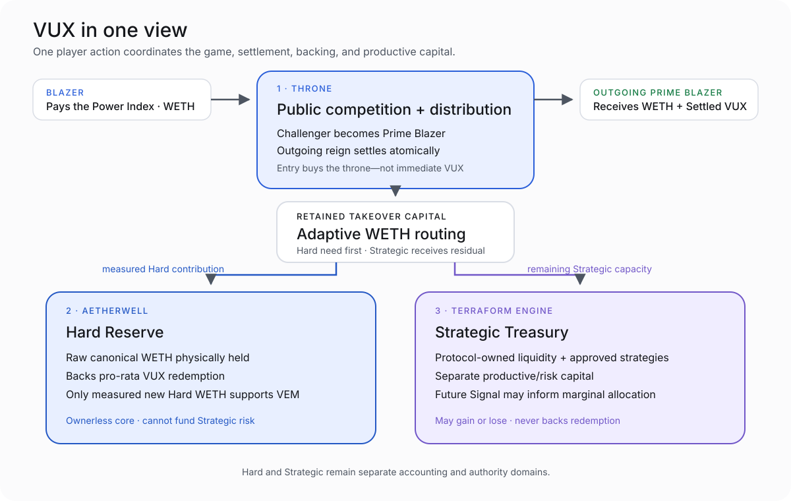

# VUX

VUX is a WETH-paid King-of-the-Hill game that distributes VUX through public competition and routes retained takeover capital between a hard redemption reserve and a separate productive treasury.

> **Project status — 2026-08-20:** VUX v1 engineering, review, audit, and launch-readiness closure are complete. Production deployment has not occurred. No production addresses or transaction hashes are published.

## Take the throne. Blaze until displaced. Settle in WETH and VUX.

A Blazer pays the current **Power Index** in WETH to take one throne.

That action:

1. settles the outgoing **Prime Blazer**;
2. seats the challenger as the new Prime Blazer;
3. starts the challenger’s **Blaze Clock**;
4. routes retained WETH between the Hard Reserve and Strategic Treasury; and
5. mints only the VUX safely supported when the outgoing reign settles.

Paying for a takeover does **not** buy or immediately mint VUX for the challenger.

```text
Blaze ’Em
→ become Prime Blazer
→ watch the Power Index decay
→ another Blazer overpowers you
→ receive outgoing-King WETH + Settled VUX
```



## Three parts explain the machine

### Throne
**Public competition and distribution**

One WETH-paid KOTH position. The next takeover price opens from the last paid price and decays over 50 minutes. Public displacement is the only v1 path that can mint user VUX.

### Aetherwell
**Hard Reserve**

Ownerless canonical WETH backing pro-rata VUX redemption. Only measured new Hard WETH supports VEM issuance.

The Hard Reserve contract is designed to be immutable and ownerless. Its backing asset is canonical Robinhood Chain WETH, which retains an external Robinhood Chain governance and upgrade trust assumption.

### Terraform Engine
**Strategic Treasury**

Separate productive/risk capital for protocol-owned liquidity and bounded strategies. Strategic may gain or lose value. Its assets never back VUX redemption.

## The interface shows three different VUX states

| Player readout | Protocol truth |
|---|---|
| **Blaze Clock** | Raw Clock Limit—time-derived opportunity, not owned VUX |
| **VUX if Displaced Now** | Live conditional settlement estimate; may rise or fall |
| **VUX Mined** | Settled VUX actually minted after completed displacement |

No successor means no settlement mint. Unsupported opportunity expires without debt or carry.

## Monetary core

```text
S = complete VUX supply
B = canonical WETH in the Hard Reserve
N = B / S = Hard backing per VUX
```

At settlement, VEM mints the smaller of:

- the reign’s Raw Clock Limit; or
- the amount supported by the exact measured new Hard WETH.

Authorized settlement minting cannot reduce pre-settlement Hard backing per VUX. Strategic WETH, POL, strategy NAV, expected yield, and market prices receive zero VEM credit.

## Public distribution

Genesis creates approximately `150,000 VUX` in canonical protocol-owned VUX/WETH liquidity and the one-raw-unit `S_MIN` posture. Founders, operators, developers, investors, partners, airdrops, public-sale buyers, and discretionary recipients receive zero genesis VUX.

The first public paid takeover mints zero and starts the first public Blaze Clock. Later public KOTH settlements create user supply under the emission schedule and VEM cap.

## Treasury separation

| | Hard Reserve | Strategic Treasury |
|---|---|---|
| Backs redemption | Yes | No |
| Supports VEM | Yes | No |
| Can fund strategies/POL | No | Yes |
| Can gain or lose through strategy risk | No VUX strategy exposure | Yes |
| Operator authority | None over backing | Bounded Strategic roles |
| Future Signal access | Never | Strategic-only input after future activation |

A complete Strategic loss does not reduce Hard backing through an authorized VUX path.

## Genesis

VUX uses two founder transactions:

```text
Tx 1 — inert commitment-gated pool deployer
Tx 2 — atomic constructor genesis
```

The design assumes future addresses may become public. Deterministic commitment, hostile-prefunding sanitation, constructor atomicity, exact postcondition checks, and the absence of surviving temporary authority keep genesis correct without relying on secret addresses.

Private same-block routing protects confidentiality; it is not the security boundary.

## Security and trust

The v1 lifecycle includes:

- exact source and licence provenance;
- immutable dependency/toolchain pins;
- property, fuzz, invariant, and adversarial tests;
- independent review and security-audit gates;
- static analysis and measured coverage;
- requirement-to-evidence traceability;
- full-knowledge genesis rehearsal; and
- exact-SHA hosted CI over the accepted tree.

Evidence reduces uncertainty. It does not make VUX risk-free.

The operator Safe can control bounded Strategic functions and can therefore lose Strategic assets. It holds no role on VUX, Rig, Hard Reserve, or Lens. Canonical RH WETH remains the principal external trust dependency and must be re-verified before deployment.

## Signal — future, not v1

Signal is the planned active capital-signaling layer for marginal Strategic allocation.

Future eligible holders may commit and age VUX, submit fresh epochal allocation preferences, and share in qualifying realized Strategic economics. Signal never receives Hard Reserve, mint, redemption, KOTH, strategy-admission, or arbitrary Treasury authority.

Signal’s requirements and design are approved and its repository authority is frozen. Its implementation is not built or active in VUX v1.

## Documentation

- [Architecture Overview](docs/architecture-overview.md)
- [How Mining Works](docs/how-mining-works.md)
- [Monetary Policy](docs/monetary-policy.md)
- [Treasury Architecture](docs/treasury-architecture.md)
- [Genesis](docs/genesis.md)
- [Security Model](docs/security-model.md)
- [Trust and Dependencies](docs/trust-and-dependencies.md)
- [Signal and Future Architecture](docs/signal-and-future.md)
- [Glossary](docs/glossary.md)

The accepted technical authority remains under [`docs/authority/`](docs/authority/). Public documentation explains that authority; it does not replace it.

## Repository map

```text
src/                 VUX v1 contracts
test/                unit, property, invariant, integration, and adversarial tests
script/              deterministic deployment and verification scripts
indexer/             rebuildable event-derived truth replica
web/                 static-exportable player truth surface
docs/authority/      accepted architecture, provenance, and supersession authority
tools/provenance/    exact-source, dependency, traceability, and release gates
tools/coverage/      measured core coverage gate
vendor/              exactly dispositioned vendored source
grimoires/loa/a2a/   engineering lifecycle and evidence records
```

## Verify the accepted tree

Use the repository’s composed gates rather than ad hoc subsets:

```bash
bash tools/provenance/run-all.sh
bash tools/coverage/verify-coverage.sh
```

The exact accepted compiler, build, dependency, and analysis identities are recorded in `docs/authority/`, the registries, and `THIRD_PARTY_NOTICES.md`.

The web and indexer are separately pinned Node projects:

```bash
cd web && npm ci
cd ../indexer && npm ci
```

Production configuration, keys, Safe composition, commitment material, and deployment values do not belong in source control.

## Launch boundary

Cycle-002 closed the VUX v1 engineering lifecycle. Production still requires:

- production Safe composition;
- jurisdiction-specific legal review;
- chain, canonical WETH, EVM, gas, and build re-verification;
- final immutable deployment inputs and manifest approval;
- Tx 1 and Tx 2 broadcast; and
- verified post-deployment facts.

Until then, this repository is launch-ready source and evidence—not a production deployment announcement.

## Licence

VUX is licensed under `GPL-3.0-or-later`. See [`LICENSE`](LICENSE).

Third-party source, licences, exact pins, notices, and permitted-use boundaries are recorded in [`THIRD_PARTY_NOTICES.md`](THIRD_PARTY_NOTICES.md) and the accepted provenance registries.
