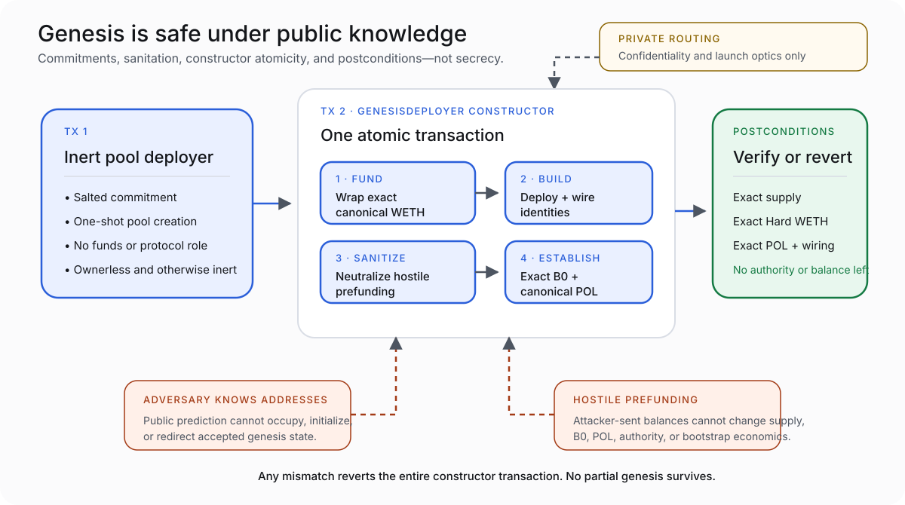

# VUX Genesis

> **Status — 2026-08-20:** The genesis architecture, tests, and deployment runbook are complete. Production genesis has not occurred.

VUX genesis is designed to remain economically correct even if an adversary knows every future protocol address before launch.

It uses two founder transactions:

```text
Tx 1 — inert commitment-gated pool deployer
Tx 2 — atomic constructor genesis
```

Private routing protects confidentiality. The architecture protects correctness.

## The two-transaction shape



## Tx 1 — inert infrastructure

The first transaction deploys `VuxPoolDeployer` with a 32-byte salted commitment to the future `GenesisDeployer` identity.

Tx 1:

- holds no genesis funds;
- holds no VUX monetary role;
- exposes no useful launch action without the commitment preimage;
- cannot reveal the future protocol address graph from the commitment alone;
- can create the canonical pool only once; and
- remains ownerless.

Publishing Tx 1 does not create a race to initialize VUX because there is no public initialization surface.

## Tx 2 — atomic constructor genesis

The second transaction creates `GenesisDeployer` and carries the exact genesis funding as native value. Its constructor wraps that value through canonical WETH and performs genesis inside one transaction.

There is no callable `genesis()` function, founder-only trigger, or temporary administrator waiting to act later.

The constructor:

1. derives and deploys the expected components;
2. establishes the exact VUX supply and authority graph;
3. creates the canonical pool through the committed one-shot deployer;
4. sanitizes hostile prefunding/residual-WETH conditions so they cannot distort accepted economics;
5. places exact `B0` canonical WETH in the Hard Reserve;
6. creates canonical protocol-owned VUX/WETH liquidity;
7. initializes the inactive future Signal seam;
8. verifies the complete post-genesis state; and
9. leaves no surviving genesis authority or balance.

If any required identity, balance, ownership, pool, supply, or wiring condition is wrong, the entire transaction reverts and `GenesisDeployer` never exists.

## What public future-address knowledge cannot do

Knowing or predicting future addresses cannot:

- deploy a valid VUX component first;
- occupy or initialize the canonical pool;
- change `B0`;
- create extra VUX supply;
- redirect genesis POL;
- become a protocol owner;
- consume the one-shot commitment without the exact preimage; or
- make attacker-provided balances count as accepted genesis economics.

This is stronger than “we will keep the addresses secret.” It assumes the addresses may become public and preserves correctness anyway.

## Hostile prefunding

Deterministic deployments often create a concern: an attacker can send assets to a future address before code exists there.

VUX does not use an attacker-reachable balance as an asserted genesis input. The accepted constructor flow establishes and verifies the intended economic quantities from its own funded transaction and sanitizes residual WETH in-transaction.

The result is not “nobody can send tokens to an address.” Anyone can send arbitrary assets to an address. The result is narrower and useful:

> Hostile prefunding cannot change the VUX supply, Hard backing, canonical POL, authority graph, or bootstrap economics accepted by genesis.

## Genesis distribution

The post-genesis state must satisfy:

| Item | Accepted result |
|---|---|
| Total supply | `150,000 × 10^18 + 1` raw VUX units |
| Canonical POL | `150,000 VUX` in the protocol-owned position |
| Hard Reserve VUX | one raw unit for `S_MIN` posture |
| Every discretionary address | zero VUX |
| Initial Hard WETH | exact operator-derived `B0` |
| Initial price/backing relationship | `P0 / N0 = 1.10` |
| Hard/VUX/Rig/Lens authority | no owner or administrator |
| Strategic authority | operator Safe roles on Strategic only |
| Pool authority | ownerless; protocol-fee authority unreachable |
| Future Signal | inactive |

The launch-target examples of approximately `$1,000` WETH-side POL and `$909.09` initial Hard backing are not production inputs. The operator converts approved reference values into exact immutable WETH quantities before deployment.

## Bootstrap after genesis

Genesis establishes the machine but does not start a public mining epoch.

The first public paid takeover:

- treats the Hard Reserve as the outgoing King;
- mints zero VUX;
- routes approximately 88%-or-more of the payment to Hard and 12% to Strategic under exact arithmetic;
- seats the first public Prime Blazer; and
- starts the emission schedule and first Blaze Clock.

Genesis creates infrastructure. Permissionless takeovers create public user supply.

## Private routing: required confidentiality, non-load-bearing security

The production runbook requires a private same-block funding-and-Tx-2 bundle so the fresh launch EOA does not create a public address-derivation window before genesis.

That protects launch confidentiality and operational optics. It does not make genesis safe.

If routing leaks:

- address confidentiality is lost;
- the operator may reconsider timing; but
- the accepted architecture still prevents poisoning, occupation, prefunding distortion, or economic takeover of genesis.

## What remains production-reserved

The repository deliberately does not contain:

- production keys, EOA, or nonce plan;
- commitment salt or preimage;
- predicted production addresses;
- exact production funding/conversion values;
- production Safe composition;
- private-routing credentials;
- final genesis manifest; or
- transaction hashes, blocks, code hashes, and post-deployment evidence.

These facts exist only after the operator freezes inputs and performs production deployment.
