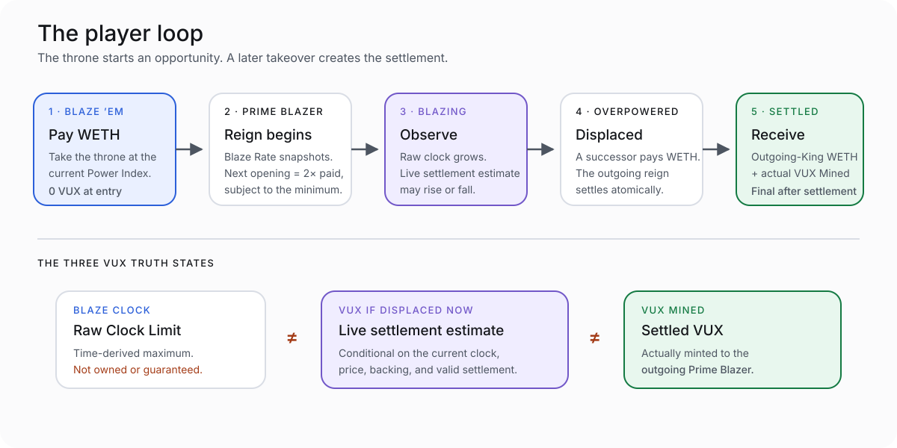
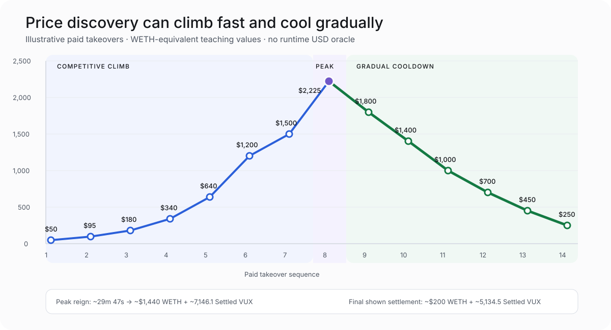

# How VUX Mining Works

> **Status — 2026-08-20:** This page explains accepted v1 behavior. VUX is launch-ready but not production-deployed; all numbers below are illustrative.

VUX mining is a King-of-the-Hill game.

You pay WETH to take the throne. Your Blaze Clock begins. Another Blazer eventually displaces you. Only then do you receive your outgoing-King WETH payment and whatever VUX the completed settlement can safely mint.



## The first rule: a takeover does not buy VUX

When you pay the current Power Index:

- you become the **Prime Blazer / Current King**;
- your mining epoch begins at its snapshotted Blaze Rate;
- the next Power Index opens from your paid price; and
- you receive **zero immediate VUX**.

Your VUX result belongs to the future settlement that occurs if another player takes the throne from you.

No successor means no settlement mint—even after the Blaze Clock reaches its 50-minute limit.

## The four mining readouts

### Prime Blazer
**Current King**

The address currently holding the throne.

### Power Index
**Takeover Price · WETH**

The WETH price a challenger must pay now. After each takeover, the next opening is twice the price just paid, subject to the accepted minimum. It then decays linearly over 50 minutes toward the floor.

### Blaze Clock
**Raw Clock Limit**

The time-derived VUX ceiling for the current reign. It is not earned, owned, owed, claimable, or guaranteed.

### VUX if Displaced Now
**Live settlement estimate**

The amount that could mint if a valid takeover settled at the current state. It incorporates both the clock and current Hard support. It can rise or fall.

After settlement, the final amount becomes:

### VUX Mined
**Settled VUX**

This is the actual VUX minted to the outgoing Prime Blazer. Only this state receives wallet-balance or finality treatment.

## How the Power Index decays

If a Blazer pays `P`, the next opening is normally `2P`.

```text
current price = max(floor, opening × (1 − elapsed / 50 minutes))
```

The price reaches half its opening after 25 minutes. It approaches the floor only near the end.

That curve creates a continuous decision:

- challenge early and pay more before another Blazer acts; or
- wait for a lower price while accepting that someone else may take the throne first.

The protocol does not score whether a bid is “good.” It exposes the state; players decide.

## A market story: from $50 to $2,225 and back to $250

For readability, this scenario describes fixed WETH amounts using one illustrative USD-equivalent conversion. VUX does not query a USD oracle at runtime.



Assume the launch-period Blaze Rate is `4 raw VUX/second`.

### Act I — ignition

The bootstrap Power Index opens around `$50` equivalent.

A first Blazer pays `$50` and becomes the first public Prime Blazer. This special takeover mints zero VUX because no public reign existed before it. The next opening becomes `$100`.

### Act II — fast price discovery

| New takeover | Opening | Approximate wait | New opening |
|---:|---:|---:|---:|
| $95 | $100 | 2m 30s | $190 |
| $180 | $190 | 2m 38s | $360 |
| $340 | $360 | 2m 47s | $680 |
| $640 | $680 | 2m 56s | $1,280 |
| $1,200 | $1,280 | 3m 08s | $2,400 |
| $1,500 | $2,400 | 18m 45s | $3,000 |
| $2,225 | $3,000 | 12m 55s | $4,450 |

Early Blazers act before the price decays very far. Later buyers wait longer but still clear above the prior paid price. Every paid takeover becomes the reference point for the next opening, so the Power Index can continue walking upward while each reign develops meaningful clock time.

### Act III — bidding war

A contender takes the throne at `$1,500`. Its next Power Index opens at `$3,000` and decays for 12 minutes 55 seconds before another Blazer pays `$2,225`.

The outgoing `$1,500` Blazer receives `$1,780` equivalent WETH—their 80% share of the successor payment—plus approximately `3,100 Settled VUX`. The new `$2,225` Prime Blazer’s next opening becomes `$4,450`.

The peak is not treated as an instant flip. The reign before it had time to develop, and the peak Prime Blazer will also receive a meaningful reign before displacement.

```text
price discovery and mining time are related through settlement,
but neither guarantees the other
```

### Act IV — the market backs away

The market does not collapse from `$2,225` directly to `$250`. It cools through six lower clearing prices:

| New takeover | Opening | Approximate wait | New opening |
|---:|---:|---:|---:|
| $1,800 | $4,450 | 29m 47s | $3,600 |
| $1,400 | $3,600 | 30m 33s | $2,800 |
| $1,000 | $2,800 | 32m 09s | $2,000 |
| $700 | $2,000 | 32m 30s | $1,400 |
| $450 | $1,400 | 33m 56s | $900 |
| $250 | $900 | 36m 07s | $500 |

The `$2,225` Prime Blazer is first displaced at `$1,800` after nearly 30 minutes. They receive `$1,440` equivalent WETH plus approximately `7,146.1 Settled VUX`.

As takeover volume declines, reigns become longer and adaptive routing sends progressively more retained WETH to Hard. The final `$450` Prime Blazer develops approximately `8,666.7 VUX` of raw opportunity before the `$250` displacement. Current Hard support settles approximately `5,134.5 VUX`; the unsupported `3,532.1 VUX` expires rather than becoming debt.

The `$250` challenger becomes the next Prime Blazer. Their next opening is `$500`, and their own result is still unknown.

## The complete settlement experience

| Takeover that ends the reign | Outgoing Blazer paid | WETH received | Raw Clock Limit | VUX Mined |
|---:|---:|---:|---:|---:|
| $95 | $50 | $76 | 600.0 | 600.0 |
| $180 | $95 | $144 | ~631.6 | ~631.6 |
| $340 | $180 | $272 | ~666.7 | ~666.7 |
| $640 | $340 | $512 | ~705.9 | ~705.9 |
| $1,200 | $640 | $960 | 750.0 | 750.0 |
| $1,500 | $1,200 | $1,200 | 4,500.0 | 4,500.0 |
| $2,225 | $1,500 | $1,780 | 3,100.0 | 3,100.0 |
| $1,800 | $2,225 | $1,440 | ~7,146.1 | ~7,146.1 |
| $1,400 | $1,800 | $1,120 | ~7,333.3 | ~7,333.3 |
| $1,000 | $1,400 | $800 | ~7,714.3 | ~7,714.3 |
| $700 | $1,000 | $560 | 7,800.0 | 7,800.0 |
| $450 | $700 | $360 | ~8,142.9 | ~8,142.9 |
| $250 | $450 | $200 | ~8,666.7 | **~5,134.5** |

These are gross protocol flows before gas and do not represent profit, fair value, or a recommended strategy. The eventual value of VUX is not assumed.

## What happens to the takeover WETH

Each ordinary takeover pays:

- 80% to the outgoing Prime Blazer; and
- 20% retained by the protocol.

The retained portion routes adaptively between:

- **Aetherwell / Hard Reserve**, which backs redemption and supports settlement; and
- **Terraform Engine / Strategic Treasury**, which holds separate productive capital.

Across the full example:

```text
new Hard WETH       ≈ $1,079.65 equivalent
new Strategic WETH  ≈ $1,326.35 equivalent
new Settled VUX     ≈ 54,225.2 VUX
```

Strategic receives its full capacity during the climb and early cooldown. Its share narrows at the `$700` and `$450` takeovers, then reaches zero at `$250` because settlement needs all available retained support in Hard.

## Why VUX if Displaced Now can fall

The Blaze Clock asks only:

> How much raw opportunity has elapsed time created?

The live estimate asks:

> If a takeover paid the current Power Index now, how much VUX could the resulting Hard contribution support?

Late in a reign, time can keep increasing while price decays rapidly. If the retained WETH becomes too small, VEM lowers the supported mint. That is why a truthful interface needs both numbers.

## What a challenger should evaluate

The protocol can show facts, not a guaranteed answer:

- current Power Index and time to the floor;
- the next opening implied by paying now;
- current Blaze Rate;
- recent takeover timing and price history;
- current Aetherwell backing;
- the current Prime Blazer’s Raw Clock Limit and live estimate; and
- transaction cost and settlement state.

A challenger is choosing whether the throne is worth the present WETH price under uncertain future competition. They are not purchasing a predetermined amount of VUX.

## Transaction truth

A safe takeover confirmation should say:

```text
Pay [current price] WETH to take the throne.

You receive no VUX at entry.
The next Power Index opens at [computed next opening] WETH.
Your Blaze Clock begins after settlement.
Your eventual VUX is determined only when another Blazer displaces you.
```
