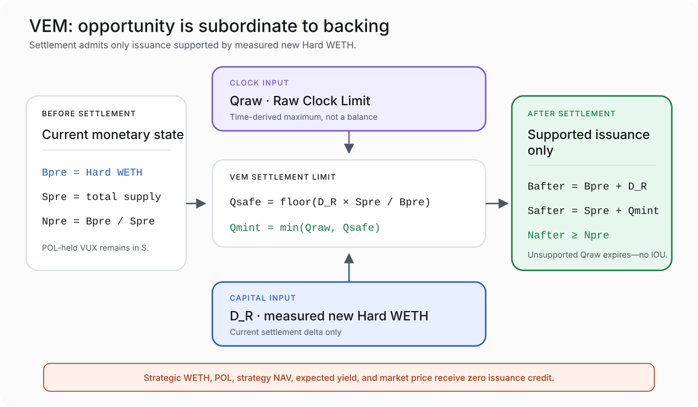

# VUX Monetary Policy

> **Status — 2026-08-20:** This page describes accepted, implemented v1 monetary behavior. Production deployment and production parameter conversion have not occurred.

VUX monetary policy makes mining opportunity subordinate to Hard Reserve integrity.

The emission schedule says how quickly a Prime Blazer’s raw opportunity can develop. VEM decides how much of that opportunity can actually mint at settlement. The Hard Reserve defines the redemption right. Strategic capital is excluded from both calculations.

## The three quantities

```text
S = complete VUX total supply
B = canonical WETH physically held by the Hard Reserve
N = B / S = Hard backing per VUX
```

`S` includes all minted VUX, including protocol-owned VUX in POL. Protocol inventory is not removed from the denominator.

`B` includes only raw canonical WETH held by the Aetherwell / Hard Reserve. It excludes Strategic WETH, POL, strategy NAV, expected yield, and market value.

`N` is a redemption-accounting relationship. It is not the VUX market price and should not be advertised as a guaranteed trading floor.

## Genesis supply and public distribution

At genesis, the accepted target creates:

- `150,000 VUX` in canonical protocol-owned VUX/WETH liquidity;
- one raw VUX unit at the Hard Reserve for the exact `S_MIN` posture; and
- zero VUX for founders, operators, developers, investors, partners, airdrops, public-sale buyers, users, or discretionary recipients.

The first public paid takeover mints zero VUX and starts the first public mining epoch. After that, public KOTH settlement is the only v1 path that can mint new user VUX.

Mining is therefore the public distribution mechanism, but the published emission curve remains opportunity—not promised supply.

## The raw emission schedule

Each reign snapshots the rate active when it opens. A later schedule change does not alter the current reign’s rate.

| Time from public schedule start | Raw Blaze Rate |
|---|---:|
| Days 0–30 | 4 VUX/second |
| Days 30–60 | 2 VUX/second |
| Days 60–90 | 1 VUX/second |
| Days 90–120 | 0.5 VUX/second |
| Days 120–150 | 0.25 VUX/second |
| Days 150–180 | 0.125 VUX/second |
| Days 180–210 | 0.0625 VUX/second |
| Days 210–240 | 0.03125 VUX/second |
| After day 240 | 0.015625 VUX/second tail |

Every reign has at most 3,000 eligible seconds. At the launch rate, the maximum Raw Clock Limit is therefore `12,000 VUX`.

That number is not a balance. Actual issuance can be lower or zero.

## Redemption

A holder redeems by burning VUX for its pro-rata share of Hard WETH.

For a redemption of `q` VUX:

```text
WETH out = floor(q × B / S)
```

The burn and WETH transfer occur under the accepted atomic ordering. Reserve-favoring rounding prevents a redeemer from taking more than the pro-rata amount.

Strategic assets never enter this formula.

## VEM: supported issuance only



At settlement:

```text
Qraw  = Raw Clock Limit
D_R   = exact measured new Hard WETH caused by this settlement
Bpre  = Hard WETH before settlement
Spre  = complete supply before settlement

Qsafe = floor(D_R × Spre / Bpre)
Qmint = min(Qraw, Qsafe)
```

The resulting invariant is:

```text
(Bpre + D_R) / (Spre + Qmint) ≥ Bpre / Spre
```

In plain language: authorized settlement minting cannot reduce pre-settlement Hard backing per VUX.

VEM uses measured capital, not a quote or intended route. If the actual Hard increase does not match the required settlement route, the transaction fails closed.

## Adaptive retained-capital routing

For an ordinary takeover payment `P`:

```text
king         = floor(80% × P)
retained     = P − king
strategicCap = floor(12% × P)
hardFloor    = retained − strategicCap

D_need       = ceil(Qraw × Bpre / Spre)
hardTarget   = min(retained, max(hardFloor, D_need))
strategic    = retained − hardTarget
```

This creates three settlement regimes:

### Premium or short-clock settlement

The Hard floor already supports the raw opportunity. Hard receives its floor; Strategic receives the full residual up to its 12% cap.

### Support-seeking settlement

The Hard floor is not enough, but the retained 20% is. Hard receives exactly what current full settlement needs; Strategic receives the remainder.

### VEM-capped settlement

Even the full retained 20% cannot support the Raw Clock Limit. All retained capital goes to Hard, Strategic receives zero, and VEM mints only the supported amount.

No regime consults an oracle, market price, strategy return, Signal, governance vote, or operator.

## Why VUX changed routing instead of weakening VEM

The earlier fixed split always sent 8% of gross payment to Hard and 12% to Strategic. Research found an incentive dead zone: the protocol retained enough total capital to support more mining, but the fixed Hard leg prevented that capital from supporting issuance.

The rejected responses were:

- count Strategic value as backing;
- mint beyond measured Hard support;
- make unsupported emissions an IOU; or
- use discretionary recapitalization later.

Each would weaken the hard property.

The accepted response was to preserve VEM and make the retained-capital route adaptive. Mining continuity remains subordinate to Hard integrity, while Strategic receives whatever retained capacity is genuinely available.

## The bidding-war example as monetary policy

The illustrative `$50 → $2,225 → $250` sequence begins with:

```text
Hard Reserve       ≈ $909.09 equivalent WETH
displayed supply   ≈ 150,000 VUX
Hard backing       ≈ $0.0060606 equivalent WETH / VUX
```

Its settlement ledger is:

| Paid takeover | Hard | Strategic | Settled VUX |
|---:|---:|---:|---:|
| $50 bootstrap | $44.00 | $6.00 | 0 |
| $95 | $7.60 | $11.40 | 600.0 |
| $180 | $14.40 | $21.60 | ~631.6 |
| $340 | $27.20 | $40.80 | ~666.7 |
| $640 | $51.20 | $76.80 | ~705.9 |
| $1,200 | $96.00 | $144.00 | 750.0 |
| $1,500 | $120.00 | $180.00 | 4,500.0 |
| $2,225 | $178.00 | $267.00 | 3,100.0 |
| $1,800 | $144.00 | $216.00 | ~7,146.1 |
| $1,400 | $112.00 | $168.00 | ~7,333.3 |
| $1,000 | $80.00 | $120.00 | ~7,714.3 |
| $700 | ~$75.96 | ~$64.04 | 7,800.0 |
| $450 | ~$79.30 | ~$10.70 | ~8,142.9 |
| $250 | $50.00 | $0.00 | ~5,134.5 |

After the sequence:

```text
Hard Reserve                ≈ $1,988.74 equivalent WETH
Strategic takeover WETH     ≈ $1,326.35 equivalent
displayed total supply      ≈ 204,225.2 VUX
Hard backing per VUX        ≈ $0.0097380 equivalent WETH
```

Several fast premium settlements add more Hard than their short clocks require, so backing rises during the climb. The market reaches `$2,225` only after the outgoing reign has developed approximately `3,100 VUX` of raw opportunity, and the `$2,225` Prime Blazer then remains on the throne for nearly 30 minutes before a `$1,800` takeover settles approximately `7,146.1 VUX`.

The cooldown continues through `$1,400`, `$1,000`, `$700`, and `$450` before reaching `$250`. Adaptive routing gradually directs more retained capital to Hard: Strategic receives approximately `$64.04` at `$700`, `$10.70` at `$450`, and zero at `$250`.

At the final `$250` settlement, the outgoing King’s Raw Clock Limit is approximately `8,666.7 VUX`. The retained `$50` can support about `5,134.5 VUX` at the established backing level. The unsupported `3,532.1 VUX` expires, preserving the approximately `$0.0097380` backing relationship instead of diluting it to satisfy the clock.

## Bootstrap is different

At bootstrap:

- the Hard Reserve itself is the outgoing King;
- the ordinary 80% King leg therefore terminates at Hard;
- the nominal Hard leg and split dust also reach Hard;
- the 12% Strategic cap reaches Strategic; and
- `Qraw = 0`, so zero VUX mints.

At an illustrative `$50` payment, approximately `$44` reaches Hard and `$6` reaches Strategic.

## What monetary policy does not promise

VUX does not promise:

- that raw opportunity becomes issued supply;
- that every reign settles;
- that VUX trades at backing value;
- that Strategic earns a return;
- that future Signal produces rewards;
- that canonical WETH is free of external governance risk; or
- that launch-target dollar equivalents remain constant after conversion to immutable WETH amounts.

The promise is narrower: the accepted core rules define redemption from Hard WETH and prevent authorized settlement minting from weakening the pre-settlement Hard backing relationship.
