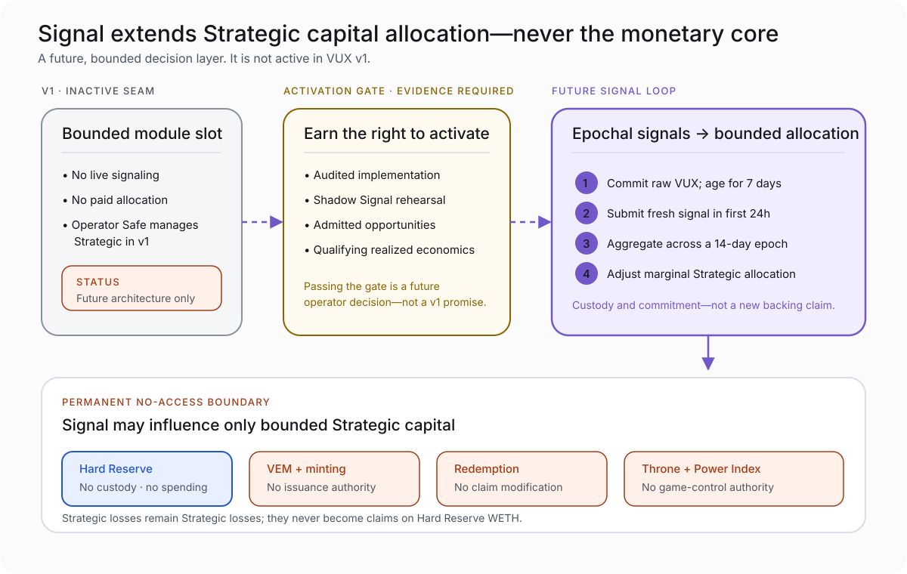

# Signal and VUX’s Future Architecture

> **Current status — 2026-08-20:** Signal’s product requirements and software design are approved, its repository authority is operator-frozen, and a five-sprint implementation plan exists. Signal implementation has not been built or activated. VUX v1 launches with Signal inactive.

Signal is the future active capital-signaling layer for the Terraform Engine / Strategic Treasury.

It is not voting governance, passive staking, or authority over the VUX monetary core.

## Why Signal exists

VUX v1 gives bounded operators responsibility for Strategic capital:

- admit strategies;
- set caps and modes;
- deploy or recall capital;
- manage risk; and
- preserve Hard/Strategic isolation.

That is appropriate for launch, but the long game can give economically committed VUX holders a transparent way to express where **new marginal Strategic capital** should go.

Signal is designed to add that input without giving holders custody of the Treasury or turning VUX into unrestricted governance.

## The intended participant loop

```text
commit raw VUX
→ age for seven days
→ submit a fresh complete signal during the epoch’s first 24 hours
→ remain committed through the 14-day close
→ share in qualifying realized Signal economics, if funded
→ signal again in the next epoch to renew participation
```

The active signal is the compensated work. Holding VUX by itself creates no passive entitlement.

## Hardened VUX is a status, not automatically an asset

**Hardened VUX** describes VUX that satisfies the future custody, age, fresh-signal, and commitment conditions for an epoch.

Current doctrine does not automatically create:

- a separate token;
- an `hVUX` receipt asset;
- a transferable wrapper;
- a liquid staking position; or
- a new redemption claim.

Until future implementation explicitly establishes otherwise, Hardened VUX is status/lore terminology only.

## What Signal can influence

Signal expresses **relative marginal allocation preference** across a versioned opportunity set of operator-admitted Strategic destinations.

That set can include:

- admitted strategies; and
- **Dry Powder**, meaning “do not deploy this marginal share into discretionary risk now.”

The aggregate signal informs a bounded Strategic deployment. It does not move funds by itself.

Operators retain responsibility for:

- admitting or removing strategies;
- setting risk caps and modes;
- choosing the marginal capital amount;
- executing deployment;
- recalling or closing positions;
- pausing unsafe actions; and
- responding to emergencies.

## What Signal can never control



Signal never receives authority over:

- the Aetherwell / Hard Reserve;
- VUX minting or burning;
- VEM;
- redemption;
- the Throne or Power Index;
- canonical WETH custody;
- strategy admission or caps;
- emergency controls; or
- arbitrary Treasury calls.

## Epoch mechanics

The accepted future shape uses:

- a seven-day minimum continuous age before epoch open;
- fixed 14-day Signal Epochs;
- one fresh, complete, write-once signal during the first 24 hours;
- eligible weight fixed at epoch opening and committed through close;
- no carry-forward signal or automatic voting;
- no same-transaction stake/signal/reward/exit shortcut; and
- one eligible raw VUX equal to one unit of signal and reward weight.

There are no correctness, profitability, loyalty, or whale multipliers.

Protocol-owned VUX, POL, lending collateral, external LP positions, inactive custody, and liquid-wallet VUX do not receive active Signal weight under the accepted one-status model.

## Rewards come from realized Strategic economics

Future Signal Rewards are not newly minted VUX and are not paid from Hard.

They may be funded only from qualifying realized Strategic WETH after:

- returned principal is excluded;
- unrealized marks are excluded;
- direct realization costs are deducted; and
- realized losses/high-water restoration obligations are satisfied.

The accepted future qualifying-value waterfall is:

| Destination | Future share |
|---|---:|
| Strategic compounding / Dry Powder floor | 50% |
| Purpose-limited Operator Reserve | 25% |
| Qualified active Signal pool | 20% |
| One-way Hard Reserve accretion | 5% |
| Speculative/unclassified claims | 0% |

This table is future doctrine. It is not active v1 yield, a guaranteed reward rate, or a claim against current Treasury revenue.

Signal’s global reward pool is shared pro rata by eligible active weight. It does not reward whoever later appears “correct,” and it does not multiply rewards based on the profitability of a preferred strategy.

## Realized-loss and high-water restoration

Signal does not distribute from a profitable-looking slice while ignoring losses elsewhere.

The accepted design carries portfolio-wide WETH loss restoration forward. Qualifying distribution begins only after realized losses and direct costs have been restored under the accepted accounting. Returned principal and unrealized gains never become distributable revenue by relabeling.

This keeps reward economics attached to realized protocol performance rather than marks or accounting optimism.

## Shadow Signal before paid activation

Signal should be observed before it is paid.

**Shadow Signal** is a public rehearsal/observation phase that exercises:

- custody and age behavior;
- fresh signaling;
- opportunity-set clarity;
- aggregate reconstruction;
- concentration and participation;
- operator interpretation; and
- Capital Allocator Record completeness.

Shadow participation creates no retroactive reward entitlement. A later paid activation does not turn earlier shadow activity into a claim.

The founder-preferred shape includes at least one public 14-day Shadow Signal epoch, but activation remains evidence-gated operator judgment rather than a calendar promise.

## Capital Allocator Record

Signal reserves a transparent, non-economic historical record of:

- each epoch’s opportunity set;
- each participant allocation vector;
- eligible weights;
- aggregate signal;
- actual operator-executed allocation;
- principal movement and direct costs;
- realized profit/loss;
- drawdowns and Dry Powder calls; and
- admission, cap, and pause changes.

This supports later analysis and a possible non-economic allocator leaderboard only after substantial clean history. No ranking may alter rewards, signal weight, access, admission, or retroactive payouts.

## Activation is evidence-gated

Signal should not activate merely because code exists.

The current guidance expects evidence such as:

- independently audited implementation;
- clean custody and failure-independence behavior;
- at least two meaningful admitted destinations plus Dry Powder;
- enough qualifying realized economics to make active attention worthwhile;
- meaningful external VUX commitment and participant diversity;
- no known dominant controller beyond the accepted concentration screen;
- reconciled protocol-owned zero-weight treatment;
- operator halt/recall capability; and
- public reconstruction of the relevant history.

The numerical screens are operator guidance, not immutable tokenomics or auto-activation thresholds.

## VUX v1’s current attachment seam

VUX v1 contains only the bounded inactive attachment surface:

- the module address begins inactive;
- activation/deactivation remains an operator action;
- VUX consumes a narrow read of aggregate allocation preference;
- actual deployment remains operator-triggered and capped; and
- reward funding remains bounded by realized-revenue accounting.

Historical code identifiers retain the earlier project name because renaming accepted interfaces would create unnecessary implementation drift. Public product language uses **Signal**.

## Current maturity

| Layer | Current state |
|---|---|
| Founder doctrine and canonical semantics | Accepted |
| Signal PRD v1.0.3 | Approved |
| Signal SDD v4.1.0 | Approved and frozen |
| Repository licence/provenance authority | Operator-frozen |
| Five-sprint implementation plan | Exists; ready for operator lifecycle action |
| Signal contracts and tests | Not implemented |
| VUX v1 module | Inactive |
| Shadow Signal | Not running |
| Paid activation | Not active |

No roadmap sentence should collapse those states into “Signal is live.”
