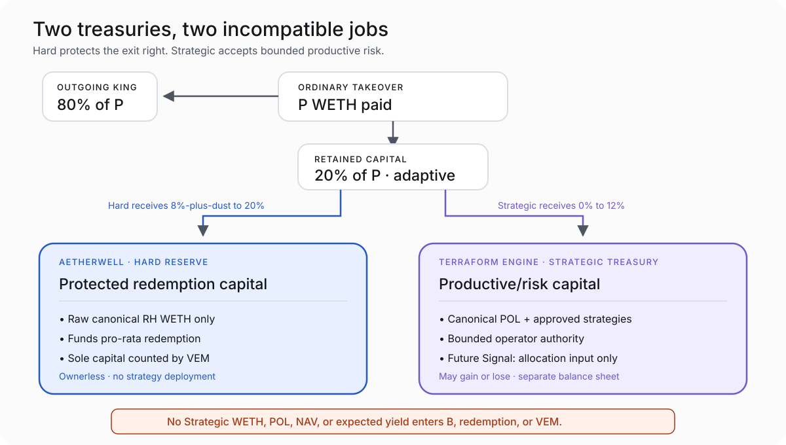

# VUX Treasury Architecture

> **Status — 2026-08-20:** The v1 Hard/Strategic architecture is implemented and Cycle-002 is closed. Production deployment has not occurred.

VUX has two capital domains because redemption capital and productive capital have incompatible jobs.



They are intentionally not one balance sheet.

## The boundary that must remain unmistakable

| | Aetherwell / Hard Reserve | Terraform Engine / Strategic Treasury |
|---|---|---|
| **Primary purpose** | Back pro-rata VUX redemption | Hold and deploy productive protocol capital |
| **Assets** | Raw canonical RH WETH only for backing calculations | WETH, canonical POL, admitted strategy positions, and other approved Strategic assets |
| **Supports VEM minting?** | Yes—only measured new Hard WETH | No |
| **Funds redemption?** | Yes | No |
| **May be deployed for yield/strategy?** | No | Yes, within bounded authority |
| **Operational authority** | Ownerless core posture; no administrator can spend backing | Operator Safe and typed roles over bounded Strategic actions |
| **Can lose value through strategy performance?** | Not by VUX strategy deployment; external WETH risk remains | Yes, including total Strategic loss |
| **If it loses value** | Redemption backing is affected if canonical WETH itself fails | Strategic loss does not become a Hard claim |
| **If it gains value** | Hard WETH directly raises backing per VUX | Strategic gains remain Strategic unless valid policy sends realized WETH one-way to Hard |
| **Future Signal access** | None | Relative marginal allocation input only, after future activation |

## Aetherwell / Hard Reserve

The Hard Reserve exists to make one statement true:

> A VUX holder can burn VUX for its pro-rata share of canonical WETH physically held in the Hard Reserve.

If the Reserve holds `B` WETH and total VUX supply is `S`, Hard backing per VUX is:

```text
N = B / S
```

Strategic NAV, POL, market prices, expected yield, and future Signal economics are excluded from both `B` and VEM support.

Hard WETH leaves only through pro-rata redemption. The Reserve cannot lend, invest, recapitalize Strategic, provide POL, fund incentives, or make arbitrary calls.

## Terraform Engine / Strategic Treasury

The Strategic Treasury is fundamental to VUX’s long game. It is not surplus backing waiting to be moved into Hard.

Its v1 responsibilities include:

- custodying canonical protocol-owned liquidity;
- receiving the Strategic residual from takeovers;
- classifying principal, returned principal, realized revenue, and unrealized marks separately;
- deploying bounded capital into admitted strategies;
- recalling capital and responding to strategy risk;
- handling POL fee value under VYRF rules; and
- exposing an inactive attachment boundary for future Signal.

Strategic may gain or lose value. That risk is acceptable because the architecture prevents it from contaminating the hard redemption right.

## How takeover capital is divided

For an ordinary takeover payment `P`:

```text
outgoing King = floor(80% × P)
retained      = P − outgoing King

Hard receives between its 8%-plus-dust floor
and the full retained 20%, depending on current issuance need.

Strategic receives the residual,
capped at floor-rounded 12% of P and possibly zero.
```

This is adaptive monetary routing, not discretionary treasury allocation. The inputs are only the current payment, raw clock, pre-settlement Hard balance, and pre-settlement supply.

### Why adaptive routing replaced the fixed split

The earlier fixed `80% King / 8% Hard / 12% Strategic` split created a settlement region in which the protocol retained enough total capital but sent too little of it to Hard to support the mining opportunity. Weakening VEM would have diluted Hard backing.

VUX instead changed the routing:

- preserve the 80% outgoing-King share;
- preserve Hard’s minimum floor;
- let Hard use more of the retained 20% when settlement needs it;
- let Strategic receive the remaining capacity; and
- keep VEM unchanged.

Near the backing boundary, Strategic receiving zero for extended periods is an accepted outcome—not a failure.

## What the bidding-war example does to both treasuries

In the illustrative `$50 → $2,225 → $250` sequence:

| Result | Amount |
|---|---:|
| Initial Hard Reserve | ~$909.09 equivalent WETH |
| Total illustrative takeover volume | **$11,830.00 equivalent WETH** |
| New Hard capital from takeovers | **~$1,079.65** |
| Ending Hard Reserve | **~$1,988.74 equivalent WETH** |
| New Strategic WETH from takeovers | **~$1,326.35** |
| Existing genesis POL | Remains separate Strategic capital |
| New user VUX settled | **~54,225.2 VUX** |
| Ending Hard backing per VUX | **~$0.0097380 equivalent WETH** |

During the gradual decline from `$2,225` through `$1,800`, `$1,400`, `$1,000`, `$700`, `$450`, and `$250`, Strategic capacity narrows as more of each retained payment is needed in Hard. The final `$250` takeover routes its entire retained `$50` to Hard and zero to Strategic. VEM limits the final settlement to a meaningful `~5,134.5 VUX` rather than satisfying the full raw clock.

See [How Mining Works](how-mining-works.md) for the player-facing sequence and [Monetary Policy](monetary-policy.md) for the settlement ledger.

## POL and VYRF

Genesis creates canonical VUX/WETH protocol-owned liquidity in the Strategic domain. POL is useful market infrastructure, but it is not redemption backing.

The fee treatment preserves that boundary:

- VUX-denominated POL fee value is burned under the accepted VYRF posture;
- WETH-denominated POL fee value moves one-way to Hard under the accepted path; and
- POL principal remains Strategic capital.

This prevents protocol-owned VUX inventory or marked LP value from being counted as backing while still allowing realized WETH fee value to strengthen Hard through an explicit path.

## Current v1 revenue surface versus the future waterfall

V1 establishes bounded realized-revenue accounting and safe transfer surfaces. It does **not** hard-code or automatically execute the mature Signal-era waterfall.

The accepted future doctrine, after direct realization costs and realized-loss/high-water restoration, is conceptually:

| Future qualifying realized value | Intended destination |
|---:|---|
| 50% | Strategic compounding / Dry Powder floor |
| 25% | Purpose-limited Operator Reserve |
| 20% | Qualified active Signal pool |
| 5% | One-way Hard Reserve accretion |
| 0% | Speculative/unclassified claims |

This is future doctrine, not active v1 holder yield. Operator Reserve accumulation mechanics and paid Signal activation require future implementation and evidence. Market infrastructure remains funded through Strategic deployment policy, not as a separate waterfall entitlement.

## Failure isolation

The decisive property is not that Strategic cannot fail. It can.

The decisive property is that Strategic failure is bounded:

- a compromised operator Safe can destroy Strategic capital;
- an admitted strategy can lose its allocated principal;
- POL can move in market value; and
- future Signal can express poor preferences.

None of those events grants access to Hard WETH, creates mint authority, changes redemption arithmetic, or turns losses into VUX holder claims against the Reserve.

## What public dashboards must not do

Never display a single “total backing” figure that adds together:

- Hard WETH;
- Strategic WETH;
- POL value;
- strategy NAV;
- expected yield; or
- future Signal economics.

Recommended presentation:

```text
Aetherwell Backing
0.00… WETH / VUX

Terraform Engine
Strategic assets and positions — separate, risk-bearing capital
```
