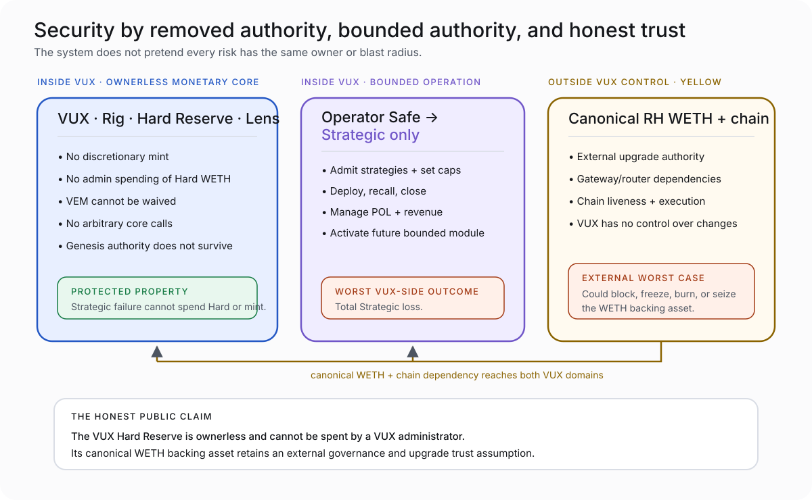

# VUX Trust and Dependencies

> **Accepted external snapshot:** 2026-08-09, carried through Cycle-002 closeout. Canonical WETH implementation, authority, and upgrade facts must be re-verified immediately before production deployment and public launch.

VUX is not absolutely trustless.

The Aetherwell / Hard Reserve contract is designed to be immutable and ownerless. Its backing asset is canonical Robinhood Chain WETH, which retains an external Robinhood Chain governance and upgrade trust assumption.

Both statements must appear together.

## Internal authority versus external trust



VUX can remove its own Reserve administrator. It cannot remove authority embedded in the canonical asset or chain beneath it.

## Canonical RH WETH — YELLOW dependency

The accepted research snapshot recorded:

| Fact | Accepted snapshot |
|---|---|
| Canonical address | `0x0Bd7D308f8E1639FAb988df18A8011f41EAcAD73` |
| Implementation lineage | Byte-verified canonical Arbitrum `aeWETH` behavior at the accepted snapshot |
| Ordinary behavior observed | No ordinary pause, blacklist, fee, rebase, arbitrary mint, force-transfer, or transfer hook |
| Bridge-specific behavior | Gateway-constrained burn primitive |
| Upgradeability | Token, gateway, and router upgradeable |
| Adverse authority path | 7-of-8 authority with a direct no-delay upgrade path; a parallel timelocked path also existed |
| Worst case | Could block, burn, freeze, or seize Hard Reserve WETH |
| VUX control over that path | None |

This is classified **YELLOW** because the risk is external, material, and not structurally removable by VUX.

The accepted address and authority facts are not evergreen documentation. If deployment-time verification finds a different implementation, authority set, or upgrade path, the disclosure—and possibly the launch decision—must be revisited.

## What ownerless does and does not mean

Ownerless means no VUX-side administrator can:

- withdraw Hard WETH;
- redirect redemption;
- invest Reserve capital;
- lend Reserve assets;
- repair Strategic loss from Hard;
- pause VEM to force unsupported issuance; or
- use an arbitrary call to seize backing.

Ownerless does not mean:

- canonical WETH cannot be upgraded;
- Robinhood Chain cannot halt;
- an immutable contract contains no defect;
- redemption has a guaranteed external exit window; or
- every interface or dependency is governance-free.

## Operator Safe — bounded internal trust

The operator Safe is trusted to manage Strategic capital. Production signer composition and threshold remain an open launch input.

Its authority includes bounded Strategic functions such as strategy admission, caps, deployment, recall, POL operations, revenue allocation, and the future Signal module boundary.

It holds no role on the Hard Reserve, VUX token, Rig, or Lens.

Worst case:

```text
operator Safe compromise
→ total Strategic loss
→ Hard backing unchanged
→ no authorized VUX mint
```

That is a serious loss, but it is not a hidden Reserve risk.

## Robinhood Chain liveness

If the chain is unavailable:

- takeovers stop;
- mining settlement waits;
- redemption waits;
- Strategic actions wait; and
- current on-chain data may be unavailable.

VUX does not reclassify balances or create compensation because time passed during a chain outage. Interfaces should degrade to explicit “data unavailable” states.

## Frontend, Lens, and indexer

The Hive Interface and indexer are truth-delivery dependencies, not monetary authorities.

- Lens provides canonical read calculations but creates no entitlement.
- The indexer reconstructs events for history and product presentation.
- The frontend submits transactions and explains state.

If any of them fails, the contracts remain the source of truth. A failed interface can mislead or become unavailable, so UI provenance, chain guards, parity tests, and explicit stale-data handling matter even though the frontend cannot spend Hard WETH.

## Liquidity and market dependencies

Canonical POL provides a protocol-owned VUX/WETH market venue. It does not promise:

- a stable VUX market price;
- a particular depth or spread;
- continuous third-party order flow;
- that market price equals Hard backing; or
- that a holder can exit through the pool at the same value as pro-rata redemption.

Market liquidity and Hard redemption are separate paths with different mechanics.

## Production-time dependency checks

Before launch, the operator must independently confirm:

- canonical WETH address, implementation, gateway/router, authority, and upgrade paths;
- chain EVM/hard-fork compatibility;
- production block gas and initcode constraints;
- archive-capable RPC availability for reproduction;
- final Safe signer composition and threshold;
- frontend/indexer production configuration; and
- the exact deployment/build identity.

Q-4 legal review also blocks public launch and must cover public descriptions of Strategic and future Signal rights.

## Claim rules

Avoid:

- “trustless backing”;
- “governance-free WETH”;
- “immutable asset stack”;
- “the multisig cannot cause losses”; or
- “audited means risk-free.”

Prefer:

> The VUX Hard Reserve is ownerless and cannot be spent by a VUX administrator. Its canonical WETH backing asset retains an external governance and upgrade trust assumption.
