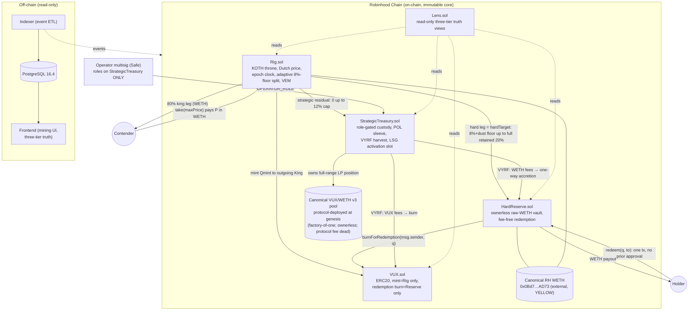
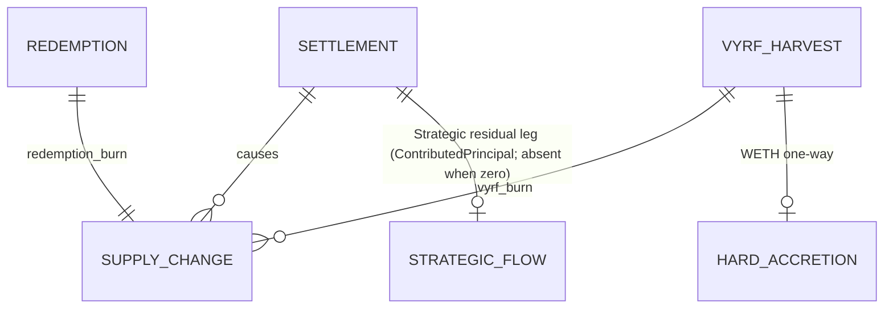
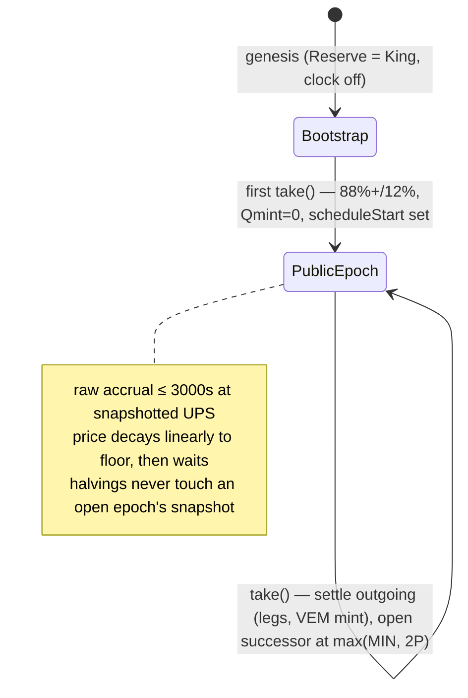

# Software Design Document: VUX v1

**Version:** 1.7.1 (v1.6.0 + adaptive-routing reconciliation amendment + focused revenue-surface remediation, both 2026-08-12 — Appendix F; cycle-002 "VUX v1 Strategic Treasury")
**Date:** 2026-08-09 (amended 2026-08-12)
**Author:** Architecture Designer Agent (Loa `/architect`, unattended operator-dispatched node); v1.7.0 amendment by the authorized consolidated reconciliation node
**Status:** `SDD_ACCEPTED` (v1.6.0, 2026-08-10) — v1.7.0 renders the 2026-08-12 founder acceptance; reconciliation-package operator acceptance pending (Appendix F)
**Operator acceptance:** 2026-08-10 — `OPERATOR_ACCEPTANCE` (v1.6.0 baseline); the v1.7.0 amendment's controlling authority is the `FOUNDER_ACCEPTANCE_COMPLETE` record of 2026-08-12
**PRD Reference:** `grimoires/loa/prd.md` v2.1.1 (`PRD_ACCEPTED` baseline + adaptive-routing amendment + revenue-surface remediation; all `prd.md:L…` citations herein remain position-valid — every in-body PRD edit was line-count-neutral, PRD Appendix C incl. §C.7)

> **Authority discipline.** This SDD decides exactly the items the PRD reserves to `/architect` (prd.md:L854-L868) and nothing more. Every frozen parameter is carried verbatim from PRD Appendix A (prd.md:L1000-L1028). No operator-reserved decision (PRD §16, R-1…R-14) is resolved here; no research-guidance value (PRD §17) appears here as a parameter. Any conflict between this SDD and the PRD resolves for the PRD.

---

## Table of Contents

1. [Project Architecture](#1-project-architecture)
2. [Software Stack](#2-software-stack)
3. [Database Design](#3-database-design)
4. [UI Design](#4-ui-design)
5. [API Specifications](#5-api-specifications)
6. [Error Handling Strategy](#6-error-handling-strategy)
7. [Testing Strategy](#7-testing-strategy)
8. [Development Phases](#8-development-phases)
9. [Known Risks and Mitigation](#9-known-risks-and-mitigation)
10. [Open Questions](#10-open-questions)
11. [Appendix](#11-appendix)

---

## 1. Project Architecture

> Sources: prd.md:L47 (six co-designed surfaces), L184-L186 (P0 capability), L368-L373 (FR-4), L385-L390 (FR-5), L415-L421 (FR-7), L433-L440 (FR-8), L679-L685 (NFR-SEC), L737-L748 (§14 role model), L855-L866 (§19 reservations)

### 1.1 System Overview

VUX v1 is a set of Solidity smart contracts on Robinhood Chain (an Arbitrum-technology L2) implementing:

> "(1) a permissionless WETH-paid King-of-the-Hill (KOTH) mining game that **is** the public TGE …; (2) an enforceable, ownerless, immutable raw-WETH **Hard Reserve** …; (3) a separately custodied, productive **Strategic Treasury** capitalized by the adaptive Strategic residual of every takeover payment (up to the floor-rounded 12% cap — FR-4); (4) bounded holder-directed Strategic allocation through **LSG** … inactive until operators affirmatively activate it; (5) protocol-owned VUX/WETH market infrastructure (**POL**) with a frozen special fee policy (**VYRF** …); and (6) realized economic activity …" (prd.md:L47)

The on-chain monetary core (KOTH settlement, VEM issuance, redemption) is fully autonomous — "must function without any off-chain actor" (prd.md:L690). Off-chain components (indexer, frontend) are strictly read-only truth surfaces; "Read-only estimates create no entitlement" (prd.md:L539).

### 1.2 Architectural Pattern

**Pattern:** Immutable on-chain monetary core + role-gated peripheral treasury + read-only off-chain periphery (a deliberately *non*-upgradeable, non-proxied contract system).

**Justification:**
- FR-7.2 requires the Reserve surface to be "ownerless; immutable/non-upgradeable; non-pausable; with no arbitrary call, token approval, sweep, successor, migration, or discretionary principal-movement authority" (prd.md:L416). Proxies/upgradeability are therefore prohibited on the monetary core, and by NFR-SEC-1 ("Hard-integrity primacy", prd.md:L679) the entire core inherits that posture.
- NFR-SEC-7 requires "LSG/Strategic/POL/revenue surfaces are structurally incapable of reaching Reserve principal, redemption math, mint authority, or routing constants" (prd.md:L685) — achieved structurally: the Reserve and Rig expose **no** privileged entry points at all; the Strategic Treasury holds no reference that can move Reserve principal or mint.
- The Strategic Treasury is the only surface with human authority, implemented with role-based access control because operators need "Strategy admission/diligence/caps, bounded execution, emergency removal/recall … LSG activation, disclosed policy setting" (prd.md:L560).

### 1.3 Component Diagram



**Authority boundaries made structural:** the operator multisig holds roles **only** on `StrategicTreasury`. `Rig`, `VUX`, `HardReserve`, and `Lens` have no owner, no roles, no pause, no upgrade path — there is no address anywhere that can reach Reserve principal, redemption math, mint authority, or routing constants (INV-14, INV-33; prd.md:L599, L628).

### 1.4 System Components

#### VUX.sol — the token
- **Purpose:** ERC20 with complete-supply truth: "`S` is always complete `VUX.totalSupply()` with no protocol-balance exclusion" (prd.md:L581, INV-1).
- **Provenance:** Adapted from allowlisted Miner Manifold `Unit.sol` (blob `26d491eb…`) / `IUnit.sol` (blob `7069422c…`) at `bcffbf1eb963810acb14a1fd1c73d03a53a085a8` (PROV-2, prd.md:L761). SPDX: `MIT AND GPL-3.0-or-later` (PROV-8).
- **Responsibilities:** genesis mint (constructor): exactly `150_000e18` to `GenesisDeployer` *transiently* for same-transaction canonical POL provisioning (the full amount is LP'd into the StrategicTreasury-owned position before the genesis transaction ends — no address holds loose genesis VUX after deployment, FR-1 acceptance) + `1` raw unit to the Hard Reserve, zero elsewhere (FR-1.1, prd.md:L318); post-genesis mint restricted to the immutable `rig` address (INV-4/INV-5); **exactly two narrow burn paths**: `burn(uint256)` (holder/treasury self-burn — the VYRF and F-46 burn path, since the treasury burns only VUX it itself owns) and `burnForRedemption(address from, uint256 q)` gated to `msg.sender == reserve` (immutable address) — the redemption path, so that `HardReserve.redeem` is **one transaction with no prior ERC20 approval** (FR-7.4 "no approval gate", prd.md:L251). The general allowance-gated `burnFrom` is **deleted** (surface reduction: nothing needs it). The token thus trusts exactly two immutable, ownerless, single-purpose contracts, each with exactly one call site: `rig` may mint (only inside VEM settlement) and `reserve` may burn-for-redemption (only `msg.sender`'s own `q` inside `redeem` — the Reserve's immutable code never passes any other account, verified by review + negative test).
- **Interfaces:** standard ERC20 + `mint(address,uint256)` (`onlyRig`), `burn(uint256)`, `burnForRedemption(address,uint256)` (`onlyReserve`).
- **Dependencies:** OpenZeppelin ERC20 base. **Deliberately excludes** ERC20Votes/hooks/permit-extensions beyond ERC20Permit — the token is immutable, so any future LSG weighting must be computed by an external module, never inside the token (see §1.4 StrategicTreasury / LSG).

#### Rig.sol — KOTH throne, pricing, settlement, VEM
- **Purpose:** "operate the one throne, Dutch price, epoch, payment, adaptive split, outgoing settlement" and never "mint outside VEM; deviate from the frozen adaptive routing law (FR-4)" (prd.md:L740).
- **Provenance:** generic auction/throne skeleton adapted from allowlisted Miner Manifold `Rig.sol` (blob `d362ef35…`) per PROV-2; the adaptive routing law, Reserve-favoring dust arithmetic, `D_R` measurement, and VEM math are `VUX_ORIGINAL_CLEAN_SOURCE_REQUIRED` (PROV-3, prd.md:L762; carried over to the adaptive law per ACC §5.1) and written from the PRD equations only.
- **Responsibilities:**
  - Dutch pricing: `price(t) = max(DECAY_FLOOR, opening × (1 − min(t, 3000)/3000))`; successor opening `max(MINIMUM_OPENING, 2 × P)` (FR-2.3, prd.md:L336).
  - Halving schedule: `epochUPS` snapshotted at epoch open from `INITIAL_UPS >> min((t − scheduleStart)/30 days, 8)` — eight halvings then permanent tail `4/256 = 0.015625` VUX/s (FR-3, prd.md:L351-L353). `scheduleStart` is set at the first public takeover ("Public clock begins at first public King's epoch", prd.md:L176).
  - Settlement (`take`): the full 13-step SPEC §15 outcome (prd.md:L373) — see §1.5 data flow.
  - Bootstrap: deploys with `king = HardReserve`, clock disabled, `Qraw = 0`; no second bootstrap state reachable (FR-6, prd.md:L402-L404).
- **Storage layout (decided):**
  ```solidity
  address public king;              // current throne holder (genesis: HardReserve)
  uint64  public epochStart;        // timestamp epoch opened (genesis: deployment timestamp —
                                    // anchors the bootstrap Dutch decay from BOOTSTRAP_OPENING;
                                    // bootstrap is detected as king == reserve, which forces Qraw = 0)
  uint192 public epochOpening;      // opening reference price (WETH wei)
  uint256 public epochUPS;          // snapshotted UPS (VUX wei/second)
  uint64  public scheduleStart;     // set once at first public takeover
  uint64  public epochId;           // monotonic settlement counter
  uint256 public totalStrategicContributed; // cumulative Strategic legs — variable residual, ≤12% each (accounting truth)
  // immutables: vux, weth, reserve, treasury, BOOTSTRAP_OPENING, MINIMUM_OPENING, DECAY_FLOOR
  ```
  All routing constants (`8_000` King bp, `1_200` **strategic-cap** bp, `10_000` denominator; `EPOCH_PERIOD = 3_000`; `PRICE_MULTIPLIER = 2`) are `constant` — not storage, not settable; since 2026-08-12 they parameterize the adaptive law (`king`, `strategicCap`, `hardFloor`), not a static three-way split (INV-18 as amended; prd.md:L608; Appendix F).
- **Dependencies:** VUX (mint), WETH (SafeERC20), HardReserve (address only — plain WETH transfer + balance measurement), StrategicTreasury (address only — plain WETH transfer).

#### HardReserve.sol — the exit right
- **Purpose:** "hold raw canonical RH WETH; redeem pro rata" and never anything else (prd.md:L739).
- **Provenance:** `VUX_ORIGINAL_CLEAN_SOURCE_REQUIRED` — "Hard Reserve and VEM are implemented from the canonical specification's equations" with post-hoc similarity review against prohibited sources (PROV-5, prd.md:L764).
- **Responsibilities:**
  - `B` is **defined as** `WETH.balanceOf(address(this))` — raw physical holdings, nothing else can enter it (INV-10, prd.md:L595). WETH accretion (settlement legs, VYRF WETH fees) is a plain ERC20 transfer in; there is no deposit function to gate and no accounting cell to corrupt.
  - `redeem(uint256 q, address to)`: **one transaction, no prior approval** — snapshot `B`/`S` pre-redemption → `payout = floor(B × q / S)` → `VUX.burnForRedemption(msg.sender, q)` (burn before pay: CEI) → `WETH.transfer(to, payout)`; zero fee, atomic, Reserve-favoring rounding, `q ≤ S − S_MIN` (FR-7.4/7.5, prd.md:L418-L419). Guarded by `nonReentrant` only — "no approval gate, pause, allowlist, or discretionary block" (prd.md:L251). The burn authority is caller-scoped by construction: the only argument the Reserve's immutable code ever passes to `burnForRedemption` is `msg.sender` — it is structurally incapable of burning any other account's VUX (negative-tested; the token-side gate additionally rejects every caller except the Reserve).
  - Holds the permanent 1-raw-unit VUX seed (`S_MIN` denominator) which it can never transfer (no code path exists).
  - **Constructor-time contamination sanitization (genesis-exactness guard):** because `B` is authority-defined as the physical WETH balance, an adversary pre-funding the *future* Reserve address would otherwise be baked into the actual genesis backing state. The constructor therefore, as its first act, reads `WETH.balanceOf(address(this))` and, if nonzero, transfers the entire pre-existing amount to `msg.sender` — its creator, structurally `GenesisDeployer` (a fixed same-transaction receiver; no parameter exists to misdirect it) — emits `PreGenesisWethSanitized(amount)`, and `require`s its own WETH balance `== 0` before construction completes. **The Reserve is born empty**; genesis later deposits exactly `B0`, so `WETH.balanceOf(HardReserve) == B0` holds exactly at genesis end, the actual `N0 = B0/S0` and `P0/N0 = 1.10` relationships are physically true (not merely true of recorded values), and the first settlements' `B_pre` starts at exactly `B0` — attacker prefunding can neither distort genesis economics nor suppress early `Qsafe`, and it receives zero mint credit. **Why no capability survives deployment:** the sanitization exists only in *init code* — constructor code is discarded at deployment and is not part of the runtime bytecode, so the deployed Reserve contains no transfer-out, sweep, recovery, or admin path of any kind; the runtime surface remains exactly `redeem` + views, ownerless and immutable (verified by runtime-bytecode inspection + negative tests). Sanitized attacker WETH ends as unattributed Strategic inventory via the deployer's step-9 sweep — explicitly distinguished from founder genesis capital (`W_POL + B0`, which arrives only via the in-transaction `WETH.deposit` wrap) by the constructor event and the sweep event.
- **Structural absences (the design):** no owner, no roles, no upgrade, no pause, no arbitrary call, no ERC20 approve of any token, no sweep, no receive-hook, no selfdestruct, no payable functions. The contract's entire external surface is `redeem` + views.

#### StrategicTreasury.sol — first-class risk capital custody
- **Purpose:** "receive/account the Strategic residual leg and protocol-owned risk capital" and never "enter `B`" (prd.md:L741). Custody primitive (PRD §19 item 3) **decided**: a dedicated VUX-original contract using OpenZeppelin AccessControl, with `DEFAULT_ADMIN_ROLE` and `OPERATOR_ROLE` held by an operator Safe multisig (Safe itself is deployment-time infrastructure recorded per R-14).
- **Responsibilities:**
  - Passive receipt of the Strategic residual leg — variable, `0 ≤ strategic ≤ floor(12%·P)`, possibly zero (plain WETH transfer from Rig inside settlement, skipped when zero — no callback, minimizing settlement's external-call surface). Cumulative contributed principal is accounted in `Rig.totalStrategicContributed` + `Settled` events (classification: "Strategic contributed … principal", prd.md:L452).
  - POL sleeve: owns the canonical full-range V3-style LP position **directly on the pool** (no v3-periphery / no position NFT — §1.6). Operator-gated `mintPolPosition`, `increasePol` (existing/purchased VUX + Strategic WETH only — no mint path exists anywhere, INV-26), `decreasePol` (returned principal classified as principal, INV-28), and `buyVuxForPol(wethIn, minVuxOut, sqrtPriceLimit)` — the answer to "how is protocol-owned VUX sourced for later POL without minting": (a) VUX returned by `decreasePol`, or (b) an in-protocol, slippage-bounded swap of Strategic WETH on the canonical pool. The swap keeps custody inside the protocol at all times (no transfer-to-operator step exists), and purchased VUX books as POL inventory principal (F-36/F-37; R-13 tactics remain operator-reserved).
  - **Storage/state ownership (decided):** the treasury owns exactly these accounting cells — `outstandingPrincipal[strategy][asset]` (deployed-asset cost basis), `unitsHeld[strategy]` (UNITIZED mode only), `realizedRevenue[asset]`, `polVuxPrincipal`, `polWethPrincipal`, the earmark `signalerBudget[asset]` (the sole revenue earmark — the former `marketInfraBudget` is deleted, 2026-08-12 remediation, Appendix F note F-2), `opsRecipient`, `lsgModule`, and the admission registry `(strategy → mode, per-asset {cap, maturesAt}, active)`. No mark/NAV cell exists on-chain (INV-30 is structural; `T_nav` is an indexer analytic). Single-writer: no other contract writes treasury state; the treasury writes no other contract's state. **Constructor immutables (complete):** `WETH`, `VUX`, `HARD_RESERVE` (VYRF WETH-fee destination), `VUX_POOL_DEPLOYER`, `POOL`, `TOKEN0`/`TOKEN1`, `FEE_TIER`, and the full-range tick bounds derived from the verified pool's `tickSpacing()` — all fixed at construction (the protocol-deployed pool exists and is verified *before* the treasury in the genesis order, §1.4/GenesisDeployer); the constructor re-verifies `POOL.factory() == VUX_POOL_DEPLOYER`, `IUniswapV3Factory(VUX_POOL_DEPLOYER).owner() == address(0)` (protocol-fee authority permanently dead), and token ordering/fee; no `setPool`, initializer, or wiring authority exists at any time. Both roles are granted in the constructor to **`msg.sender` — the creator, structurally `GenesisDeployer`** (no `genesisOperator` argument exists to misconfigure, and the external genesis caller receives nothing).
  - **VYRF harvest** — `harvestPol()`, deliberately **permissionless** so that "operational conveniences … may be assisted but their absence must not corrupt classification" (prd.md:L690, NFR-REL-2). Keepers are *useful, never necessary*; unharvested fees simply accrue inside the pool position and are counted nowhere until collected (FB-8: "No anticipated revenue counted"). Exact mechanics — in the v3 position model `collect` withdraws **everything** credited to `tokensOwed` (fees *and* any principal credited by a prior `burn`), so the fee/principal separation is realized by **ordering**, not by the `collect` call alone:
    - `harvestPol()`: `pool.burn(tickLower, tickUpper, 0)` (a zero-liquidity "poke" that credits accrued fees to `tokensOwed`) → `pool.collect(treasury, …, max, max)`. Because `decreasePol` always sweeps its own principal atomically (next bullet), **`tokensOwed` outside a `decreasePol` execution consists of fees only** — a tested invariant (§7). Collected VUX fees are burned and WETH fees transferred to `HardReserve` in the same call; neither can touch principal (FR-11, prd.md:L481-L486).
    - `decreasePol(liquidity)`: poke + collect fees first (classified VYRF exactly as above) → `pool.burn(…, liquidity)` (credits principal) → `pool.collect` for exactly that principal → booked as returned POL principal against the `polVuxPrincipal`/`polWethPrincipal` cost-basis cells (INV-28; returned VUX stays non-voting/non-redeeming POL inventory, returned WETH becomes Strategic dry powder). Fee-vs-principal classification is therefore mechanical and cannot be confused in either direction.
    - Harvest performs no swap (no slippage surface), needs no standing approval (v3 pushes on `collect`), and is `nonReentrant`.
  - Classification events for every inflow/outflow in the five FR-9.1 classes (prd.md:L452).
  - **LSG activation authority (P0):** `address public lsgModule` (launch value `address(0)` = inactive) + `activateLSG(address module)` / `deactivateLSG()` gated by `OPERATOR_ROLE` and emitting `LSGActivated`/`LSGDeactivated` — an "explicit operator-controlled activation authority present" while "LSG inactive" at launch (FR-13 acceptance, prd.md:L522). No calendar or numeric threshold appears in code (F-50). The `ILSGModule` interface (see §5.2.5) is signal-only: the treasury never grants the module any transfer, admission, or role authority — satisfying "every LSG-prohibited authority … structurally unreachable" (prd.md:L523). The complete LSG mechanism (representation, weighting, time semantics, execution, anti-capture, emergency) is decided in **§1.11**; only the module's *implementation* remains P1.
  - Strategy admission registry (P0 code, P1 use): `admitStrategy(strategy, asset, cap, mode)` / `removeStrategy` (`OPERATOR_ROLE`), bounded `deployToStrategy`/`recallFromStrategy` restricted to admitted targets within per-(strategy, asset) caps. The **accounting `mode`** (`NETTING` | `CLAIM` | `UNITIZED`, §1.10) is fixed per strategy at admission and immutable thereafter — changing it means remove + re-admit, which re-runs the maturity delay. Admission **matures after `ADMISSION_DELAY = 24 hours`** before any deployment — an asymmetric structural guard (slow to add risk, instant to remove it) that turns a compromised-operator drain into an on-chain-visible pending admission with a response window (§1.12); **accepted by the operator (2026-08-10) as the current architecture constant**. Removal and recall are always instant and cannot be blocked by any signal (UC-10, prd.md:L303-L306). All value flows in/out run through the three typed classification primitives of §1.10 (`returnFor`, `harvestYield`, `redeemUnits`); bare transfers default to principal-side inventory, never revenue.
- **Structural absences:** holds no reference to any Rig/Reserve/VUX privileged function (none exist); cannot mint; cannot redeem POL VUX against the Reserve as treasury conduct — enforced by **not implementing** any code path that calls `HardReserve.redeem` (FR-10.3), verified by review + a negative test.

#### Lens.sol — read-only truth periphery
- **Purpose:** "truthful epoch/price/opportunity/estimate/accounting views" that "create no entitlements" (prd.md:L748).
- **Responsibilities:** the FR-15 three-tier truth as three distinctly named views (§5.2.4): `rawClockLimit()` (tier 1), `estimateIfDisplacedNow()` (tier 2 — computed via current price, current `B`/`S`, and VEM math; explicitly variable), `minedToDate(address)` via indexer (tier 3 is settlement history, not a live view). Plus current Dutch price, epoch state, `B`, `S`, `B/S`, Strategic contributed principal.

#### GenesisDeployer.sol — one-shot deployment (exact wiring decided; non-griefable by construction)
- **Purpose:** atomically instantiate the exact frozen genesis (FR-1) **inside its own constructor** — the launch transaction *is* the `GenesisDeployer` creation transaction, so no `genesis()` entry point, founder gate, or callable launch surface exists at all (nothing to trigger, front-run, or replay; constructors run exactly once by EVM law). Afterward it is inert bytecode: no authority, no balances, no roles. Launch consists of exactly **two founder transactions** (§1.7): tx1 deploys the inert `VuxPoolDeployer` (below); tx2 — the launch transaction — creates `GenesisDeployer`, carrying the genesis funding as native value which the constructor wraps via canonical `WETH.deposit()` (no prior approval to any predicted address is ever published).
- **Founder security requirement (binding):** genesis must succeed, at the intended addresses and with the exact intended economics, even if an adversary knows **every** future VUX-system address in advance. The structural theorem now has two halves: **(1) no step of genesis reads or writes any shared permissionless namespace** — every contract is created in a namespace exclusively controlled by its own creator's account (CREATE addresses derive from the creator's address+nonce; the pool's CREATE2 address derives from `VuxPoolDeployer`'s address+salt+init-code-hash — in both cases only that account's own execution can deploy there), the canonical pool comes from protocol-owned one-shot infrastructure rather than a public factory (§1.6), and the only external contract touched is canonical WETH; **(2) no assertion — and no economic quantity — depends on an attacker-reachable balance** — anyone can transfer WETH to a predicted address before its code exists, so every intended flow is verified as a **measured delta of that flow**; the one authority-defined balance (the future Hard Reserve, since `B ≡ WETH.balanceOf(reserve)`) is **mechanically sanitized in its own constructor before the immutable runtime exists**, so the Reserve is born empty and ends genesis at exactly `B0`; all other pre-existing balances are classified (sanitized, inventoried, or stuck — see the prefunding-defense table below); and no exact check was weakened to `≥`: exactness is preserved by construction, not abandoned. Therefore no `require` in genesis can be made to fail — and no economic quantity can be altered — by any adversary, mempool observer, or block builder, regardless of what they know or pre-fund. Address confidentiality (§1.7) is launch hygiene on top of this, never the security boundary.
- **Wiring method (decided):** the immutable cross-references contain two 2-cycles (`VUX↔Rig`, `VUX↔HardReserve`), so at least one edge of each cycle must be constructed against a *predicted* address. The selected method is **CREATE nonce-prediction with in-transaction verification** — inside one genesis transaction, `GenesisDeployer` deploys its children with plain `CREATE`, whose addresses are a pure function of `(deployer address, deployer nonce)` (contract nonces start at 1); the deployer computes `predict(n) = keccak256(rlp([address(this), n]))[12:]` for the two forward references it needs, passes them as constructor args, and **requires equality with the actual deployed addresses immediately after construction — any mismatch reverts the entire genesis** (fail-closed: mis-wiring cannot produce a partially usable deployment). CREATE2 was rejected **for the five VUX protocol contracts** (both sides of a 2-cycle cannot embed each other in `init_code` — circular hash — and breaking the circle via post-deploy setters would create exactly the initializer authority this architecture forbids); the canonical pool, by contrast, **is CREATE2-deployed, because that is the exact pinned upstream semantics**: canonical `UniswapV3PoolDeployer.deploy()` executes `new UniswapV3Pool{salt: keccak256(abi.encode(token0, token1, fee))}()`, so the pool address is `create2(vuxPoolDeployer, keccak256(abi.encode(token0, token1, fee)), POOL_INIT_CODE_HASH)` — where `POOL_INIT_CODE_HASH` is the keccak of the pinned pool creation code (constant, because the `parameters()` pattern keeps init code argument-free; recorded as a refreeze/deployment-evidence artifact). Byte-faithful vendoring is preserved precisely by *not* rewriting this to CREATE (v1.4.0's nonce-based pool-address statements were inaccurate and are corrected throughout). Exclusivity is unchanged: a CREATE2 address is bound to the deploying account — an adversary who knows every input can *compute* the pool address but can never deploy into `VuxPoolDeployer`'s `0xff` namespace, and pre-funding that address with tokens neither blocks CREATE2 (EIP-684 collision requires code/nonce, which no third party can place there) nor affects the pool (see prefunding table). The pool is **created and verified before the treasury is constructed**, so the treasury's pool identity is an ordinary verified constructor immutable — no "wire the pool in later" step, setter, or initializer exists anywhere. Nonce stability: the pool CREATE2 consumes **`VuxPoolDeployer`'s** nonce, not `GenesisDeployer`'s, and `pool.initialize` is a plain call, so `predict(4)` for the treasury remains valid — proven in-transaction by the `predict(4)` equality check and rehearsed by a mutated-nonce negative test (§7). Founder-level wiring is **commitment-based, not address-based** (§1.7 confidentiality): tx1 gives `VuxPoolDeployer` only `commitment = keccak256(abi.encode(genesisDeployerAddr, salt))` with a high-entropy secret salt — nothing derivable is published; during genesis, `deployCanonicalPool(salt, …)` verifies `keccak256(abi.encode(msg.sender, salt)) == commitment`, binding the one-shot to the real `GenesisDeployer` (unforgeable even by an observer who extracts the salt from the pending launch transaction, since `msg.sender` cannot be faked; a wrong commitment wastes only inert infrastructure, which is redeployed).
- **Deployment order (launch = two founder transactions; genesis executes inside `GenesisDeployer`'s constructor; GenesisDeployer CREATE nonces 1–5; pool via `VuxPoolDeployer` CREATE2):**
  - **tx1** *(pre-launch, inert)*: deploy `VuxPoolDeployer(commitment)` — publishes only its own address, its bytecode, and a 32-byte salted commitment; no protocol address is derivable from it (§1.7). It holds no funds or roles and nothing callable to any effect without the commitment preimage.
  - **tx2 — the launch transaction**: create `GenesisDeployer{value: ethForB0AndPol}(…)`; its **constructor** performs all of the following atomically:
  0. **Contamination snapshot + funding**: record `wethPreSelf = WETH.balanceOf(address(this))` (unsolicited pre-genesis transfers to the deployer — classifiable, never trusted); wrap the transaction's native value: `WETH.deposit{value: msg.value}()` — genesis is funded **in-transaction** with exactly the founder contribution `W_POL + B0`, so no WETH approval or transfer to a predicted address is ever published pre-launch.
  1. `HardReserve(weth, vux = predict(3))` — deployer nonce 1. Its constructor **sanitizes any pre-existing WETH** at its own address (transfers the full amount to `msg.sender` = this deployer, emits `PreGenesisWethSanitized`, requires own balance `== 0`) — **the Reserve is born empty** and no sanitization capability survives into the runtime bytecode (§1.4 HardReserve).
  2. `Rig(weth, reserve = actual₁, vux = predict(3), treasury = predict(4), pricing immutables)` — deployer nonce 2.
  3. `VUX(rig = actual₂, reserve = actual₁)` — deployer nonce 3; constructor mints `150_000e18` to `msg.sender` (the deployer, transiently) + `1` raw unit to `reserve`; **verify `address(vux) == predict(3)`**, else revert. (VUX itself is unforgeable pre-genesis: the token does not exist before this step, so no adversary can ever hold or pre-place VUX.)
  4. **Deploy + initialize the canonical VUX/WETH pool through protocol-owned infrastructure**: `pool = vuxPoolDeployer.deployCanonicalPool(salt, vux, weth, feeTier, tickSpacing)` — one-shot, commitment-gated, **CREATE2 with the exact canonical semantics** (upstream salt `keccak256(abi.encode(token0, token1, fee))`); `VuxPoolDeployer` enforces the §-Finding-4 parameter domain (token sort/nonzero/distinct; `fee < 1_000_000`; `0 < tickSpacing < 16384`); then `pool.initialize(sqrtP0X96)` — atomically first, since the pool only became callable this instant. **Verify**: `pool == create2(vuxPoolDeployer, keccak256(abi.encode(token0, token1, fee)), POOL_INIT_CODE_HASH)` (exact derived address); `pool.factory() == vuxPoolDeployer`; `pool.token0()/token1() == sorted(vux, weth)`; `pool.fee()/tickSpacing()` match; `IUniswapV3Factory(vuxPoolDeployer).owner() == address(0)` (protocol-fee authority permanently dead); `slot0.sqrtPriceX96 == sqrtP0X96` exactly — else revert.
  5. `StrategicTreasury(weth, vux = actual₃, reserve = actual₁, poolDeployer = vuxPoolDeployer, pool = verified₄, feeTier)` — deployer nonce 4; **verify `address(treasury) == predict(4)`**, else revert (this equality also *proves* the pool-deployment step consumed no GenesisDeployer nonce). The constructor receives **every immutable identity it will ever need** — there is no `setPool`, initializer, proxy, or discretionary wiring authority — grants both roles to `msg.sender` (**the creator: `GenesisDeployer`, transiently, inside this transaction only** — no role argument exists, so no external party can ever receive authority), and independently re-verifies its own wiring (`POOL.factory() == VUX_POOL_DEPLOYER`, owner-is-zero, token ordering, tick bounds from `pool.tickSpacing()`).
  6. `Lens(actual addresses)` — deployer nonce 5; no forward references.
  7. Provision POL: the deployer transfers the 150,000 VUX + the recorded POL WETH into the treasury, which mints the full-range position via `treasury.mintPolPosition`, paying the pool exactly what it demands through the one-shot authenticated mint callback (§1.6). Liquidity quantization dust (at most a few wei of either token, from v3's liquidity-unit rounding) remains treasury-held POL inventory — evented, principal-classified, never revenue. Transfer exactly `B0` WETH to `HardReserve` (delta-verified).
  8. Grant `DEFAULT_ADMIN_ROLE` + `OPERATOR_ROLE` to the operator Safe.
  9. Renounce both roles from the deployer; **sweep any residual deployer WETH** — arithmetically equal to `wethPreSelf` plus the amount sanitized out of the Reserve in step 1, since every intended flow was exact — to the treasury as unattributed Strategic inventory (§1.10 rule 5; explicitly attacker-donation-classified, never founder capital, never revenue), then require `WETH.balanceOf(address(this)) == 0` **exactly**.
  10. Run the closing self-verification below — any failure reverts the complete launch transaction (and with it, `GenesisDeployer` itself never comes into existence).
- **Unsolicited-prefunding defense (per predicted address — attacker sends arbitrary WETH pre-genesis; each case proven grief-free):**

  | Predicted address | Unsolicited pre-genesis WETH is… | Why it cannot grief or distort |
  |---|---|---|
  | `GenesisDeployer` | **Mechanically sanitized** (step 9: swept to treasury as Strategic inventory, then exact-zero check) | Intended flows are delta-exact, so residual ≡ donations; the exact-zero assertion is checked *after* sanitization — unforgeable and ungriefable |
  | Future `HardReserve` | **Mechanically sanitized in-constructor** — the full pre-existing amount (arbitrarily large) is transferred to the deployer before the immutable runtime exists, evented (`PreGenesisWethSanitized`), and ends as unattributed Strategic inventory via the step-9 sweep; the closing check is the exact frozen invariant `balanceOf(reserve) == B0` | The Reserve is born empty, so prefunding **cannot alter the actual genesis backing state**: physical `N0 = B0/S0`, `P0/N0 = 1.10`, and the initial VEM `B_pre = B0` all hold exactly; the donation receives zero mint credit and zero revenue classification, and is explicitly distinguished from founder capital (`W_POL + B0` arrives only via the in-tx `WETH.deposit` wrap). Sanitization exists only in init code — the deployed Reserve retains no sweep/recovery/admin path (runtime-bytecode-verified). *Post-genesis runtime* donations remain the separate, long-accepted benign class (§9.1: they only raise `B` and lower future `Qsafe`) |
  | Future `VUX` / future `Rig` / future `Lens` | **Provably stuck** | No code path in any of these contracts reads, moves, or asserts their own WETH balance; no sweep exists; value is permanently inert (same class as stray tokens on the Reserve, §1.12) |
  | Future `StrategicTreasury` | **Lawful Strategic donation** | Exactly §1.10 rule 5: unattributed bare transfers default to principal-side inventory — never revenue, never distributable; no genesis assertion demands an exact treasury balance |
  | `VuxPoolDeployer` | **Provably stuck** | No WETH-touching code; no balance assertion |
  | Future canonical pool (CREATE2 address is computable) | **Provably harmless/stuck** | Pre-funding neither blocks CREATE2 (EIP-684 collision requires code/nonce, which no third party can place) nor moves `slot0` nor credits any position: v3 verifies mint/swap payments as *within-operation balance deltas*, so pre-existing balance is baseline, not payment; the donation is unattributed excess owned by no position, and our POL cost-basis cells track only our own deposits |
  | Founder EOA / operator Safe | Out-of-protocol gift | No genesis assertion involves them |

  Forced **native ETH** (via `selfdestruct`-push) to any of these addresses is likewise harmless: no genesis or runtime assertion reads ETH balances, and no protocol contract has a payable path that misinterprets it (`GenesisDeployer`'s constructor wraps only its own `msg.value`).
- **Genesis price encoding (`sqrtPriceX96`, decided — deployment-time arithmetic only, no runtime oracle):** inputs are the founder-approved one-shot conversion record (FR-1.4): exact wei values `P0` (WETH-wei per VUX-wei, as the exact rational `n/d`), `B0`, `S0`. Orientation: `(token0, token1) = addressSort(vux, weth)`; the encoded ratio is token1-per-token0, i.e. `n/d = P0` if VUX is `token0`, else `1/P0`. Encoding (floor convention at both steps, computed off-chain at full precision and supplied as a constant): `sqrtP0X96 = isqrt( (n << 192) / d )`. The pool stores the supplied value verbatim, so the post-initialize check is **exact equality** `slot0.sqrtPriceX96 == sqrtP0X96`. Deployment evidence records: founder `P0` (`n/d`), token ordering, `feeTier`/`tickSpacing`, `sqrtP0X96`, and the *effective encoded price* `sqrtP0X96² / 2^192` with its quantization delta (< 1 ulp) — per FR-1.4's "actual marginal price". The `P0/N0 = 1.10` ratio and the bootstrap-cushion inequality `BOOTSTRAP_OPENING ≤ P0×S0 − B0` are verified in **exact wei arithmetic on the recorded conversion values**, never re-derived from the Q64.96 encoding — no impossible rational equality is demanded of the fixed-point representation.
- **Transient genesis custody of the 150,000 POL VUX** is *non-discretionary by construction*: it exists only inside the single atomic transaction, only in the fixed code path above (mint → transfer to treasury → LP), and the closing self-verification proves it ended where FR-1 requires — no EOA or discretionary address ever holds it, and no code path can exit genesis with it (a revert anywhere destroys the entire deployment instead). This is the minimum custody achievable: the position cannot pre-exist the token it contains.
- **Closing self-verification (all checks EXACT and contamination-proof; any failure reverts the launch transaction):** `S == 150_000e18 + 1`; `vux.balanceOf(reserve) == 1`; `vux.balanceOf(deployer) == 0` (VUX is unforgeable pre-genesis, so this cannot be griefed) and, *after the step-9 sanitizing sweep*, `weth.balanceOf(deployer) == 0`; **`weth.balanceOf(reserve) == B0` — the exact frozen invariant, restored**: the Reserve is born empty (step-1 constructor sanitization) and receives exactly `B0`, so the physical `N0 = B0/S0` and `P0/N0 = 1.10` relationships hold in actual state, not merely in records, and the first settlements' `B_pre` is exactly `B0`; POL position liquidity > 0 and owned by the treasury; **immutable pool identity coherent end-to-end**: `treasury.POOL() ==` the step-4-verified pool `== create2(vuxPoolDeployer, keccak256(abi.encode(token0, token1, fee)), POOL_INIT_CODE_HASH)`, with `pool.factory() == vuxPoolDeployer` and `IUniswapV3Factory(vuxPoolDeployer).owner() == address(0)`; `slot0.sqrtPriceX96 == sqrtP0X96` with `P0/N0 = 1.10` and `BOOTSTRAP_OPENING ≤ P0×S0 − B0` verified on the recorded wei values (cushion, FR-1.4, prd.md:L321 — balance-independent by design); `vuxPoolDeployer` one-shot consumed (a second `deployCanonicalPool` reverts); `rig.king() == reserve` (bootstrap state); **role topology exact**: Safe holds both treasury roles, the deployer holds none, the launch EOA holds none, and no role exists on `VUX`/`Rig`/`HardReserve`/`Lens`. Post-genesis both infrastructure contracts are inert bytecode with zero authority — verified by the checks above and by negative tests.
- The four USD targets are converted **once, off-chain, pre-deployment** by founders (no runtime oracle, prd.md:L321) and passed as immutable constructor WETH-wei values; the conversion evidence (price, source, timestamp, rounding) is recorded in the deployment record per R-14.

#### VuxPoolDeployer.sol — one-shot canonical-pool infrastructure ("factory-of-one")
- **Purpose:** deploy the canonical VUX/WETH pool **inside the genesis transaction, in a namespace only the protocol controls** — the structural answer to pool-pre-creation griefing (§1.6 analysis). It replaces any use of a shared permissionless factory for the canonical venue.
- **Design:** a minimal contract in the vendored v3-core compilation unit (Solidity `=0.7.6`, §2.1) deriving from the pinned `UniswapV3PoolDeployer`, whose exact upstream semantics are preserved: `deploy()` performs `new UniswapV3Pool{salt: keccak256(abi.encode(token0, token1, fee))}()` — **CREATE2**, so the canonical pool address is `create2(vuxPoolDeployer, canonicalSalt, POOL_INIT_CODE_HASH)` (init code is argument-free by the `parameters()` pattern, hence the hash is a build constant recorded at refreeze and in deployment evidence). `deployCanonicalPool(salt, token0/token1, fee, tickSpacing)` is callable **exactly once** and only with the commitment preimage: `require(keccak256(abi.encode(msg.sender, salt)) == COMMITMENT)` — binding the call to the real `GenesisDeployer` without publishing any address pre-launch (§1.7), and immune to phishing/`tx.origin` tricks because the binding is to `msg.sender`. **Parameter-domain checks (Finding 4 — the safety the deleted factory used to provide, re-imposed here without freezing any economic value):** `token0 < token1`, both nonzero and distinct (canonical sort/nonzero); `fee < 1_000_000` (v3 fee is hundredths-of-bip and must be < 100%); `0 < tickSpacing < 16384` (canonical `enableFeeAmount` bound, preserving tick-math safety); `sqrtP0X96` bounds are enforced downstream by the vendored `initialize` itself (`TickMath` requires `MIN_SQRT_RATIO ≤ sqrtPriceX96 < MAX_SQRT_RATIO`) and pre-asserted by `GenesisDeployer` for clear failure, with full-range tick bounds aligned to `tickSpacing` within `[MIN_TICK, MAX_TICK]`. The concrete (fee, tickSpacing) pair remains a founder deployment-time fact (R-14) — domain-checked, never value-frozen. It permanently exposes `owner() == address(0)` — so `pool.setFeeProtocol`/`collectProtocol` (gated upstream to `IUniswapV3Factory(factory).owner()`) are **unreachable forever**. No fee-tier registry, no permissionless `createPool`, no other function exists.
- **Why it is ungriefable:** deployed pre-launch by a founder EOA but inert — no funds, no roles; its single function requires the unpublished commitment preimage *and* the matching `msg.sender`, so it cannot be consumed, and the pool it creates lives in `VuxPoolDeployer`'s exclusive CREATE2 namespace, which no other account can deploy into (computing the address ≠ being able to occupy it; token pre-funding of that address neither blocks CREATE2 nor affects pool state — §1.4 prefunding table). Knowing every predicted address and every parameter in advance gives an adversary nothing to create, initialize, occupy, consume, or poison.
- **Provenance:** requires vendoring the pinned v3-core pool implementation + libraries + deployer pattern — **not yet authorized; exact refreeze delta enumerated in §2.1** (unchanged file census; `POOL_INIT_CODE_HASH` added as a recorded build artifact). The wrapper additions (commitment gate, one-shot, domain checks, `owner()=0`) are VUX-original.

### 1.5 Data Flow — ordinary settlement (the 13-step outcome)

Realization of SPEC §15 as cited in FR-4.6 (prd.md:L373), in checks-effects-interactions order with a `nonReentrant` guard:

```mermaid
sequenceDiagram
    participant C as Contender
    participant R as Rig
    participant W as WETH
    participant H as HardReserve
    participant T as StrategicTreasury
    participant V as VUX

    C->>R: take(maxPrice)
    Note over R: 1-2. identify epoch/outgoing King; fix P = price(now); require P ≤ maxPrice
    R->>H: 3. B_pre = W.balanceOf(H); S_pre = V.totalSupply()
    Note over R: 4. Qraw = bootstrap ? 0 : min(elapsed, 3000) × epochUPS
    R->>W: 5. transferFrom(C, Rig, P)  — collect payment
    Note over R: 6. king=floor(P×8000/10000); retained=P−king; strategicCap=floor(P×1200/10000); hardFloor=retained−strategicCap;<br/>D_need=ceil(Qraw×B_pre/S_pre); hardTarget=min(retained, max(hardFloor, D_need)); strategic=retained−hardTarget
    R->>W: 7. transfer(T, strategic) — Strategic residual delivered & classified [skipped when zero]
    R->>W: 8a. transfer(H, hardTarget [+king if bootstrap])
    R->>H: 8b. D_R = W.balanceOf(H) − B_pre; require D_R == hardTarget (+king at bootstrap), else REVERT
    Note over R: 9. Qsafe = mulDiv(D_R, S_pre, B_pre) [floor]; Qmint = min(Qraw, Qsafe)
    Note over R: 12'. EFFECTS: king=C; epochStart=now; epochOpening=max(MIN_OPENING, 2P); snapshot epochUPS; epochId++
    R->>V: 10. mint(outgoingKing, Qmint)   [skipped when Qmint = 0]
    R->>W: 11. transfer(outgoingKing, king leg)   [ordinary only]
    Note over R: 13. emit Settled(...) — single atomic tx: all or nothing
```

Design notes:
- **Atomicity** (INV-21) is the transaction boundary; any revert (including the step-8b `D_R` consistency rejection, FR-5 acceptance, prd.md:L394) unwinds everything.
- **Effects before final interactions:** throne-state writes (step 12') commit before the mint and the outbound king-leg transfer. The payment pull and Hard-leg transfer necessarily precede `D_R` measurement — this is the measured-reality requirement (NFR-SEC-6), and is safe under `nonReentrant` + the YELLOW facts that canonical WETH has "no … transfer-hook" (prd.md:L721); the guard defends against a future adverse upgrade regardless.
- **No prohibited signals (narrowed prohibition):** the function reads only `block.timestamp`, its own storage, `WETH.balanceOf(reserve)`, and `VUX.totalSupply()` — exactly the input set of the sanctioned settlement-local adaptive law, `(P, Qraw, B_pre, S_pre)` — and structurally no "time-phase, macro, NAV, ROOT/GIGA price, market price, oracle data, or operator preference" branch (prd.md:L233; FREEZE-Δ §3.2).
- **Arithmetic:** `Math.mulDiv` (OpenZeppelin) for `Qsafe` and redemption payout — full-precision 512-bit intermediate, floor semantics (NFR-SEC-4). Basis-point legs use native `uint256` (`P ≤ 2^192` is unreachable for WETH amounts; overflow-checked Solidity ≥0.8 everywhere).

### 1.6 External Integrations

| Service | Purpose | API Type | Trust status | Documentation |
|---------|---------|----------|-------------|---------------|
| Canonical RH WETH `0x0Bd7D308f8E1639FAb988df18A8011f41EAcAD73` | Payment + Hard backing asset | ERC20 (external runtime interface, never vendored — prd.md:L725) | **YELLOW** — mandatory disclosure §13 (prd.md:L721-L723) | Robinhood Chain docs (recorded at deployment per R-14) |
| Canonical VUX/WETH pool | Canonical POL venue | **Protocol-deployed** pinned v3-core pool (vendored source post-refreeze, deployed at genesis via `VuxPoolDeployer` — no longer an external runtime dependency) | Non-griefable by construction (below); fee/tickSpacing recorded per R-14 | https://docs.uniswap.org/contracts/v3/reference/overview |
| Robinhood Chain RPC | Runtime | JSON-RPC | FB-17: chain outage delays, never reclassifies (prd.md:L665) | — |

**AMM decision (PRD §19 item 4):** the POL integration targets a **Uniswap-v3-style concentrated-liquidity pool with a single full-range position at genesis, held by the treasury directly on the pool** (no v3-periphery, no `NonfungiblePositionManager`, no position NFT — the treasury implements the mint/swap pay-in callbacks itself, leaving zero standing token approvals). Justification: the v3 position model accounts *accrued fees* separately from *position liquidity*, so the frozen VYRF classification boundary — "The policy applies to incremental fee yield only, not principal" (prd.md:L484) — can be realized as an exact, contract-measured fact via the fee-first collect ordering specified in §1.4 (the tested invariant: `tokensOwed` outside `decreasePol` = fees only). A v2-style pool compounds fees into reserves, making the frozen fee/principal separation an off-chain estimate instead of a measured fact — rejected. Genesis uses full-range (price discovery on a shallow book, prd.md:L466); fee tier, token ordering, and tick facts are recorded at deployment (FR-1.4/R-14); later range tactics remain operator-reserved (R-2, R-13). **The canonical venue is protocol-deployed** (v1.4.0 — the former "fallback" is now the design): the pool is created inside the genesis transaction by the one-shot `VuxPoolDeployer` (§1.4) from pinned v3-core source, so no external factory, registry, or deployment on Robinhood Chain is a launch dependency at all — the former assumption that a v3-compatible AMM exists on RH chain is **deleted, not just de-risked**. A pleasant structural consequence: because the pool's `factory` is `VuxPoolDeployer` with `owner() == address(0)` permanently, the upstream `setFeeProtocol` fee-share switch is **unreachable forever** — no external authority can ever dilute VYRF fee yield on the canonical pool. (External venues may still appear later as optional operator POL *tactics*, R-2/R-13, with their own recorded facts — they are never the canonical genesis venue.) Fee tier and tickSpacing for the canonical pool remain founder deployment-time facts recorded per R-14.

**Genesis-venue non-griefability (Finding-2 analysis — decided).** Founder requirement: knowing the future VUX token address must be insufficient to interfere with genesis. Researched fact about the pinned v3-core factory semantics: `createPool(tokenA, tokenB, fee)` performs **no code-existence check on the tokens** and never calls them, and `initialize(sqrtPriceX96)` is permissionless first-caller — so on any shared factory, an adversary who knows a *predicted* token address can pre-create the (VUX, WETH, fee) pool for **every enabled fee tier** and pre-initialize it at a hostile price *before VUX exists*. The naive "VUX doesn't exist yet, so its pool can't" argument is false and is withdrawn. Options analyzed:

| Option | Who can create / initialize pre-genesis? | Does a leaked VUX address help an attacker? | Post-creation authority | Verdict |
|---|---|---|---|---|
| Shared permissionless v3 factory (v1.3.0 design) | **Anyone** — `createPool` + `initialize` need no token code; namespace `(token0, token1, fee)` occupiable for all enabled tiers; attacker can even add real one-sided WETH liquidity (single-token ranges owe only WETH) | **Yes — fatally**: genesis `createPool` reverts on the occupied namespace (grief), and the only alternative is reusing attacker-influenced state | External factory owner keeps `setFeeProtocol` | **Rejected** for the canonical venue |
| Inspect / adopt / price-correct an attacker pre-created pool | n/a (accepts attacker state) | Yes — attacker chooses initial price and can seed one-sided liquidity; a "corrective" swap trades real value into attacker positions; unbounded adversarial surface | as above | **Rejected outright** (also rejected by the founder requirement verbatim) |
| Fresh full `UniswapV3Factory` deployed at genesis | Nobody pre-genesis (factory doesn't exist) — property achieved | No | But: permissionless `createPool` forever on a protocol-branded factory, an owner with fee-tier + protocol-fee authority, and the full factory source vendored — extra surface for zero extra safety | Rejected — dominated by the one-shot deployer |
| **One-shot `VuxPoolDeployer` (selected)** | **Nobody** — the pool is CREATE2-deployed (exact canonical salt semantics) in `VuxPoolDeployer`'s exclusive `0xff` namespace, only during genesis, only on the single commitment-gated call; initialization happens in the same atomic transaction the pool is born in; pre-funding the computable pool address neither blocks CREATE2 nor affects pool state (§1.4 prefunding table) | **No — knowing every future address gives nothing to create, initialize, occupy, consume, or poison**; a mempool observer / block builder has no shared-state `require` to race and cannot use an extracted salt (commitment binds `msg.sender`) | None: `owner() == address(0)` permanently; protocol fee dead; no temporary authority survives (one-shot consumed, verified in the closing sweep) | **Selected** — smallest topology satisfying the requirement; costs the §2.1 vendored-pool refreeze delta |

Attacker lookalike pools on public factories remain possible and are simply **irrelevant**: no VUX contract ever references a registry lookup — the canonical pool identity is the treasury's constructor immutable, and callback authentication binds to exactly that address. Private transaction submission remains available as operational defense-in-depth (§1.7) but is **not** load-bearing: the protocol-level reason the attack fails is that genesis touches no shared permissionless namespace.

**Pool callback authentication (decided — VUX-original; no v3-periphery code is imported or copied).** Under the pinned v3-core semantics, `pool.mint` and `pool.swap` collect payment by calling back into the initiator (`uniswapV3MintCallback(amount0Owed, amount1Owed, data)` / `uniswapV3SwapCallback(amount0Delta, amount1Delta, data)`), while `burn` and `collect` have **no** callbacks (`burn` only credits `tokensOwed`; `collect` pushes tokens out). The treasury therefore implements exactly two callbacks, authenticated by a transient operation context rather than by trust in the caller:

- **Verified pool identity:** `POOL`, `TOKEN0`, `TOKEN1`, `VUX_POOL_DEPLOYER`, `FEE_TIER` are **constructor immutables** — realizable because the genesis order deploys and verifies the protocol-owned pool *before* constructing the treasury (§1.4/GenesisDeployer); the constructor re-verifies `POOL.factory() == VUX_POOL_DEPLOYER`, `IUniswapV3Factory(VUX_POOL_DEPLOYER).owner() == address(0)`, and token ordering/fee, and the genesis closing sweep asserts the same identity end-to-end (including the exact CREATE2 derivation `POOL == create2(vuxPoolDeployer, keccak256(abi.encode(token0, token1, fee)), POOL_INIT_CODE_HASH)`). No wiring step, setter, or initializer ever exists; no shared registry is ever consulted. Only this exact pool can ever be a legitimate callback caller — attacker-created lookalike pools on public factories have no standing anywhere in the system.
- **One-shot operation context:** each outer pool operation (`mintPolPosition`/`increasePol` → `CTX_MINT`; `buyVuxForPol` → `CTX_SWAP`) **arms** a context word `{type, maxVuxIn, maxWethIn}` exactly once, immediately before its single pool call. The context is a *single-use authorization*: the callback **consumes it (resets it to `NONE`) after validation and before making any token payment**, so a second callback under the same outer operation — even from the canonical pool — finds no active authorization and reverts. After the pool call returns, the outer operation **requires the context to be consumed** (`NONE`): an authorization can neither survive the operation nor remain silently unused. Context never persists across transactions; the committed maxima are the caller-supplied slippage bounds of the initiating operation.
- **Callback validation order (each violation reverts):** (1) `msg.sender == POOL` (forged caller); (2) the armed context type matches the callback type — a consumed or never-armed context has type `NONE`, so out-of-operation, wrong-type, and duplicate callbacks all fail here; (3) the owed/positive-delta side matches the expected VUX/WETH token direction for the armed operation (for a swap, exactly one delta is positive and it must be on the committed input token); (4) owed amounts `≤` the committed maxima (excess-delta); (5) `data` is required empty (the treasury passes none — malformed-data rejection). Then the context is consumed, and only then is payment made by direct `transfer` — **no standing approvals exist at any time**. This consume-then-pay ordering stays fully compatible with the synchronous v3-core callback contract (pool → one callback → payment verified by the pool before its call returns).
- **Reentrancy interplay (explicit, not assumed):** the outer operations are `nonReentrant`; the callbacks arrive *while that guard is held*, so they deliberately do **not** take the guard themselves — their authentication *is* the one-shot context gate above. Callbacks perform only validation, context consumption, and token payment (no other state writes, no external calls except the token transfers to the pool), so no nested treasury operation can be initiated from inside a callback: every state-changing treasury entry point is either `nonReentrant` (blocked while the outer guard is held) or a callback whose single-use authorization is already consumed. A nested/reentrant/duplicate callback attempt therefore fails on the consumed context, the guard, or both.
- **Slippage:** `buyVuxForPol` keeps `minVuxOut` + `sqrtPriceLimitX96`; for liquidity adds, the committed `max*In` values are the slippage bound. Outputs are verified after the pool call returns (`minVuxOut` checked against the measured VUX balance delta).

**Re-verified VYRF ordering against pinned v3-core semantics:** `burn(tickLower, tickUpper, 0)` is the canonical fee "poke" (a zero-liquidity `_modifyPosition` that updates `feeGrowthInside` and credits accrued fees to `tokensOwed`); `collect` then withdraws exactly what is credited; a subsequent `burn(liquidity)` credits principal to `tokensOwed`; a second `collect` withdraws that principal. Because the whole sequence executes in one transaction, no swap can interleave, so **zero new fees can accrue between the fee-collect and the principal-credit** — the fee-first ordering of §1.4 realizes the frozen VYRF outcome exactly, and the §7 invariant (`tokensOwed` outside `decreasePol` = fees only) holds under these pinned semantics.

**POL range risk (explicit treatment).** Full-range genesis POL is the accepted conservative posture. Concentrated/range management is **not** required by anything in this architecture; later concentration, range moves, or additional positions remain operator-reserved tactics (R-2, R-13) executed through the same authenticated operations. Explicit risk statement: narrower active ranges increase inventory, range, and impermanent-loss risk; a position that exits its selected range stops earning fees and becomes one-sided inventory; **all such outcomes are borne entirely by the Strategic Treasury** — they never change `B`, redemption, VEM, or minting (FB-7: "Price discovery and Strategic NAV may suffer; Hard arithmetic unchanged"), and no range-management oracle, keeper mandate, or automation enters the monetary core. No future range policy is frozen here.

### 1.7 Deployment Architecture

Single chain (Robinhood Chain). **Launch = exactly two founder transactions** (collapsed from three in v1.5.0, evaluated per Finding 3): **tx1** deploys the inert, commitment-gated `VuxPoolDeployer`; **tx2 — the launch transaction — creates `GenesisDeployer`, whose constructor executes the entire genesis** (five CREATEs, CREATE2 pool deployment + initialization, POL provisioning, `B0`, Safe handoff, role renounce, closing sweep), funded by native value wrapped in-transaction via `WETH.deposit()` — no `genesis()` entry point exists, no approval or transfer to a predicted address is ever published, and no third transaction exists to observe. A fully single-transaction launch (folding `VuxPoolDeployer` in too) was evaluated and rejected: it would require embedding the ~24 KB 0.7.6 pool init code as raw bytes inside `GenesisDeployer`'s own init code with assembly CREATE2 (§1.13) — disproportionate complexity for removing one inert transaction. No proxies, no initializers, no post-genesis deployer privilege, no multi-stage migration.

**Confidentiality vs. security (explicit posture).** These are two different layers and the SDD refuses to conflate them. *Security*: the §1.4 structural theorem — no shared-namespace dependence, no attacker-reachable-balance dependence — holds even under **total** leakage of every address, parameter, and the pending launch transaction itself; no security claim anywhere in this document rests on secrecy. *Confidentiality (founder-required launch hygiene)*: the future VUX address must additionally remain **underivable** before launch, and under the two-transaction topology it structurally is: tx1 publishes only `VuxPoolDeployer`'s address, bytecode, and a 32-byte *salted* commitment — the `GenesisDeployer` address hides behind a high-entropy salt (brute-force infeasible, unlike a bare hash of a guessable EOA+nonce), and the VUX address additionally depends on the tx2 EOA and its nonce. **The funding trail is the last derivation window and is closed operationally:** an ordinary public gas-funding transfer to the fresh tx2 EOA would place that EOA on-chain pre-launch, letting any observer compute `GenesisDeployer = f(EOA, nonce 0)` and from it the VUX address. The **production launch posture therefore REQUIRES a private same-block bundle**: {fund-tx2-EOA → tx2} submitted together via private/builder routing so the tx2 EOA's first on-chain appearance *is the launch block* — the VUX address becomes publicly derivable only in the block that irrevocably creates and verifies everything (zero-length public window). tx1 needs no such handling (nothing derivable), though private submission is recommended for it too. This split is explicit: **private routing is REQUIRED for production confidentiality and NON-LOAD-BEARING for security** — if routing fails or leaks, genesis still cannot be pre-created, pre-initialized, pre-funded into failure or distortion, occupied, raced, or poisoned; "security by obscurity" is not claimed anywhere.

**Launch-secret hygiene (repository/CI posture — deployment runbook law, not a protocol dependency):** the following are launch secrets until the launch block and MUST NOT be committed to the public repository or emitted through public CI/logs beforehand: the production launch EOA (address and keys) and its nonce plan; the commitment salt/preimage; every predicted production address; the final genesis manifest (constructor arguments, `sqrtP0X96`, fee/tickSpacing choices); founder conversion inputs where sensitive; builder/private-routing configuration; and production Foundry **broadcast artifacts** (`broadcast/**` for the production chain — these embed addresses, nonces, and calldata). Templates and fake/rehearsal values may remain tracked; rehearsal EOAs and artifacts are never reused for production. After launch, the R-14 deployment record publishes the facts deliberately. Post-genesis the system's deployable surface is: (a) the operator Safe configuration (outside protocol scope), (b) future P1 contracts (LSG module, strategy adapters) which plug into the treasury's admission/activation slots without touching the core. Deployment facts (addresses, blocks, conversion evidence, pool facts, final pins) are recorded per R-14 (prd.md:L795).

### 1.8 Scalability Strategy

No performance/scalability NFRs exist: "No performance/scalability NFRs are invented: authority imposes none, and gas strategy is reserved to `/architect`" (prd.md:L675). Gas posture (PRD §19 item 11) **decided**: correctness-first; no inline assembly in the monetary core; storage reads cached to memory within `take()`; no optimization that changes rounding or ordering semantics. The indexer/frontend scale trivially (single-chain event volume).

### 1.9 Security Architecture

- **Authentication/Authorization:** none on the monetary core (permissionless by requirement, prd.md:L339). StrategicTreasury: OpenZeppelin AccessControl — `DEFAULT_ADMIN_ROLE` + `OPERATOR_ROLE` → operator Safe multisig. That is the complete privileged surface of the protocol (FR-16 acceptance, prd.md:L568).
- **Reentrancy:** `nonReentrant` on `Rig.take`, `HardReserve.redeem`, and all treasury state-changing entry points **except the two pool callbacks**, which execute while the outer operation's guard is held and are instead authenticated by the §1.6 transient-context scheme (caller = exact pool, type/direction/maximum-bounded, cleared after the operation); CEI ordering per §1.5.
- **Oracle surface:** none in the core (NFR-SEC-5). The Dutch price is a deterministic function of `block.timestamp` and stored state.
- **Immutability:** no proxy, no `selfdestruct`, no `delegatecall`, no owner on core contracts (NFR-SEC-2).
- **Boundary unreachability:** enforced by absence of code paths (see structural-absence lists in §1.4) and verified by the §7 negative-test suite (INV-33, FB-15/16).
- **Slippage/MEV:** `take(maxPrice)` caps what a contender can be charged; redemption needs no slippage parameter (deterministic payout). Throne front-running is inherent to KOTH and accepted (fair access ≠ equal outcomes, prd.md:L100).

### 1.10 General Realized-Revenue Architecture (FR-9 P0 accounting; FR-12 policy surface)

> Provenance: `VUX_ORIGINAL_CLEAN_SOURCE_REQUIRED` (DELTA §3 "general realized-revenue classification/policy surface"). Principle: **realized-token-flow accounting — classification is arithmetic, not declaration** (prd.md:L498 "Prefer realized-token-flow accounting" analog; FR-9.3).

**Recognition architecture (per-admission accounting modes).** A single universal "revenue only after all principal returns" rule was **rejected by the operator** for long-lived Strategies: a position that stays deployed for years while paying genuine weekly cash yield must be able to recognize that yield as realized revenue without pretending its principal returned. The replacement keeps classification **arithmetic** — there is still no `declareProfit()`, no operator declaration, and no oracle anywhere — by fixing one of three *measurement disciplines* per strategy at admission (immutable thereafter; §1.4):

| Mode | For | Revenue-recognition guard (mechanical) |
|---|---|---|
| `NETTING` (conservative fallback) | Opaque strategies with no verifiable position handle | The v1.1.0 rule, now scoped instead of universal: inflows via `returnFor` net principal-first; revenue exists only beyond full principal return for that (strategy, asset) |
| `CLAIM` | Claim-style positions (staking/fee claims) where realized yield is paid **without reducing the principal position** — incl. long-lived principal that never exits | `harvestYield(strategy)` (permissionless): records `unitsBefore = adapter.principalUnits()`, calls `adapter.harvest()`, measures **the treasury's own balance deltas** in the reported reward assets (the D_R measured-reality pattern — actual received tokens, never adapter-claimed amounts), requires `adapter.principalUnits() ≥ unitsBefore`, then credits `realizedRevenue[rewardAsset]`. Same-asset yield is legitimate here precisely because the position units did not shrink |
| `UNITIZED` | Vault-like/receipt-share positions (e.g. 4626-shaped) where value accrues into unit price and is realized by redeeming units | `redeemUnits(strategy, units, minOut)`: measured `amountOut` (balance delta) vs. proportionally released cost basis `basisReleased = ceil(outstandingPrincipal × units / unitsHeld)` (clamped; ceiling = conservative, minimizes immediate revenue): excess over basis → `realizedRevenue`; shortfall → **realized loss** (principal reduction, evented — never negative revenue). Deposits record units by measured `principalUnits()` delta |

The three flow primitives compose (a mode is a permission set over them): `NETTING` = `returnFor` only; `CLAIM` = `returnFor` + `harvestYield`; `UNITIZED` = all three. Common rules, all modes:

1. **Outflow** to an admitted+matured strategy (`deployToStrategy` / `deployMarginalBySignal`): `outstandingPrincipal[strategy][asset] += amount` — deployed Strategic principal.
2. **Attributed principal return** via the permissionless `returnFor(strategy, asset, amount)` (pulls via `transferFrom`, classification in-call): principal-first netting against `outstandingPrincipal[strategy][asset]`; only the excess beyond full principal return credits revenue. `returnFor` accepts only assets with outstanding principal (or the admitted deployment asset) — arbitrary-asset "returns" cannot mint revenue.
3. **Realized losses:** `UNITIZED` shortfalls book at redemption; for `NETTING`/`CLAIM`, residual `outstandingPrincipal` after removal + final recall is written off by `closeStrategy(strategy)` (operator, only after removal) as `StrategyLossRealized` — a write-off can only *reduce* principal accounting; it can never create revenue, so it is not a declaration escape hatch.
4. **Adversarial adapters:** an adapter that lies about `principalUnits()` (or mislabels flows) to manufacture "revenue" can, by the same lie, simply steal the funds — classification fraud is strictly no more powerful than theft, and both are bounded by the same admission diligence, per-(strategy, asset) caps, 24 h maturity, instant removal, and Strategic-only blast radius (threat row 9). No mode extends what a malicious strategy could already do.
5. **Unattributed bare transfers** into the treasury default to principal-side inventory — never revenue (conservative default; the 12% settlement leg is attributed by `Rig.Settled` + `totalStrategicContributed`). Trailing value from a removed strategy likewise lands as inventory.
6. **Unrealized marks:** no storage cell for marks exists anywhere on-chain; appreciation that has not been realized as a measured token flow through one of the three primitives is invisible to this surface by construction (INV-30 structural; `T_nav` is an off-chain indexer analytic, never labeled backing, FR-14.4).

POL flows never touch this surface: VYRF fee legs bypass the waterfall by construction (§1.4), and POL principal nets against its own cost-basis cells. Every primitive emits a source-specific event carrying (strategy, mode, asset, principal/revenue/loss split) — observable, source-attributed classification (FR-9 acceptance).

**The distribution surface — the v1.6.0 five-leg design is SUPERSEDED IN PART 2026-08-12 (remediation; Appendix F note F-2):** `allocateRevenue(asset, toCompound, toHard, toOps, toSignalers)` (`OPERATOR_ROLE`) — a **four-leg** P0 revenue accounting/safety surface with amounts as **call-time arguments, never stored constants** (each call is the disclosed policy act, evented). `toOps` is ONLY payment of an ACTUAL APPROVED operating expense from realized revenue — it does **not** encode the founder-accepted future 25% Operator Reserve contribution, whose credit/accumulation/sweep/allocator-exclusion mechanics are a P1/future design obligation before the accepted `50/25/20/5/0` waterfall activates (no person holds a claim before an approved expense is incurred):

| leg | realization | bound |
|---|---|---|
| Strategic compounding | book transfer revenue → dry-powder principal | Σ of all four legs ≤ `realizedRevenue[asset]` — principal and marks are arithmetically unreachable (FR-12 negative acceptance, prd.md:L505-L506) |
| Hard Reserve accretion | transfer to `HardReserve`, one-way | **WETH only** — any other asset reverts (`B` is raw WETH; nothing unredeemable can strand in Reserve custody) |
| Operations/contributors | transfer to `opsRecipient` (operator-set, evented, disclosed) — payment of an actual approved operating expense only; never a same-period entitlement, never the future Operator Reserve credit | revenue-bounded; never principal (FB-9/FB-12: zero revenue ⇒ every leg reverts) |
| LSG/signaler economics | book earmark `signalerBudget[asset]`, spendable only via `fundSignalerProgram(asset, amount, start, end)` → a PROTOCOL-provenance reward program on the active LSG module (§1.11) | revenue-bounded; requires active LSG; observable (FR-13.7, R-11). The operator's X / (total − X) split between marginal capital and signaler rewards is two call-time amounts (`toCompound` later consumed by `deployMarginalBySignal`, vs. this leg) — no ratio exists in code |
| ~~Market infrastructure~~ — **DELETED as a revenue leg (2026-08-12)**: no `toMarketInfra` argument and no `marketInfraBudget` earmark exist | market infrastructure remains a permitted Strategic use, funded through Strategic capital deployment policy from Strategic capital (POL operations act on Strategic principal under R-2/R-13) — never a dedicated realized-revenue waterfall leg (FREEZE-Δ §5.1) | F-52 posture unchanged: own the liquidity; bribe experiments use realized protocol economics under disclosed policy (e.g., compounded revenue subsequently deployed), never Hard Reserve principal, never the primary model |

**VUX-denominated non-POL revenue:** `allocateRevenue` rejects `asset == VUX`; the only path is `burnVuxRevenue()` (F-46 "normally burned" — a different treatment would require new founder authority and a new module, i.e. it is structurally outside v1).

**Hard Reserve principal as revenue:** no path exists — the treasury holds no authority over the Reserve and the Reserve pushes nothing anywhere (§1.4).

### 1.11 LSG Architecture (P0 boundary + activation authority; P1 module implementation)

> The PRD reserves the exact LSG mechanism to `/architect` (prd.md:L860, §19 item 5) — decided here. **SUPERSEDED IN PART 2026-08-12, see Appendix F note F-3:** the founder-accepted epochal doctrine (7-day stake age / 14-day epochs / first-24h fresh signal / fixed frozen opening weight / no carry-forward / global pool / no delegation initially / custody-class one-status eligibility) supersedes this sketch's standing-signal, operator-paced-cadence, and time-integrated-streaming rows; the P1 module MUST be realigned to that doctrine before any P1 build. The P0 surface (activation slot, `ILSGModule`, POL non-voting, treasury-side boundaries, INV-32…34) is unaffected. Provenance: `VUX_ORIGINAL_CLEAN_SOURCE_REQUIRED` (DELTA §3/§4); designed from the PRD boundary only — the pinned external liquid-signal-governance repository remains prohibited source (PROV-4) and was not consulted. Implementation and its boundary-test suite are P1; the activation authority, POL-non-voting rule, and interface ship at P0.

**The one job (F-47):** eligible holders express *relative preference for marginal Strategic deployment among operator-admitted strategies*. Nothing else.

| Decision | Choice | Justification |
|---|---|---|
| Signal representation — **SUPERSEDED IN PART 2026-08-12 (Appendix F, F-3)** | ~~Standing~~ per-staker preference vector `(strategies[], weightsBp[])`, Σ ≤ 10,000 bp, ≤ 16 entries, admitted-targets only; aggregated per strategy — under the accepted doctrine the signal is **epochal**: fresh complete signal in the first 24 hours of each 14-day epoch, opening eligible weight fixed, frozen through close, no carry-forward | Gauge-style *relative* preference retained; no proposals, ballots, quorums, or yes/no questions — LSG never becomes a DAO voting on things |
| Stake vs. balance | **Stake-escrow**: weight = VUX escrowed in the `LSGSignals` module | The immutable token deliberately has no checkpoints/hooks (§1.4), so balance-snapshot voting is impossible without oracle/merkle trust; escrow is flash-swap-immune (stake→signal→unstake inside one tx nets to zero standing weight) and makes protocol-VUX exclusion structural |
| Weight accounting | `aggregate[strategy] = Σ stakeᵢ × bpᵢ / 10⁴`, updated incrementally (O(entries) per staker action); 1 staked VUX-wei = 1 weight-wei | Exact, loop-free reads; no iteration over stakers; no supply-scaling factors |
| Checkpointing / time semantics — **SUPERSEDED IN PART 2026-08-12 (Appendix F, F-3)** | ~~None historical — the signal is standing state~~ — the accepted doctrine fixes epochal time semantics: 7-day minimum continuous stake age before epoch open, 14-day epoch, opening-weight snapshot frozen through close; every consumption still snapshots exactly what it read via `SignalConsumed` | Accountability lives in the epoch snapshot + consumption event; no retroactive reads |
| Delegation | None in v1 | A delegation market is capture surface with no product need for one narrow signal; addable later by module swap without touching anything else |
| Precision | bp (`uint16`) preferences; VUX-wei weights; `mulDiv` floor splits; undeployed remainder stays dry powder | The Reserve-favoring-dust philosophy applied to Strategic: rounding favors *not deploying* |
| Allocation cadence — **SUPERSEDED IN PART 2026-08-12 (Appendix F, F-3)** | ~~No on-chain epoch or timer~~ — the accepted doctrine fixes a 14-day **signal epoch**; capital-deployment *execution* timing within/after epochs remains operator-paced (R-3 preserved: signal cadence is doctrine, deployment timing stays reserved) | The doctrine governs signal eligibility windows, not deployment compulsion |
| Execution interface | `StrategicTreasury.deployMarginalBySignal(totalAmount)` (`OPERATOR_ROLE`): reads `lsgModule.currentAllocationSignal()`, filters to admitted + matured + cap-headroom strategies, splits `totalAmount` pro-rata by weight (floor), clamps at caps, deploys through the same §1.10 principal ledger as manual deployment, emits `SignalConsumed` | Holder-directed *split*; operator-held trigger, size, and safety — exactly UC-9's "bounded execution follows within admission caps" |
| Anti-capture | **Topology first**: the menu is operator-admitted only; caps clamp; execution is operator-held; removal/recall is unblockable; deactivation is instant; **bribes grant no authority** — the bounded `fundBribe` programs (§1.11 rewards) can only target already-admitted strategies and can never cause admission, raise a cap, or touch any core/security surface; their entire effect is on relative signaling weight inside the existing bounded menu; escrow friction defeats flash weight; the treasury cannot stake | The bounded blast radius *is* the defense (FB-11): capture at worst skews marginal flow among already-diligenced, capped strategies. ve-locks and decay curves are disproportionate machinery for a signal that structurally cannot reach anything security-critical; incentive programs are admitted-target-bounded rather than an open votes-for-hire market |
| Activation / deactivation | `lsgModule` slot on the treasury: `address(0)` at launch (inactive); `activateLSG(module)` / `deactivateLSG()` `OPERATOR_ROLE`; **no numeric threshold or calendar date appears in code** (F-50; R-6/R-7 readiness judgment stays off-chain and operator-internal); module swap = deactivate + activate | The affirmative activation authority ships at P0 (FR-13 launch acceptance) with zero mechanism risk at launch |
| Emergency behavior | `deactivateLSG()` severs consumption instantly; `unstake` is permissionless on an **ownerless, immutable** module — nobody can lock stakers in; strategy removal/recall operates independently of signal state | UC-10; FB-10: LSG absent/captured/failed leaves operators fully able to act, and Hard/minting were never reachable |

**Prohibited-authority checklist (FR-13.3, structural):** the module holds only its stakers' voluntarily escrowed VUX; the treasury grants it zero roles, approvals, or asset authority; consumption is a `view` read. Hard Reserve, minting, KOTH routing, redemption, VEM, recipients outside the admitted registry, admission itself, security parameters, exploit response, upgrades — no code path from the LSG surface reaches any of them (§7 negative tests; INV-32…34).

**POL non-voting (F-38, INV-27):** weight derives only from escrowed stake; the pool contract never stakes its POL VUX; the treasury is explicitly rejected as a staker (`staker != strategicTreasury`); therefore protocol-owned voting power ≡ 0 at all times, under any future module, because the treasury-side rule travels with the activation slot's usage, not the module.

**Signaler rewards & bribes (FR-13.7, R-11, F-52) — decided; accrual model SUPERSEDED IN PART 2026-08-12 (Appendix F, F-3).** The folded-engine topology stands (one P1 contract, not two — a separate distributor would need weight-change hooks from the module, and a reverting hook could block `unstake`, which must be ungateable; internal accounting cannot be blocked by an external call), but the continuous time-integrated streaming below must be realigned to the accepted **per-epoch global-pool** attribution (14-day epochs; fresh-signal eligibility; no correctness/profit multipliers; no reward-bearing delegation initially) before any P1 build. Design (pre-realignment record):

- **Program primitive:** a program = `{funding token, amount, window [start, end], target, provenance}` that **streams linearly over its window to time-integrated *applied* signal weight** — a staker's applied weight is `stake × Σbp/10⁴` (global programs) or `stake × bp(strategy)/10⁴` (strategy-targeted programs), maintained by the module's own accumulator (`rewardPerWeight` updated lazily at stake/unstake/setPreference/claim; O(1) per interaction; streaming remainder and zero-weight intervals accrue to a funder-refundable residual).
- **Two provenance classes, one engine, distinguishable end-to-end:** `PROTOCOL` programs are fundable **only by the treasury** via `fundSignalerProgram` (which spends the revenue-bounded `signalerBudget` earmark — §1.10); `EXTERNAL` programs (bribes) are fundable **permissionlessly** by anyone via `fundBribe(token, amount, start, end, strategy)`, which requires the target strategy to be currently admitted. `ProgramFunded` events carry the provenance class and funder — protocol rewards and external bribes are never commingled in accounting (distinct program ids, distinct provenance field).
- **Why rewards accrue to time-integrated applied weight:** (a) it ties rewards to *sustained, actually-pointed* signaling — raw stake with no preferences has zero applied weight and earns nothing; (b) it structurally defeats flash-stake/reward-sniping — a one-block stake earns one block's worth of stream, and within-tx stake→claim→unstake nets ≈ zero; (c) it needs no reward checkpoint history and no coupling to operator consumption timing (consumption-snapshot rewards were rejected: they pay nothing between consumptions and invite sniping around visible pending Safe transactions).
- **What a bribe can and cannot do (structural):** funding a program touches no registry and grants nothing — it cannot admit a strategy, raise a cap, or reach the Hard Reserve, VEM, minting, redemption, KOTH routing, security parameters, or upgrades (the module holds zero authority anywhere; the funding functions write only program-accounting state). A bribe's entire effect is to make signaling toward an already-admitted, already-capped strategy more attractive — the outcome stays inside the same menu + caps + operator-executed consumption (FB-11). If external bribes are zero, nothing anywhere changes: programs are strictly additive.
- **Safety under deactivation:** `unstake` and `claim(programIds[])` are permissionless on the ownerless, immutable module and remain live regardless of LSG activation state — deactivation severs *consumption* (treasury-side), never staker exit or accrued claims; already-funded program windows simply run out (the treasury funds no new ones). Nobody can be trapped by rewards, bribes, or deactivation.
- **Program hygiene:** bribe accrual for a strategy that is later removed lazily halts at the next accounting touch (admission re-checked per accumulator segment); unstreamed residual of any program is refundable to its funder after the window ends (`refundResidual(programId)`) — no stranded funds, and removal stays instant and unblockable.
- **Protocol-owned VUX earns zero rewards** the same way it holds zero weight: the treasury cannot stake, the pool never stakes, and rewards accrue only to applied stake weight (F-38 extended to economics).
- **Provenance note:** the streaming-accumulator math is implemented VUX-original from first principles (standard published accumulator arithmetic); the prohibited external LSG repository (incl. its Synthetix-lineage `Bribe.sol`) remains unconsulted, and the PROV-5-style pre-merge similarity review explicitly covers `LSGSignals` against it (PROV-3/PROV-4; DELTA §3 "future LSG … boundary").

### 1.12 Access Control & Upgrade Posture (per component)

Authority separation as five disjoint planes: **monetary authority** — nobody (pure code: Rig/VUX/HardReserve); **Strategic-management authority** — operator Safe via treasury roles; **LSG allocation authority** — holder signal input, operator-executed, bounded; **emergency/risk authority** — operator Safe (instant removal/recall/deactivation only); **deployment/configuration authority** — genesis-only, self-verifying, retained by nobody afterward.

| Component | Mutability | Why this posture | Privileged actor → surface | Delay | Emergency authority | Blast radius if compromised | Why compromise cannot reach Reserve principal or mint |
|---|---|---|---|---|---|---|---|
| `VUX` | Immutable, ownerless | Supply truth is monetary core (INV-1…9) | none → none | — | none (nothing to pause) | n/a — no authority exists to seize | `mint` hard-gated to the immutable `rig` address; no other mint symbol exists |
| `Rig` | Immutable, ownerless | Routing/VEM/pricing are frozen founder authority; mutability would be an unauditable monetary authority | none → none | — | none | n/a | Mints only via the VEM path to the outgoing King; constants are `constant`; no admin entry points |
| `HardReserve` | Immutable, ownerless, non-pausable | FR-7.2 verbatim; recovery convenience is explicitly refused (Reserve design priority) | none → none | — | none — deliberately | n/a — it is the asset under protection; stray non-WETH tokens sent to it are permanently stuck (accepted cost of having no sweep) | The entire external surface is `redeem` + views |
| `StrategicTreasury` | **Code immutable; configuration mutable via roles** | Evolution happens through external slots (admitted adapters, LSG module, call-time policy args) — so the code itself never needs an upgrade admin, deleting the upgrade-compromise class; even "successor treasury" is expressible later as an admitted migration adapter after delay, so no successor hook is built | operator Safe (`DEFAULT_ADMIN_ROLE`, `OPERATOR_ROLE`) → admission/caps/modes, deploy/recall/close, POL ops (callback-authenticated), LSG slot, revenue allocation + signaler-program funding, `opsRecipient` | `ADMISSION_DELAY = 24 h` before a new strategy is deployable — **operator-accepted architecture constant (2026-08-10)**; a mechanism constant under §19 item 7, not an operator-reserved economic value |  operator Safe: `removeStrategy`/`recallFromStrategy`/`deactivateLSG` — always instant | **Strategic assets only** — worst case is total Strategic loss, which the protocol survives by design (FB-5, FR-8.6) | Holds no role/reference on any core contract; core contracts expose no privileged entry points to hold; `allocateRevenue` is accumulator-bounded so even a rogue operator cannot label principal distributable; Hard-accretion leg is one-way WETH-in |
| `LSGSignals` (P1, incl. reward engine) | Immutable, ownerless | Stakers must never be lockable by an admin; swap-by-slot replaces upgrade; reward accounting is internal so no external hook can ever block `unstake`/`claim` | stakers → their own stake/preferences/claims; treasury → PROTOCOL program funding only; anyone → EXTERNAL bribe funding only | — | treasury deactivation (consumption side); `unstake`/`claim`/`refundResidual` always live | Its stakers' voluntarily escrowed VUX + committed program funds + signal noise | Granted zero authority anywhere; consumption is a read; program funding writes only its own accounting |
| `Lens` | Immutable, stateless | Views only | none → none | — | none | Wrong display only — views create no entitlement (prd.md:L539) | Reads only |
| `GenesisDeployer` | One-shot; **genesis runs in its constructor** | Atomic genesis with self-verification (reverts wholesale on any FR-1 mismatch, in which case the contract never exists); no callable launch surface exists at all | launch EOA → sends the creation transaction (gains **no** authority — roles pass creator→Safe entirely inside the tx; there is no function anyone can call) | — | abort = revert before existence | A failed genesis leaves nothing; redeploy | Holds no post-genesis authority or balances; residual WETH sanitized in-tx; sweep-verified |
| `VuxPoolDeployer` | One-shot, ownerless, commitment-gated | Canonical-pool deployment must be protocol-namespace-exclusive (§1.6 non-griefability); `owner() == address(0)` permanently kills pool protocol-fee authority; commitment gate publishes no address pre-launch (§1.7) | holder of the commitment preimage **with matching `msg.sender`** (= the real `GenesisDeployer`, once) → one `deployCanonicalPool` call, ever; domain-checked params (§1.4) | — | none needed (inert before and after) | None — no funds, roles, or post-genesis function | Deploys one pool via canonical CREATE2 and exposes two views; nothing else exists |
| Operator Safe | External infrastructure | Signer set/threshold are deployment facts (R-14, Q-3) | signers → exactly the treasury-role surface above | Safe-internal policy | signer rotation | = treasury row | Holds roles on `StrategicTreasury` **only** — verified at genesis and by negative tests |
| Canonical WETH | Externally upgradeable (7-of-8, no-delay path) | Not VUX's choice — YELLOW trust disclosure is mandatory and verbatim (§13) | RH chain authority → token implementation | none VUX can rely on | none VUX holds | Catastrophic-external: could block/seize Reserve WETH (FB-18) | Not a VUX-authority question; honesty is the mitigation — architecture cannot remove this trust |
| Canonical v3 pool (protocol-deployed) | Immutable once deployed; **no owner, no admin, protocol-fee authority permanently unreachable** (`factory` = `VuxPoolDeployer`, `owner() == address(0)`) | Vendored pinned pool deployed in a protocol-exclusive namespace (§1.6) — the external-factory `setFeeProtocol` risk class is deleted for the canonical venue | nobody → nothing | — | none needed | n/a | No connection to Reserve or mint; VYRF classification uses measured collected amounts regardless |

**Timelock posture:** exactly one delay exists in the whole system — strategy-admission maturity. Everything else is either immutable (needs no timelock) or emergency-response (must be instant). Blanket timelocks were rejected: they would delay emergency recall, the one place speed is safety-critical, while protecting surfaces that are already structurally unreachable.

### 1.13 Alternatives Considered (architecture simplicity test)

Material alternatives evaluated and rejected; in each case the selected design is simpler, safer, or both:

| Rejected alternative | Why rejected |
|---|---|
| Monolithic single contract | Would put redemption, routing, and custody behind one surface; the Reserve's ownerless-immutability claim becomes a review exercise instead of a visible structural fact; component split makes each invariant's audit surface minimal |
| Upgradeable proxies anywhere (incl. treasury) | An upgrade admin is a cross-cutting compromise class and an unauditable authority (node quality gate); core is frozen by FR-7.2; treasury evolution is fully covered by slots/adapters/call-time args |
| Internal `B` accounting cell | A cell can desync from physical holdings; `WETH.balanceOf(reserve)` cannot; donations become benign instead of corrupting |
| v2-style AMM POL | Fees compound into reserves — the frozen fee/principal separation would become an off-chain estimate (§1.6) |
| v3-periphery `NonfungiblePositionManager` | Extra dependency + NFT custody surface + standing approvals; direct pool position with pay-in callbacks is a strictly smaller surface |
| `ERC20Votes`/checkpoints in the token for LSG | Freezes governance machinery into the immutable monetary token for a P1 surface; stake-escrow module achieves eligibility without touching the token (§1.11) |
| ve-locks / native bribe market / delegation for LSG | Capture-economics machinery disproportionate to a signal whose blast radius is already bounded by admission+caps+operator execution (§1.11 anti-capture row) |
| Oracle/NAV-based revenue recognition | PRD prefers realized token flow; the netting ledger is declaration-free and oracle-free (§1.10) |
| Keeper-mandatory VYRF automation | Permissionless `harvestPol()` means keepers are optional conveniences; absence delays collection without corrupting classification (FB-8) |
| Reserve recovery/sweep/migration hooks | Explicitly refused — every convenience hook is authority leakage against the Reserve design priority; cost accepted: stray tokens stuck, core bugs unpatchable (mitigated by §7 invariant suite + audit gate) |
| Separate `PolManager` contract now | Sleeve-in-treasury is one fewer contract and one fewer trust boundary; split remains the recorded fallback if the operator reads "physically distinct" more strictly (§10 assumption) |
| Blanket operator timelocks | Would slow emergency removal/recall — the asymmetric single admission delay captures the benefit without the cost (§1.12) |
| Runtime USD oracle for launch targets | Prohibited by FR-1.4 — one-shot founder conversion with recorded evidence; deleted entirely |
| Allowance/permit-based redemption (`approve`+`burnFrom`, or ERC20Permit signatures) | Contradicts the PRD's approval-free one-transaction redemption (FR-7.4); the narrow Reserve-gated `burnForRedemption` deletes the requirement instead of papering over it, and lets general `burnFrom` be deleted entirely |
| Redemption entry point on the token (token burns then commands the Reserve to pay) | Inverts authority — the Reserve would have to trust an inbound privileged call, breaking "external surface = `redeem` + views"; redemption stays on the Reserve with a caller-scoped burn |
| Universal full-return netting as the only revenue recognition | Rejected by the operator — structurally blind to genuine long-lived yield; replaced by per-admission measurement modes with the netting rule retained as the conservative fallback (§1.10) |
| Operator `declareProfit()` / free-form classification | The forbidden declaration escape hatch — every revenue credit passes a mechanical guard instead (netting excess, units-intact harvest, cost-basis redemption) |
| Separate `rewardsDistributor` contract | Needs weight-change hooks from the module; a reverting hook could block `unstake` (must be ungateable) or silently corrupt reward accounting; folding the engine into the immutable module deletes the fragile coupling and one contract |
| Consumption-snapshot signaler rewards | Pays nothing between operator consumptions and invites stake-sniping around visible pending Safe transactions; time-integrated applied-weight streaming is sniping-resistant and cadence-independent (§1.11) |
| CREATE2 genesis wiring | Both sides of a 2-cycle cannot embed each other's address in `init_code` (circular hash); breaking the circle with post-deploy setters would create initializer authority — CREATE nonce-prediction + in-tx verification has neither problem (§1.4) |
| v3-periphery callback-validation reuse | Unauthorized source (nothing beyond v3-core interfaces is cleared); the transient-context authentication scheme is smaller and VUX-original (§1.6) |
| Shared permissionless v3 factory for the canonical genesis pool | Structurally griefable with a leaked/predicted VUX address: `createPool`/`initialize` never touch the tokens, so the namespace can be pre-occupied for every fee tier and pre-initialized at a hostile price — rejected per the founder non-griefability requirement (§1.6 analysis) |
| Adopting / price-correcting an attacker pre-created pool | Accepts attacker-chosen state; a corrective swap trades real value into attacker-seeded one-sided WETH liquidity; unbounded adversarial surface — rejected outright |
| Fresh full `UniswapV3Factory` at genesis | Achieves pre-creation immunity but ships a permanently permissionless `createPool`, a live factory owner authority, and the whole factory source — dominated by the one-shot `VuxPoolDeployer` (§1.6) |
| Embedding pool creation bytecode in `GenesisDeployer` via assembly CREATE2 (fully single-transaction launch) | Would fold tx1 away but requires cross-compilation-unit raw-bytecode embedding + assembly in deployment infrastructure and crowds the EIP-3860 initcode limit; the 0.7.6-unit `VuxPoolDeployer` using canonical `new UniswapV3Pool{salt: …}` semantics is boring and byte-comparable to upstream — the two-transaction topology is the floor (§1.7) |
| Exact-balance closing checks on attacker-fundable addresses (`weth.balanceOf(x) == constant`) | Griefable by 1-wei unsolicited transfers to predicted addresses; replaced by snapshot/delta-exact verification + in-tx sanitization of temporary infrastructure — exactness preserved, grief deleted (§1.4 prefunding table); weakening to `≥` was rejected as demanded |
| Funding genesis via WETH approval/transfer to the predicted `GenesisDeployer` | Publishes a predicted address pre-launch (confidentiality leak) and adds a transaction; native value wrapped in-tx via `WETH.deposit()` needs neither (§1.4 step 0; native-token fact Q-6) |
| `tx.origin`-gated or address-gated pool-deployer | `tx.origin` is phishable; a constructor-embedded `genesisDeployer` address publishes the predicted address in tx1 (leak); the salted `msg.sender`-binding commitment has neither problem and stays 5 lines (§1.4) |
| Separate `genesis()` entry function (`onlyFounder`) | A callable launch surface that must be gated and could be mis-timed; constructor-genesis deletes the entire class — creation *is* execution, once, by EVM law (§1.4) |

Deletion answers to the mandate's checklist: no runtime price/NAV oracle exists in the monetary core; no duplicate accounting authority (every cell has one writer); no wrapper tokens; no redundant governance layer (LSG is one module + one slot); no overly general treasury executor (assets can move only to admitted-and-matured targets, the canonical pool, the Reserve, or the two disclosed revenue recipients); no Reserve recovery hooks; LSG controls nothing but the marginal split; VYRF is a single permissionless function.

---

## 2. Software Stack

> Sources: prd.md:L760-L768 (PROV-1…9), L706-L708 (NFR-COMP), L864 (dependency selection reserved to SDD)

### 2.1 Smart Contract Stack

| Category | Technology | Immutable pin (selected, DELTA §6 item 1) | Provenance disposition | Justification |
|----------|------------|-------------------------------------------|------------------------|---------------|
| Language | Solidity (exact pragma `=0.8.28`) — all VUX-original + Miner-derived code | tag `v0.8.28` → commit `7893614a31fbeacd1966994e310ed4f760772658` (2024-10-09) | Toolchain (not imported source); pin recorded for reproducibility | Post-Cancun, mature audited compiler generation with checked arithmetic (NFR-SEC-4); boring over bleeding-edge |
| Language (vendored v3 unit only) | Solidity `=0.7.6` — compiles **only** the vendored v3-core tree + `VuxPoolDeployer` as a separate compilation unit (upstream pragma; the v3 libraries rely on 0.7 wrapping arithmetic and MUST NOT be ported to 0.8) | tag `v0.7.6` → commit `7338295feebfb3f044e265d5cf05ef1841b258b1` (2020-12-16) | Toolchain pin for the vendored unit; recorded now, verified at refreeze | Byte-faithful compilation of the pinned pool exactly as upstream shipped it; Foundry compiles multi-version units natively |
| Contracts framework | OpenZeppelin Contracts v5.2.0 (MIT) | tag `v5.2.0` → commit `acd4ff74de833399287ed6b31b4debf6b2b35527` (2025-01-09) | **Approved family** (REG `dependency_families`: `LICENSE_FAMILY_CLEARED_EXACT_RELEASE_UNSELECTED`) — this SDD supplies the required exact selection; registry refreeze records it before first import | ERC20/ERC20Permit base, AccessControl, ReentrancyGuard, SafeERC20, `Math.mulDiv` full-precision arithmetic |
| Toolchain | Foundry (forge/anvil/cast) stable 1.0.0 — **SUPERSEDED 2026-08-12**, see note below | tag `v1.0.0` → commit `8692e926198056d0228c1e166b1b6c34a5bed66c` (2025-01-31), pinned via `foundry.toml` + CI | Toolchain (not imported source); pin recorded | Property/fuzz/invariant testing is the primary INV-register verification method (§7) |
| AMM: @uniswap/v3-core v1.0.0 — **interfaces + vendored pool implementation** (scope enlarged in v1.4.0 by the non-griefable-genesis requirement, §1.6) | Interfaces: SPDX `GPL-2.0-or-later`. Implementation files (`UniswapV3Pool.sol`, `UniswapV3PoolDeployer.sol`, `NoDelegateCall.sol`): SPDX `BUSL-1.1`, whose upstream LICENSE sets **Change Date 2023-04-01 with Change License `GPL-2.0-or-later`** — the change date has passed; libraries carry per-file `GPL-2.0-or-later`/MIT headers. Compatibility with the project's `GPL-3.0-or-later` selection is the refreeze's licence-census determination to confirm — stated here as the objective basis, not assumed silently | tag `v1.0.0` → commit `e3589b192d0be27e100cd0daaf6c97204fdb1899` (2021-05-04) | **New dependency outside the base registry** → REG-DELTA `future_refreeze_required_for` applies: operator-accepted provenance refreeze REQUIRED before first import — now covering the enumerated implementation files below, not just interfaces (explicitly returned as the required provenance action; NOTHING is imported by this SDD) | Interfaces for the treasury integration; vendored pool + deployer pattern for the protocol-deployed canonical venue (§1.4 `VuxPoolDeployer`, §1.6) |
| Allowlisted reuse | Miner Manifold `contracts/Rig.sol`, `contracts/Unit.sol`, `contracts/interfaces/IUnit.sol` | commit `bcffbf1eb963810acb14a1fd1c73d03a53a085a8`; blob OIDs `d362ef354994df29f0859889a7189ec028868e07` / `26d491eb650d5e0cc1609ee1b9791b9aee510d02` / `7069422ce70c4d848145f8bfce42300a3f024bb5` | **Approved derived/reused** — the only permitted direct reuse (PROV-2, prd.md:L761); Euler FeeFlow lineage evidence pin `3bee858a1568d1313f37d615953f83391a897866` (never imported) | Generic throne/token skeleton; all corrected surfaces remain VUX-original (PROV-3) |
| External runtime interfaces | Canonical RH WETH `0x0Bd7D308f8E1639FAb988df18A8011f41EAcAD73` **only** (the canonical pool is protocol-deployed as of v1.4.0 and is vendored pinned source, not an external runtime dependency; its deployed address is still recorded per R-14) | runtime address | **External runtime interface** — interacted with through a cleared interface, never vendored (REG `external_runtime_interfaces`; prd.md:L725) | §1.6 |

> **Toolchain supersession (2026-08-12).** The Foundry row above records the Sprint-1 selection and is preserved as history. The current toolchain authority is Foundry **`v1.5.0` → `1c57854462289b2e71ee7654cd6666217ed86ffd`**, per `docs/authority/vux-v1-foundry-v1.5-toolchain-refreeze-2026-08.md`. That refreeze moves the Foundry orchestrator only: both solc pins, every v3 build setting, `POOL_INIT_CODE_HASH`, the dependency set, and the vendored bytes are unchanged.

**OpenZeppelin imported paths (REG requires "record all imported paths"):** `token/ERC20/ERC20.sol`, `token/ERC20/extensions/ERC20Permit.sol`, `token/ERC20/IERC20.sol`, `token/ERC20/utils/SafeERC20.sol`, `access/AccessControl.sol`, `utils/ReentrancyGuard.sol`, `utils/math/Math.sol` (+ their transitive OZ-internal imports; final census at implementation, CI-enforced against the pin).

**Exact v3-core refreeze delta (enumerated for operator approval — NOT imported by this SDD):** from `Uniswap/v3-core @ e3589b192d0be27e100cd0daaf6c97204fdb1899` — `contracts/UniswapV3Pool.sol`, `contracts/UniswapV3PoolDeployer.sol`, `contracts/NoDelegateCall.sol`; `contracts/libraries/` `Tick.sol`, `TickBitmap.sol`, `Position.sol`, `Oracle.sol`, `FullMath.sol`, `FixedPoint96.sol`, `FixedPoint128.sol`, `LiquidityMath.sol`, `LowGasSafeMath.sol`, `SafeCast.sol`, `SqrtPriceMath.sol`, `SwapMath.sol`, `TickMath.sol`, `TransferHelper.sol`, `UnsafeMath.sol`, `BitMath.sol`; `contracts/interfaces/**` (pool + sub-interfaces, `IUniswapV3PoolDeployer`, `IUniswapV3Factory` for the `owner()` check, callback interfaces, `IERC20Minimal`). Explicitly **excluded**: `UniswapV3Factory.sol` (rejected topology) and all of v3-periphery (nothing authorizes it). The refreeze must additionally record: per-file SPDX census (incl. the BUSL-1.1 → `GPL-2.0-or-later` Change-Date conversion basis and the MIT-headed libraries), Uniswap Labs attribution in `THIRD_PARTY_NOTICES.md`, the solc `=0.7.6` toolchain pin for the vendored unit, unmodified-vendoring policy (upstream files land byte-identical; the only VUX-original additions are `VuxPoolDeployer`'s one-shot gate and `owner()=address(0)`), and a compiled-bytecode comparison of the vendored `UniswapV3Pool` creation code against the canonical upstream build as a similarity/fidelity check. The refreeze additionally records **`POOL_INIT_CODE_HASH`** — the keccak of the pinned pool's creation code compiled with the pinned solc `=0.7.6` — as a build artifact used by the CREATE2 address derivation, the closing sweep, and the wiring tests (§1.4); file census otherwise unchanged from the enumeration above (the CREATE2 correction *confirms* canonical `UniswapV3PoolDeployer` semantics rather than departing from them, so bytecode fidelity improves). The vendored pool's internal TWAP observation machinery ships as-is but **nothing in VUX ever reads it** — the no-oracle-in-the-monetary-core invariant (NFR-SEC-5) is unaffected.

**Provenance gate (binding, PROV-6/7/9) — refreeze is a hard pre-import gate.** The 40-character commit SHAs above were retrieved mechanically at SDD time from each canonical repository (tag→commit dereference via the GitHub API) and cross-checked against the known release dates shown. They are the SDD's exact dependency selection under DELTA §6 item 1 — and **selection authorizes nothing**: architecture selection in this SDD implies no dependency or source authorization whatsoever. Standing facts: the exact OpenZeppelin release requires registry acceptance; the @uniswap/v3-core interfaces are **outside the current base registry**; an **operator-accepted provenance refreeze is REQUIRED before the first import of either**; **no v3-periphery code is authorized by this SDD** (the callback scheme in §1.6 is VUX-original for exactly this reason). Before first import, the refreeze must: (1) independently re-verify each SHA (`git ls-remote <repo> refs/tags/<tag>` + `^{}` dereference must resolve to the same commit), (2) add the OZ exact-release row and the **full enumerated v3-core delta above** (interfaces + pool implementation + libraries + deployer pattern + the 0.7.6 toolchain pin) to the operator-accepted source registry (this SDD does not edit `docs/authority/` — registry mutation is an operator provenance action; the operator intends a narrow provenance-refreeze node after SDD acceptance, before sprint planning), and (3) update `THIRD_PARTY_NOTICES.md` per the enumerated notice requirements (DELTA §6 item 6). Tags/branches are never authority (prd.md:L765) — the SHAs, not the tag names, are the pins. CI fails closed if any pin is missing, non-40-char, or mismatched (PROV-9, §7.3).

**SPDX policy (PROV-8):** VUX-original files `GPL-3.0-or-later`; Miner-derived files (`VUX.sol`, Rig skeleton portions) `MIT AND GPL-3.0-or-later`; upstream SPDX retained on unmodified imports; no invented copyright holders (prd.md:L767).

### 2.2 Off-chain / Frontend Technologies

| Category | Technology | Version | Justification |
|----------|------------|---------|---------------|
| Indexer | ponder | 0.8.x (exact pin at refreeze) | Typed event ETL to PostgreSQL 16.4; simpler than a subgraph stack for a single-chain protocol |
| Database | PostgreSQL | 16.4 | Boring, proven; relational shape fits the settlement/accounting schema (§3) |
| Frontend framework | Next.js | 15.1.4 (React 19.0.0) | Static-exportable read-only UI; no server-side custody of anything |
| Chain client | viem + wagmi | viem 2.21.x / wagmi 2.14.x | Typed contract reads, wallet interactions for `take`/`redeem` |
| UI testing | Playwright | 1.49.x | FR-15 copy assertions on every mining-state surface (§7) |

All off-chain dependencies pass the same pin-recording gate before use (PROV-6). Off-chain components are read-only truth surfaces plus transaction builders; none holds keys or custody.

### 2.3 Infrastructure & DevOps

| Category | Technology | Purpose |
|----------|------------|---------|
| CI/CD | GitHub Actions | forge build/test/coverage, provenance fail-closed checks (PROV-9), SPDX lint, artifact validation |
| Static analysis | slither 0.10.x + forge lint | Defense-in-depth on the audited surface |
| Deployment | Foundry scripts + `GenesisDeployer` | One-shot genesis (§1.7); rehearsed on a fork first (§8 Phase 5) |
| Monitoring | Indexer-derived dashboards | UC-6 accounting truth; no protocol dependency on monitoring (NFR-REL-2) |

---

## 3. Database Design

> Sources: prd.md:L530-L539 (FR-14), L265-L268 (UC-6), L535 ("Exact event names, indexing choices, and schema layout remain SDD decisions")

### 3.1 Database Technology

**On-chain source of truth:** contract storage + the event schema in §3.2 — this *is* the protocol's database; the PRD's observability requirements are satisfied at the event level so that "An independent indexer, using only observable facts, can reproduce `S`, `B`, `B/S`, per-settlement legs, and burn causes with zero ambiguity" (prd.md:L538).

**Off-chain replica:** PostgreSQL 16.4, populated exclusively from events by the indexer. It is derived, disposable, and rebuildable from genesis; it never feeds anything back on-chain.

### 3.2 Event Schema (decided — PRD §19 item 8)

```solidity
// Rig.sol — one event carries the complete FR-14.1 settlement record
event Settled(
    uint64  indexed epochId,
    address indexed outgoingKing,
    address indexed newKing,
    bool    bootstrap,
    uint256 price,          // exact P
    uint256 kingLeg,        // floor(P×8000/10000) — fixed 80%
    uint256 strategicLeg,   // adaptive residual: retained − hardTarget, in [0, floor(P×1200/10000)]
    uint256 reserveLeg,     // ≡ hardTarget = min(retained, max(hardFloor, D_need)), in [8%+dust, retained]; D_need = ceil(qRaw×bPre/sPre) exactly derivable from emitted fields (observability)
    uint256 bPre, uint256 sPre,
    uint256 dR,             // measured Hard delta
    uint256 qRaw, uint256 qSafe, uint256 qMint,
    uint256 nextOpening, uint256 epochUPS
);

// HardReserve.sol
event Redeemed(address indexed redeemer, address indexed to,
               uint256 q, uint256 payout, uint256 bPre, uint256 sPre);
event PreGenesisWethSanitized(uint256 amount); // constructor-only emission (§1.4): pre-existing WETH swept
                                               // to the deployer before the immutable runtime exists;
                                               // distinguishes attacker donations from founder capital

// StrategicTreasury.sol — classification-by-substance (FR-9.1 five classes)
event StrategicInflow(uint8 indexed class, address indexed asset, uint256 amount);
    // class: 1=ContributedPrincipal 2=ReturnedPrincipal 3=PolFeeYield 4=OtherRealizedRevenue
    // (class 0=HardAccretion is never a treasury inflow; 5=UnrealizedMark is never an event — marks are disclosure, not transfers)
event StrategicOutflow(uint8 indexed kind, address indexed target, address asset, uint256 amount);
event PolPositionChanged(int8 direction, uint256 vuxDelta, uint256 wethDelta, uint128 liquidityDelta);
event VyrfHarvest(uint256 vuxFeesBurned, uint256 wethFeesToHard);   // FR-11 legs, separately observable
event StrategyAdmitted(address indexed strategy, address indexed asset, uint256 cap,
                       uint8 mode, uint64 maturesAt);                     // mode: 0=NETTING 1=CLAIM 2=UNITIZED (§1.10)
event StrategyRemoved(address indexed strategy, bool emergency);
event ReturnedFromStrategy(address indexed strategy, address indexed asset,
                           uint256 principalPart, uint256 revenuePart);   // §1.10 principal-first netting, in-call
event YieldHarvested(address indexed strategy, address indexed rewardAsset,
                     uint256 amount, uint256 principalUnitsAfter);        // CLAIM/UNITIZED: units-intact measured harvest
event UnitsRedeemed(address indexed strategy, uint256 units, uint256 amountOut,
                    uint256 basisReleased, uint256 revenuePart, uint256 lossPart); // UNITIZED cost-basis realization
event StrategyLossRealized(address indexed strategy, address indexed asset, uint256 amount); // write-off/shortfall — never negative revenue
event RevenueAllocated(address indexed asset, uint256 toCompound, uint256 toHard,
                       uint256 toOps, uint256 toSignalers); // four legs (2026-08-12); toOps = approved-expense payment only; call-time policy disclosure
event SignalerProgramFunded(address indexed asset, uint256 amount, uint64 start, uint64 end); // spends signalerBudget → module PROTOCOL program
event VuxRevenueBurned(uint256 amount);                                   // F-46 path
event VuxPurchasedForPol(uint256 wethIn, uint256 vuxOut);                 // existing-supply POL sourcing (INV-26)
event OpsRecipientSet(address indexed recipient);
event LSGActivated(address indexed module);
event LSGDeactivated(address indexed module);

// VuxPoolDeployer (one-shot genesis infrastructure, §1.4)
event CanonicalPoolDeployed(address pool, address token0, address token1, uint24 fee, int24 tickSpacing);

// LSGSignals module (P1 implementation, §1.11 — incl. reward-program engine)
event Staked(address indexed staker, uint256 amount);
event Unstaked(address indexed staker, uint256 amount);
event PreferenceSet(address indexed staker, address[] strategies, uint16[] weightsBp);
event SignalConsumed(uint64 indexed allocationId, uint256 totalDeployed,
                     address[] strategies, uint256[] amounts);            // UC-9 observability
event ProgramFunded(uint64 indexed programId, uint8 provenance,           // 0=PROTOCOL 1=EXTERNAL — never commingled
                    address indexed funder, address token, address indexed targetStrategy, // target=0x0 → global
                    uint256 amount, uint64 start, uint64 end);
event RewardClaimed(address indexed staker, uint64 indexed programId, address token, uint256 amount);
event ProgramResidualRefunded(uint64 indexed programId, address indexed funder, uint256 amount);
```

Burn-cause attribution (INV — "every `S` change attributable to its cause", prd.md:L267): redemption burns pair `Transfer(holder→0)` with `Redeemed`; VYRF burns pair with `VyrfHarvest`; any other authorized burn pairs with its emitting event. The indexer joins on transaction hash + log ordering — zero ambiguity because each burn site emits exactly one cause event in the same transaction.

### 3.3 Off-chain Schema

```sql
CREATE TABLE settlement (
    epoch_id        BIGINT PRIMARY KEY,
    block_number    BIGINT NOT NULL,
    tx_hash         BYTEA  NOT NULL,
    ts              TIMESTAMPTZ NOT NULL,
    outgoing_king   BYTEA  NOT NULL,
    new_king        BYTEA  NOT NULL,
    bootstrap       BOOLEAN NOT NULL,
    price           NUMERIC(78,0) NOT NULL,
    king_leg        NUMERIC(78,0) NOT NULL,
    strategic_leg   NUMERIC(78,0) NOT NULL,
    reserve_leg     NUMERIC(78,0) NOT NULL,
    b_pre           NUMERIC(78,0) NOT NULL,
    s_pre           NUMERIC(78,0) NOT NULL,
    d_r             NUMERIC(78,0) NOT NULL,
    q_raw           NUMERIC(78,0) NOT NULL,
    q_safe          NUMERIC(78,0) NOT NULL,
    q_mint          NUMERIC(78,0) NOT NULL,
    next_opening    NUMERIC(78,0) NOT NULL,
    epoch_ups       NUMERIC(78,0) NOT NULL,
    CONSTRAINT legs_sum CHECK (king_leg + strategic_leg + reserve_leg = price) -- adaptive legs (2026-08-12): strategic_leg = residual ≤ floor(12%·price); reserve_leg = hardTarget ≥ nominal 8%+dust; d_need = ceil(q_raw·b_pre/s_pre) derivable; sum law unchanged
);

CREATE TABLE supply_change (
    id           BIGSERIAL PRIMARY KEY,
    block_number BIGINT NOT NULL,
    tx_hash      BYTEA NOT NULL,
    cause        TEXT NOT NULL CHECK (cause IN
                 ('genesis','settlement_mint','redemption_burn','vyrf_burn','other_authorized_burn')),
    delta        NUMERIC(78,0) NOT NULL,   -- signed
    ref_epoch_id BIGINT REFERENCES settlement(epoch_id)
);

CREATE TABLE redemption (
    id BIGSERIAL PRIMARY KEY, block_number BIGINT, tx_hash BYTEA, ts TIMESTAMPTZ,
    redeemer BYTEA, recipient BYTEA,
    q NUMERIC(78,0), payout NUMERIC(78,0), b_pre NUMERIC(78,0), s_pre NUMERIC(78,0)
);

CREATE TABLE strategic_flow (
    id BIGSERIAL PRIMARY KEY, block_number BIGINT, tx_hash BYTEA, ts TIMESTAMPTZ,
    direction TEXT CHECK (direction IN ('in','out')),
    class TEXT NOT NULL,          -- FR-9.1 classes; NEVER 'backing'
    asset BYTEA, amount NUMERIC(78,0), counterparty BYTEA
);

CREATE INDEX idx_settlement_block ON settlement(block_number);
CREATE INDEX idx_supply_cause     ON supply_change(cause);
CREATE INDEX idx_strategic_class  ON strategic_flow(class);
```



Analytics views compute exactly the prd.md:L534 report list (genesis POL inventory, current `S`, cumulative raw opportunity, mints, burns-by-cause, `B`, `B/S`, Strategic contributed principal, realized revenue, disclosed NAV) — with the NAV column named `strategic_nav_disclosed`, never "backing" (FR-14.4).

### 3.4 Migration / Backup

The PostgreSQL 16.4 replica is rebuildable from chain events (RPO = 0 by re-sync; RTO = full re-index time). Schema migrations are ordinary because the store is derived. On-chain storage has no migration path by design (§1.2).

---

## 4. UI Design

> Sources: prd.md:L546-L553 (FR-15), L712-L713 (NFR-UX), L722-L723 (YELLOW disclosure), L268 (NAV labeling)

### 4.1 Design Principles

The UI is a truth surface with hard copy requirements; visual design is otherwise unconstrained. Tailwind CSS 4.0 + a minimal component set; light/dark; WCAG AA.

### 4.2 The Three-Tier Truth (mandatory on every mining surface)

| Tier | Label (canonical) | Source | Prohibited framings |
|------|-------------------|--------|---------------------|
| 1 | "Raw clock limit — maximum from time" | `Lens.rawClockLimit()` | "earned", "owned", "claimable", "owed", "guaranteed", "debt" (prd.md:L547) |
| 2 | "VUX if displaced now — live estimate, may rise or fall, not claimable" | `Lens.estimateIfDisplacedNow()` | any claimability implication |
| 3 | "VUX mined (settled)" | indexer `settlement.q_mint` history | conflation with tiers 1-2 |

The canonical explanation must be available verbatim: "You mine while you hold the throne. The clock sets the maximum reward. Your exact VUX is settled when the next King pays, and only the amount safely backed by that payment is minted." (prd.md:L548). The contestability claim may appear only in its exact bounded form (prd.md:L549). Copy strings live in a single `truth-copy.ts` module with lint-guarded string constants so review and Playwright tests target one location.

### 4.3 Page Structure

| Page | Route | Purpose | Key data |
|------|-------|---------|----------|
| Throne | `/` | Current King, live Dutch price curve, `take` flow with `maxPrice` guard, three-tier truth panel | Lens + wallet |
| Redeem | `/redeem` | Burn q → exact `floor(B×q/S)` quote (deterministic, zero fee), YELLOW disclosure | HardReserve views |
| Accounting | `/accounting` | UC-6 truth: settlements table, legs, burns-by-cause, `B`, `B/S`, Strategic contributed principal, disclosed NAV (never "backing") | indexer |
| Treasury | `/treasury` | Strategic composition, POL position, VYRF harvest history, LSG activation state | indexer + Lens |
| Docs/Trust | `/trust` | Verbatim YELLOW disclosure (prd.md:L722-L723), no-trustless-claims language, evidence-labeled ROOT/GIGA statements if any | static |

**Disclosure rule:** every surface that describes the Reserve as ownerless/immutable renders the mandatory YELLOW disclosure text verbatim (INV-36) — implemented as a single `<ReserveDescription/>` component that always couples the two statements.

### 4.4 Key Flow: take the throne

```
Connect wallet → see price(t) decaying live → approve WETH (exact P upper bound)
→ take(maxPrice) → success: "You are King. Raw clock limit accrues — not earned VUX."
→ on displacement: settlement receipt shows exact recycle + Qmint (tier 3)
```

### 4.5 State Management

Read path: viem watch + indexer polling; no optimistic entitlement display (an unconfirmed settlement never renders as mined VUX). Wallet state via wagmi. No server-side session state.

---

## 5. API Specifications

> Sources: prd.md:L737-L748 (§14 role model), L855-L866 (§19 items 1, 7, 8)

### 5.1 Design Principles

The protocol API **is** the contract ABI. The listings below are exhaustive over **protocol-specific state-changing functions** — any protocol mutator absent from them does not exist, which is itself the FR-16/NFR-SEC-7 boundary argument. Inherited standard surfaces additionally exist exactly as specified by the pinned OpenZeppelin release, and are enumerated precisely rather than hand-waved: `VUX` inherits ERC20 (`transfer`, `approve`, `transferFrom`) + ERC20Permit (`permit`); `StrategicTreasury` inherits AccessControl role management (`grantRole`/`revokeRole`, gated by `DEFAULT_ADMIN_ROLE`; `renounceRole`, self-only) — this Safe-held surface is the intended role-rotation mechanism, not an additional authority class; `Rig`, `HardReserve`, `Lens`, `LSGSignals`, `GenesisDeployer`, and `VuxPoolDeployer` inherit **no** external state-changing functions (ReentrancyGuard exposes none). No other inherited mutator exists on any contract.

### 5.2 Contract Interfaces

#### 5.2.1 VUX.sol

```solidity
// ERC20 (name "VUX", symbol "VUX", 18 decimals) + ERC20Permit (market UX only — redemption does NOT need it)
// Inherited mutators (pinned OZ): transfer/approve/transferFrom/permit — see §5.1. Protocol-specific:
function mint(address to, uint256 amount) external;              // onlyRig (immutable address); reverts otherwise
function burn(uint256 amount) external;                          // self-burn (holders; treasury VYRF/F-46 burns of its OWN VUX)
function burnForRedemption(address from, uint256 q) external;    // onlyReserve (immutable address); the redemption path —
                                                                 // no allowance, no approval; Reserve passes only msg.sender (§1.4)
// NO general burnFrom exists.
```

#### 5.2.2 Rig.sol

```solidity
function take(uint256 maxPrice) external;                // nonReentrant; the only state-changing entry
function currentPrice() external view returns (uint256); // Dutch price at block.timestamp
function currentUPS() external view returns (uint256);   // schedule rate now (for next epoch open)
function epochState() external view returns
    (address king, uint64 epochStart, uint256 epochOpening, uint256 epochUPS, bool bootstrap);
// constants: SPLIT_KING_BP()=8000, STRATEGIC_CAP_BP()=1200 (adaptive-law cap, not a fixed leg — 2026-08-12),
//            BP_DENOM()=10000, EPOCH_PERIOD()=3000, PRICE_MULTIPLIER()=2, INITIAL_UPS()=4e18,
//            BOOTSTRAP_OPENING(), MINIMUM_OPENING(), DECAY_FLOOR()   // WETH-wei immutables; legs derive per FR-4
```

#### 5.2.3 HardReserve.sol

```solidity
function redeem(uint256 q, address to) external returns (uint256 payout); // nonReentrant; fee-free;
                                                         // ONE tx, NO prior approval (burnForRedemption path, §1.4)
function backing() external view returns (uint256 B);    // = WETH.balanceOf(this)
function previewRedeem(uint256 q) external view returns (uint256); // floor(B×q/S); creates no entitlement
// NO other state-changing function exists.
```

#### 5.2.4 Lens.sol (read-only)

```solidity
function rawClockLimit() external view returns (uint256);          // tier 1
function estimateIfDisplacedNow() external view returns
    (uint256 estimateQmint, uint256 price, uint256 qRaw, uint256 qSafeEst); // tier 2, variable, non-claimable — MUST mirror the adaptive law: D = hardTarget(price, qRaw, B, S), qSafeEst = floor(D×S/B) (parity, 2026-08-12)
function hardStats() external view returns (uint256 B, uint256 S, uint256 bPerSRay);
function wethNeededForFullQraw() external view returns (uint256); // ≡ the adaptive law's D_need at current Qraw — rounds UP (F-16); settlement now self-routes toward it via hardTarget = min(retained, max(hardFloor, D_need)); creates no entitlement
function strategicContributed() external view returns (uint256);
```

#### 5.2.5 StrategicTreasury.sol

```solidity
// constructor(weth, vux, reserve, poolDeployer, pool, feeTier) — ALL identities immutable; the
//   protocol-deployed pool exists and is verified BEFORE this constructor runs (§1.4 genesis order);
//   the constructor re-verifies POOL.factory() == VUX_POOL_DEPLOYER, owner() == address(0), token
//   ordering/fee, and derives immutable full-range tick bounds from pool.tickSpacing().
//   Roles are granted to msg.sender — the creator, structurally GenesisDeployer (transient, in-tx);
//   NO genesisOperator argument exists, so the external genesis caller can never receive authority.
//   No setPool/initializer exists. Inherited mutators (pinned OZ AccessControl): grantRole/revokeRole
//   (DEFAULT_ADMIN_ROLE) + renounceRole (self) — Safe-held role rotation, see §5.1.
// OPERATOR_ROLE (operator Safe):
function mintPolPosition(...) external;         // genesis/expansion; existing/purchased VUX only
function increasePol(uint256 vuxAmt, uint256 wethAmt) external;   // amounts = committed callback maxima (§1.6)
function decreasePol(uint128 liquidity) external;      // fee-first ordering, then principal (§1.4)
function buyVuxForPol(uint256 wethIn, uint256 minVuxOut, uint160 sqrtPriceLimitX96) external;
                                                 // in-protocol pool swap; existing-supply sourcing (INV-26)
function admitStrategy(address strategy, address asset, uint256 cap, uint8 mode) external;
                                                 // P0 code, P1 use; mode immutable per strategy (§1.10);
                                                 // deployable after ADMISSION_DELAY (§1.12)
function removeStrategy(address strategy, bool emergency) external;  // instant; never blockable by LSG
function deployToStrategy(address strategy, address asset, uint256 amount) external;
                                                 // admitted + matured + cap; books outstandingPrincipal (§1.10)
function recallFromStrategy(address strategy, address asset, uint256 amount) external; // instant
function redeemUnits(address strategy, uint256 units, uint256 minOut) external;
                                                 // UNITIZED cost-basis realization; measured amountOut (§1.10)
function closeStrategy(address strategy) external;      // only after removal; loss write-off ONLY — cannot create revenue
function deployMarginalBySignal(uint256 totalWeth) external;  // §1.11 execution interface (P1 use)
function allocateRevenue(address asset, uint256 toCompound, uint256 toHard, uint256 toOps,
                         uint256 toSignalers) external;   // FOUR legs (2026-08-12, Appendix F F-2); toOps = actual
                                                 // approved operating expense only; Σ ≤ realizedRevenue[asset]; asset != VUX (§1.10)
function fundSignalerProgram(address asset, uint256 amount, uint64 start, uint64 end) external;
                                                 // spends signalerBudget earmark → PROTOCOL program on active module (§1.11)
function burnVuxRevenue() external;              // the only VUX-revenue treatment (F-46)
function setOpsRecipient(address recipient) external;
function activateLSG(address module) external;   // FR-13 activation authority (present at launch)
function deactivateLSG() external;
// Permissionless:
function harvestPol() external;                  // VYRF: VUX fees→burn, WETH fees→HardReserve (§1.4)
function returnFor(address strategy, address asset, uint256 amount) external;
                                                 // attributed principal return via transferFrom; netting in-call (§1.10)
function harvestYield(address strategy) external;// CLAIM/UNITIZED: measured reward deltas, principal-units-intact guard (§1.10)
// Pool callbacks (context-authenticated, NOT nonReentrant — §1.6; only the exact pool, only mid-operation,
// ONE-SHOT: the armed authorization is consumed before payment, so a duplicate callback reverts):
function uniswapV3MintCallback(uint256 amount0Owed, uint256 amount1Owed, bytes calldata data) external;
function uniswapV3SwapCallback(int256 amount0Delta, int256 amount1Delta, bytes calldata data) external;
// Mechanism constant: ADMISSION_DELAY = 24 hours (operator-accepted, §1.12)
```

#### 5.2.6 LSG module (P1 implementation; interface fixed at P0)

```solidity
// ILSGModule — signal-only; the treasury grants it NO asset or role authority:
interface ILSGModule {
    function currentAllocationSignal() external view returns (address[] memory strategies, uint256[] memory weights);
}
// LSGSignals (VUX-original ILSGModule implementation; ownerless & immutable once deployed — §1.11;
// includes the reward-program engine — no separate distributor contract exists):
function stake(uint256 amount) external;         // escrow VUX; rejects strategicTreasury (F-38)
function unstake(uint256 amount) external;       // always live; structurally ungateable (internal accounting only)
function setPreference(address[] calldata strategies, uint16[] calldata weightsBp) external;
                                                 // Σ ≤ 10_000 bp; ≤ 16 entries; admitted targets only
function fundSignalerProgram(address token, uint256 amount, uint64 start, uint64 end) external;
                                                 // onlyTreasury → PROTOCOL provenance (revenue-bounded upstream, §1.10)
function fundBribe(address token, uint256 amount, uint64 start, uint64 end, address strategy) external;
                                                 // permissionless EXTERNAL provenance; target must be currently admitted;
                                                 // grants nothing: cannot admit, raise caps, or touch any core surface
function claim(uint64[] calldata programIds) external;          // always live, incl. after deactivation
function refundResidual(uint64 programId) external;             // funder reclaims unstreamed remainder after window end
function stakeOf(address staker) external view returns (uint256);
function totalStaked() external view returns (uint256);
function appliedWeightOf(address staker) external view returns (uint256); // stake × Σbp/10⁴ — the reward-eligible weight
```

Access-control implementation (PRD §19 item 7) **decided**: OpenZeppelin AccessControl v5.2.0; `DEFAULT_ADMIN_ROLE` = operator Safe; `OPERATOR_ROLE` = operator Safe (separable later without protocol change). No role exists on any other contract; the single delay in the system is `ADMISSION_DELAY` (§1.12).

### 5.3 Indexer API

Read-only REST (ponder-served): `GET /settlements`, `GET /settlements/:epochId`, `GET /supply-changes?cause=`, `GET /strategic-flows?class=`, `GET /stats` — JSON mirrors of §3.3 tables. No write endpoints, no auth (public data only).

---

## 6. Error Handling Strategy

> Sources: prd.md:L681 (atomicity), L394 (D_R rejection), L665-L666 (FB-17/18)

### 6.1 On-chain: typed custom errors, fail-closed

| Error | Site | Meaning |
|-------|------|---------|
| `PriceAboveMax(uint256 price, uint256 maxPrice)` | `Rig.take` | Contender slippage guard |
| `InconsistentReserveDelta(uint256 expected, uint256 measured)` | `Rig.take` step 8b | "an inconsistent measurement rejects the settlement" (prd.md:L231) — whole tx reverts |
| `SupplyFloor(uint256 q, uint256 maxRedeemable)` | `HardReserve.redeem` | `S_MIN` preservation |
| `NotRig()` | `VUX.mint` | Mint authority breach attempt |
| `NotReserve()` | `VUX.burnForRedemption` | Redemption-burn authority breach attempt (§1.4) |
| `StrategyNotAdmitted(address)` / `CapExceeded(...)` | Treasury | Bounded execution |
| `LSGInactive()` | Treasury | Signal surfaces before activation |
| `AdmissionNotMatured(address strategy, uint64 maturesAt)` | Treasury | `ADMISSION_DELAY` gate (§1.12) |
| `RevenueExceedsRealized(address asset, uint256 requested, uint256 available)` | Treasury `allocateRevenue` | Principal/marks arithmetically non-distributable (§1.10) |
| `HardLegMustBeWeth()` | Treasury `allocateRevenue` | Revenue→Hard accretion is WETH-only (§1.10) |
| `VuxRevenueMustBurn()` | Treasury `allocateRevenue` | F-46 structural — `burnVuxRevenue()` is the only VUX path |
| `NotAStaker()` / `TreasuryCannotStake()` | LSGSignals (P1) | F-38 protocol-voting exclusion |
| `ModeForbidsFlow(address strategy, uint8 mode)` | Treasury `harvestYield`/`redeemUnits` | Flow primitive not permitted by the strategy's admission mode (§1.10) |
| `PrincipalUnitsDecreased(address strategy)` | Treasury `harvestYield` | Units-intact guard — a "harvest" that shrank the position is not yield (§1.10) |
| `UnknownReturnAsset(address strategy, address asset)` | Treasury `returnFor` | Arbitrary-asset returns cannot mint revenue (§1.10 rule 2) |
| `NotClosed()` / `StillAdmitted()` | Treasury `closeStrategy` | Write-off only after removal; loss-only, never revenue |
| `ForgedCallback()` | Treasury callbacks | `msg.sender` is not the exact verified pool (§1.6) |
| `NoActiveCallbackContext()` | Treasury callbacks | Canonical pool called outside a treasury-initiated operation, **or** the operation's single-use authorization was already consumed — duplicate callbacks revert even from the canonical pool (§1.6) |
| `CallbackNotConsumed()` | Treasury outer pool ops | Pool call returned with the armed authorization unconsumed — an authorization can never outlive its operation (§1.6) |
| `CallbackTypeMismatch()` / `CallbackDirectionMismatch()` | Treasury callbacks | Wrong callback for the active operation / owed side not the committed input token (§1.6) |
| `CallbackAmountExceedsCommitted(uint256 owed, uint256 max)` | Treasury callbacks | Pool demanded more than the operation's committed maximum (§1.6) |
| `UnexpectedCallbackData()` | Treasury callbacks | Malformed/nonempty callback data (§1.6) |
| `BadCommitment()` / `PoolAlreadyDeployed()` | `VuxPoolDeployer.deployCanonicalPool` | One-shot canonical-pool deployment gated by the salted `msg.sender`-binding commitment preimage (§1.4); no `genesis()` function exists anywhere to gate — launch is `GenesisDeployer`'s constructor |
| `InvalidPoolParams(...)` | `VuxPoolDeployer.deployCanonicalPool` | Finding-4 domain checks: token sort/nonzero/distinct; `fee < 1_000_000`; `0 < tickSpacing < 16384`; (sqrtP0X96 bounds enforced by vendored `initialize` + pre-asserted) |
| `ProgramTargetNotAdmitted(address strategy)` | LSGSignals `fundBribe` (P1) | In-protocol incentive targets must be currently admitted (§1.11) |
| `ProgramNotEnded(uint64 programId)` / `NotFunder()` | LSGSignals `refundResidual` (P1) | Residual refund only after window end, only to the funder (§1.11) |

Design law: **no partial-success paths, no try/catch salvage in the monetary core** — settlement and redemption "commit all authorized effects or none" (prd.md:L681). Treasury operations likewise revert whole; a failed VYRF leg aborts the entire harvest (classification is never half-applied, FB-8).

### 6.2 Off-chain

Indexer: at-least-once ingestion with idempotent upserts keyed by (tx_hash, log_index); chain reorg handling by block-hash confirmation depth; on gap detection, re-sync from last confirmed block (derived store, §3.4). Frontend: RPC failure degrades to explicit "data unavailable" states — never stale numbers presented as live, never an estimate presented when inputs are missing (FR-15 truthfulness under failure). Chain outage messaging follows FB-17: actions are delayed, balances are not reclassified.

### 6.3 Logging

Off-chain services: structured JSON logs (level, ts, component, request id). On-chain "logging" is the §3.2 event schema — complete by construction.

---

## 7. Testing Strategy

> Sources: prd.md:L575 (invariant register as traceability spine), L645-L669 (FB-1…18 + assigned methods), L818 (§17 grep check), L878-L886 (launch criteria)

### 7.1 Test Pyramid

| Level | Scope | Tool | Gate |
|-------|-------|------|------|
| Unit | Every formula at boundary points (price at t=0/3000/beyond; leg arithmetic; VEM edge cases; redemption rounding) | forge test | 100% of FR acceptance checkboxes with an automatable method |
| Property/fuzz | Randomized `(P, Qraw, B_pre, S_pre)` regime testing (weak/cheap → strong/premium), `(B_pre, S_pre, D_R, Qraw)`, `(B, S, q)` per FR-4/5/7 acceptance (prd.md:L376, L393, L426) | forge fuzz (≥10,000 runs CI) | Leg-sum; `hardFloor ≤ hardTarget ≤ retained`; `0 ≤ strategic ≤ strategicCap`; dust-to-Hard; static-split degeneracy at `D_need ≤ hardFloor`; VEM inequality; Reserve-favoring rounding |
| Stateful invariant | INV-1…INV-37 as forge invariant handlers over random op sequences (take/redeem/harvest/treasury ops) | forge invariant | `B/S` monotone under authorized issuance (INV-13); supply attribution; boundary unreachability |
| Scenario | FB-2…FB-5, FB-7, FB-13…FB-16 automated (prd.md:L669); bootstrap one-shot; Strategic 50/80/100% loss with bit-identical core state (prd.md:L444); VYRF ordering invariant (`tokensOwed` outside `decreasePol` = fees only, §1.4) | forge test | All automated FB rows green |
| Treasury accounting (modes) | §1.10 properties ∀ flow sequences and ∀ modes: revenue distributions ≤ realized-revenue credits; returned principal never credits revenue; unattributed/arbitrary-asset inflows never credit revenue; `NETTING`: revenue only beyond full return; `CLAIM`: harvest with decreased `principalUnits` reverts; same-asset yield credits only under intact units; `UNITIZED`: cost-basis release conservation (Σ basisReleased = original basis over full unwind), gain→revenue / shortfall→loss (never negative revenue), long-lived-principal yield recognized while principal stays deployed; `closeStrategy` write-off can only reduce principal; `allocateRevenue` negative tests (asset=VUX rejected; non-WETH Hard leg rejected; over-accumulator rejected); mode immutability (change requires remove+readmit+delay) | forge fuzz/invariant | FR-9/FR-12 acceptance incl. negative test (prd.md:L505-L506) |
| Redemption burn path | One-tx approval-free `redeem`; `burnForRedemption` reverts for every caller except the Reserve; Reserve code passes only `msg.sender` (no path burns a third party); no general `burnFrom` symbol exists | forge test + review | FR-7 acceptance (prd.md:L251) |
| Callback authentication | Negative suite (§1.6): forged caller; canonical pool with no active context; wrong callback type; wrong token direction; amount above committed maximum; nested/reentrant callback attempt; malformed (nonempty) data; **authorization reuse — a duplicate second callback under the same armed operation reverts even from the canonical pool (mock-pool double-callback test), and an outer operation whose authorization goes unconsumed reverts (`CallbackNotConsumed`)** — each reverts; plus zero-standing-approval assertion after every pool op | forge test | §1.6 required properties |
| Genesis wiring | Fork rehearsal of the two-transaction launch: CREATE predicted-vs-actual equality for the five protocol contracts (mutated-nonce negative test reverts the whole launch); **exact CREATE2 pool derivation** — tests compute `create2(vuxPoolDeployer, keccak256(abi.encode(token0, token1, fee)), POOL_INIT_CODE_HASH)` independently and assert equality with the deployed pool and `treasury.POOL()`; nonce-stability (`predict(4)` holds across the pool CREATE2, which consumes only `VuxPoolDeployer`'s nonce); commitment-gate checks (wrong salt reverts, wrong `msg.sender` with correct salt reverts, second call reverts); Finding-4 domain-violation negatives (unsorted/zero/identical tokens; `fee ≥ 1_000_000`; `tickSpacing` 0 or ≥ 16384; out-of-bounds `sqrtP0X96`) each revert; ETH-wrap funding path (`WETH.deposit` in constructor); exact `slot0.sqrtPriceX96 == sqrtP0X96`; ratio/cushion in recorded wei values; contamination arithmetic (Reserve constructor-sanitization: born-empty require, `PreGenesisWethSanitized` event, **final `balanceOf(reserve) == B0` exact**; runtime-bytecode inspection proves no transfer-out path survives deployment; deployer residual sweep → exact zero); closing sweep (S0, seed, POL position ownership + quantization-dust inventory, role topology incl. deployer renounce + launch-EOA-holds-nothing + one-shot consumed) — any single violation reverts all; gas/initcode headroom measured | forge script + anvil fork | FR-1 acceptance; §1.4 GenesisDeployer |
| **Genesis adversarial rehearsal (launch-security invariant, not a runbook item)** | Adversary is given every predicted address **and every parameter** (VUX, GenesisDeployer, VuxPoolDeployer, CREATE2 pool address, token ordering, fee) before launch and, pre-launch: creates (VUX, WETH) lookalike pools on public v3-style factories at every fee tier and hostilely initializes them; seeds one-sided WETH liquidity in them; **sends arbitrary WETH to every predicted VUX-system address** (deployer, reserve, rig, vux, treasury, lens, pool deployer, pool) and force-sends native ETH; attempts to occupy predicted namespaces; attempts `deployCanonicalPool` with guessed/extracted salts and wrong senders; attempts to consume the one-shot; races/spams the mempool around both launch transactions. Required results: launch succeeds unchanged at the intended VUX address; **exact intended `B0`/`P0`/`N0` economics unchanged in actual physical state** — the rehearsal prefunds the future Reserve with a **very large** WETH amount (not dust) and must end with `WETH.balanceOf(reserve) == B0` exactly, physical `N0 = B0/S0` and `P0/N0 = 1.10` intact, first-settlement `B_pre == B0`, and the sanitized amount evented and landed as Strategic inventory; canonical pool identity and `sqrtP0X96` price unchanged; **no attacker WETH receives VEM credit or any revenue classification** (donations end as Hard accretion, Strategic inventory, or provably stuck per the §1.4 table); no exact-balance closing assertion griefed; attacker gained no role, custody, POL/liquidity ownership, or callback authority (forged callbacks revert on `msg.sender != POOL`); post-genesis pool/factory authority is exactly `factory == vuxPoolDeployer`, `owner() == address(0)`, `setFeeProtocol` unreachable; all temporary deployment authority dead (roles renounced, one-shot consumed, no callable genesis surface exists) | forge script + anvil fork | §1.4 founder security requirement + prefunding table; §1.6 non-griefability analysis |
| LSG boundary + module | P0: activation slot gating, treasury-stake rejection, POL zero-weight; P1 (at module build): weight bookkeeping, cap-clamped signal consumption, unstake ungateability, within-tx stake/unstake nets zero standing weight; **rewards**: time-integrated applied-weight accrual (flash stake earns ≈ 0; zero-preference stake earns 0), PROTOCOL/EXTERNAL provenance separation, bribe cannot admit/raise-cap (negative), claim/unstake/refund live after deactivation, residual refund only post-window to funder | forge test | FR-13 acceptance; INV-27, INV-32…34; §1.11 required properties |
| Fork/E2E | Genesis rehearsal + pool integration + VYRF harvest end-to-end on an RH-chain fork | forge script + anvil fork | FR-11 end-to-end scenario (prd.md:L489) |
| UX copy | Three-tier labels, prohibited-phrase greps, YELLOW disclosure presence | Playwright 1.49.x + lint rule | FR-15 acceptance (prd.md:L552-L553) |

### 7.2 Traceability

Every test file header maps to its carried requirements (`// carries: INV-13, FR-5, FB-4`). `/review-sprint` and `/audit-sprint` verify the map covers all 37 invariants and all 18 FB rows per their assigned method (test vs. review vs. documented analysis — prd.md:L669). Review-only items (FB-1, FB-6, FB-8…FB-12, FB-17, FB-18; code-inspection items like FR-4's "no prohibited signal") get named checklist entries in the sprint review artifacts.

### 7.3 CI Gates (fail-closed, PROV-9)

- forge build + test + coverage (line ≥90% on core contracts; invariant suite green).
- Provenance: fail if any upstream URL is mutable, any SHA ≠ 40 chars, any non-allowlisted upstream file appears, any required notice absent, any dependency lacks an immutable pin (prd.md:L768).
- Research-guidance quarantine grep (PRD §17 as re-expressed 2026-08-12, prd.md:L818): superseded values (five-way 50/10/25/10/5 waterfall; old 60-day/5M/50-holder/$250K LSG gates) appear nowhere active; founder-accepted doctrine values (50/25/20/5/0 waterfall, 7/14/24h LSG timing, 18-month runway) never appear as code constants/stored ratios/v1 parameters; research values (2.5% monitoring ratio, §16 evidence-gate set, 10/25/35% ROOT caps, 30/40-60/10% dry powder, bribe thresholds) only in labeled guidance context; `40%` LLTV never active (research-reopening ceiling only).
- SPDX lint per PROV-8; slither with triaged baseline.

---

## 8. Development Phases

> Sources: prd.md:L828-L832 (§18.1/18.2 scope), L878-L886 (launch criteria). Sprint granularity is refined at `/sprint-plan`; phases below are the dependency-ordered decomposition.

### Phase 1: Foundation & Monetary Core Skeleton (Sprint 1)
- [ ] Repo scaffolding: Foundry project, CI with PROV-9 fail-closed gates, SPDX lint, quarantine grep.
- [ ] Provenance refreeze execution (operator-approved): OZ v5.2.0 exact release; the **full §2.1 v3-core delta** (interfaces + pool implementation + libraries + deployer pattern, per-file SPDX census incl. the BUSL Change-Date basis, Uniswap Labs notices); solc `=0.7.6` vendored-unit toolchain pin; import allowlisted Miner files with notices (PROV-6/7).
- [ ] `VUX.sol` (genesis mint, onlyRig mint, burns) + unit tests (INV-1…5).
- [ ] `Rig.sol` pricing + schedule (Dutch formula, halvings, snapshot) + boundary tests (FR-2/FR-3 acceptance).

### Phase 2: Settlement, VEM, Hard Reserve (Sprint 2)
- [ ] `Rig.take` 13-step settlement incl. bootstrap branch, `D_R` measurement/rejection, adaptive legs (FR-4/FR-5/FR-6).
- [ ] `HardReserve.sol` one-tx approval-free redemption (`burnForRedemption` path) + structural-absence review + redemption-burn negative suite (FR-7).
- [ ] Property/fuzz + stateful invariant suites for INV-6…22; FB-2/3/4/13/14/15/16 scenario tests.

### Phase 3: Strategic Treasury, POL, VYRF, Revenue Surface, LSG Authority (Sprint 3)
- [ ] `StrategicTreasury.sol`: receipt accounting, AccessControl roles, POL position management directly against v3 interfaces with the §1.6 context-authenticated callbacks (+ full callback negative suite) + `buyVuxForPol` (FR-8/FR-10).
- [ ] `harvestPol()`/`decreasePol()` VYRF fee-first ordering + classification events (FR-11, FR-9); INV-23…31 invariant handlers; FB-5/7 tests.
- [ ] Mode-aware recognition surface: admission registry (mode + `ADMISSION_DELAY`) + `returnFor`/`harvestYield`/`redeemUnits`/`closeStrategy` + `allocateRevenue`/`fundSignalerProgram`/`burnVuxRevenue` (§1.10; FR-9/FR-12 boundary).
- [ ] LSG activation authority + `ILSGModule` boundary + negative tests (FR-13 P0; INV-32…34).

### Phase 4: Observability & Truthful UX (Sprint 4)
- [ ] `Lens.sol` three-tier views; event-schema completeness audit against FR-14.
- [ ] Indexer + PostgreSQL 16.4 schema + independent-reconstruction test (an indexer-only recompute of `S`, `B`, legs, burn causes matches chain state — FR-14 acceptance).
- [ ] Frontend pages, `truth-copy.ts`, YELLOW disclosure component, Playwright copy suite (FR-15, NFR-UX, INV-36).

### Phase 5: Hardening, Genesis Rehearsal, Launch Readiness (Sprint 5)
- [ ] `GenesisDeployer.sol` + `VuxPoolDeployer.sol` (CREATE nonce-predicted wiring, protocol-deployed canonical pool, `sqrtP0X96` encoding, closing self-verification sweep, §1.4) + fork rehearsal incl. predicted-address negative tests, deployer-renounce assertions, cushion/ratio verification (FR-1), and the **§7 genesis adversarial rehearsal** (launch-security invariant).
- [ ] Full §20.1 launch-criteria sweep; security review prep; slither triage; docs; `LICENSE`/`THIRD_PARTY_NOTICES.md` release check (NFR-COMP).
- [ ] Deployment runbook: founder USD→WETH one-shot conversion procedure; private same-block {fund → launch} bundle procedure (§1.7 — required for production confidentiality); launch-secret handling per §1.7 (no production EOA/nonce/salt/manifest/broadcast artifacts in the public repo or CI pre-launch); R-14 fact-recording template.

**P1 (mature, operator-paced, separate future cycle):** `LSGSignals` module implementation to the §1.11 design **as realigned to the founder-accepted 7/14 epochal doctrine (Appendix F, F-3)** — stake/signal **and** the folded-in reward-program engine (no separate distributor contract exists) — plus its boundary/reward test suite; strategy adapters (`deposit`/`recall`/`harvest`/`principalUnits`/`redeemUnits` per their admission mode + `returnFor` convention); first general-waterfall use (FR-12); POL expansion tooling; ROOT/GIGA adapters (each behind verification + provenance refreeze, F-53/PROV-6) — all plug into slots defined here; no P0 contract changes, so P0 launches without painting P1 into a corner.

---

## 9. Known Risks and Mitigation

> Sources: prd.md:L936-L946 (§22.1), plus architecture-specific risks introduced by this SDD's decisions

### 9.1 Delivery & dependency risks

| Risk | Probability | Impact | Mitigation |
|------|-------------|--------|------------|
| Canonical RH WETH adverse upgrade (7-of-8 no-delay path) blocks/seizes Reserve WETH | Low | Critical | Unmitigable structurally (prd.md:L938); verbatim YELLOW disclosure everywhere (INV-36); `D_R` measurement + SafeERC20 detect behavioral drift at settlement time and fail closed |
| ~~No v3-compatible AMM on Robinhood Chain at deployment~~ — **resolved by design (v1.4.0)**: the canonical venue is protocol-deployed via `VuxPoolDeployer`, so no external AMM is a launch dependency; external venues matter only for optional future tactics (R-2/R-13) | — | — | §1.6 topology decision; the launch-blocking risk class is deleted |
| Vendored 0.7.6 v3-core compilation unit drifts from upstream semantics | Low | High | Byte-identical vendoring policy (only `VuxPoolDeployer`'s gate/`owner()` are VUX-original); pinned solc `=0.7.6`; refreeze bytecode comparison of compiled pool creation code against the canonical upstream build; fork-rehearsed end-to-end (§2.1, §7) |
| Balance-defined `B` invites donation-based griefing (raising `B` to skew `Qsafe`) | Low | Low (benign) | Runtime-only class: donations only *increase* backing in holders' favor; `B/S` monotonicity unaffected; documented in tests. Pre-genesis contamination is a separate, closed case — constructor-sanitized so genesis starts at exactly `B0` (§1.4) |
| Reentrancy via future WETH upgrade adding hooks | Low | High | `nonReentrant` on all state-changing core functions + CEI ordering (§1.5) despite current no-hook YELLOW facts |
| Rounding/precision drift between spec math and implementation | Medium | High | `Math.mulDiv` floor semantics only; property tests assert the exact PRD formulas (prd.md:L376, L393, L426); no assembly |
| Provenance contamination while adapting Miner files | Low | High | PROV-2 blob pins; similarity review before merge (PROV-5); non-allowlisted Miner files never opened during implementation |
| Later artifact freezes an operator-reserved value, or treats founder-accepted doctrine (R-9/R-10 ratios) as still operator-adjustable | Medium | High | §17 quarantine grep in CI; sprint reviews check R-1…R-14 execution scope stays reserved and no doctrine value is re-opened (prd.md:L945) |
| Operator Safe key compromise | Low | Medium (bounded by design) | Blast radius is Strategic-only by structure — no role exists on Rig/Reserve/VUX (§1.9); Strategic loss cannot reach `B` (FR-8.5, FB-5) |
| Indexer bug misreports accounting truth | Medium | Medium | Store is derived + rebuildable; independent-reconstruction test (Phase 4); on-chain events remain the canonical record |
| Concentrated POL tactics (if later chosen) create inventory/range/IL exposure; out-of-range positions stop earning and go one-sided | Medium (tactic-dependent) | Medium (Strategic only) | §1.6 explicit risk treatment: concentration is never required; range tactics stay operator-reserved (R-2/R-13); all such losses are Strategic-borne and cannot touch `B`, redemption, VEM, or minting (FB-7); no range oracle/automation enters the monetary core |

### 9.2 Architecture-specific threat model (mandated coverage)

Posture: attack surface is reduced by **topology first** — most rows are mitigated by the absence of a code path, with monitoring/tests as verification, not as the defense.

| # | Threat | Structural defense | Residual risk & posture |
|---:|---|---|---|
| 1 | Settlement reentrancy | `nonReentrant` on `take`/`redeem`/all treasury mutators; CEI ordering (§1.5: throne state commits before mint + outbound transfers); canonical WETH currently has no transfer hooks (YELLOW facts) | A WETH upgrade adding hooks meets the guard and fails closed; accepted external risk (row 22) |
| 2 | ERC-20/WETH transfer failure or abnormal behavior (fee-on-transfer, false-return, revert) | SafeERC20 everywhere; the step-8b `D_R == routed amount` equality makes any deflationary/abnormal behavior revert the whole settlement; redemption transfer failure reverts atomically (funds stay) | Settlement halts under abnormal WETH — correct per FB-18 (halt over corruption); redemption delayed with the asset, never reclassified (FB-17) |
| 3 | Measured `D_R` manipulation | `D_R` is a same-transaction physical balance delta of the Reserve, compared for exact equality against the routed Hard leg; no external call can interleave (`nonReentrant`, no hooks); pre-tx donations only raise `B_pre`, which *lowers* `Qsafe` — anti-inflationary, never credit | None identified; donation griefing is economically self-defeating (§9.1) |
| 4 | Arithmetic / rounding / precision | `Math.mulDiv` 512-bit floor for `Qsafe`/redemption; legs sum to `P` by remainder construction (dust→Hard); issuance floors, required-contribution ceils (Lens), redemption floors favor Reserve; overflow-checked 0.8.x; no assembly in core | Property/fuzz suite asserts the exact PRD formulas (§7) |
| 5 | Successor-state corruption | Single storage writer (`Rig`); outgoing King captured in memory before state overwrite; effects committed before interactions; `epochId` monotonic; settlement cannot rewrite a prior epoch or mint recipient (INV-21) | Invariant-tested over random op sequences |
| 6 | Unauthorized mint / unauthorized burn | `VUX.mint` hard-gated to the immutable `rig` address and `burnForRedemption` hard-gated to the immutable `reserve` address — two immutable, ownerless, single-purpose authorities, each with exactly one call site; the Reserve's code passes only `msg.sender` (cannot burn third parties); no general `burnFrom` symbol exists; genesis amounts fixed in the constructor; no recovery/migration/recap mint anywhere (INV-4/5) | Negative tests + audit review; unpatchable-by-design means also un-backdoorable |
| 7 | Reserve authority leakage | Structural absence: no owner, roles, pause, upgrade, arbitrary call, approval, sweep, successor, or migration on `HardReserve`; external surface = `redeem` + views (INV-14) | Stray non-WETH tokens sent to the Reserve are permanently stuck — accepted cost of refusing sweep authority |
| 8 | Strategic custody compromise | Blast radius bounded to Strategic assets by topology (no role exists on core contracts); `ADMISSION_DELAY` turns the largest drain path into a visible pending admission with a response window; caps bound per-strategy exposure; FB-5 guarantees the protocol survives total Strategic loss | Worst case = Strategic loss, Hard untouched — this is the design's explicit promise, not a gap |
| 9 | Malicious / adversarial Strategy (incl. classification fraud) | Operator diligence + per-(strategy, asset) caps + maturity delay + instant removal/recall + immutable per-admission accounting mode; every revenue credit passes a mechanical guard (netting excess, units-intact measured harvest, cost-basis redemption) with amounts always measured as the treasury's own balance deltas, never adapter claims; write-offs are loss-only | An adapter that lies (fakes `principalUnits`, mislabels flows) can at most misclassify funds it could equally have stolen — fraud ≤ theft, both bounded by cap + delay + removal + Strategic-only blast radius (FB-6); loss limited to deployed amount ≤ cap |
| 10 | Approval abuse | Reserve and Rig grant zero approvals ever; treasury grants no standing approvals (v3 pay-in callbacks + `collect` push; strategy deposits use exact-amount approve-then-call with zero residual) | Reviewed + tested; any residual allowance is a test failure |
| 11 | POL accounting / principal-fee confusion | Fee-first ordering invariant (§1.4): outside `decreasePol`, position `tokensOwed` = fees only; principal sweeps atomically inside `decreasePol` against cost-basis cells; separate events per leg | Invariant-tested (§7); this is why v3-style + direct position was chosen (§1.6) |
| 12 | Fee-harvest manipulation | `harvestPol` is permissionless but outcome-fixed (VUX→burn, WETH→Reserve, no swap, no parameters); harvest timing changes *when*, never *where*; wash-trading to inflate fees is attacker-paid donation to burn/Hard | None meaningful; unharvested fees sit uncounted in the pool (FB-8) |
| 13 | LSG capture / bribery | Menu = operator-admitted only; caps clamp; execution operator-held; removal unblockable; deactivation instant; escrow defeats flash weight; bribes are first-class but structurally inert — funding a program can never admit a strategy, raise a cap, or touch any core surface, and PROTOCOL/EXTERNAL provenance is never commingled (§1.11) | Signal skew within the admitted+capped menu is accepted (FB-11) — a bribe's entire effect is making an already-diligenced, capped option more attractive; reward sniping defeated by time-integrated applied-weight accrual |
| 14 | Protocol-owned voting power / rewards | Weight = escrowed stake only; pool cannot stake; treasury rejected as staker; rewards accrue only to applied stake weight — POL VUX voting power **and** reward share ≡ 0 under any module (F-38 structural, extended to economics) | Negative-tested at module build |
| 15 | Strategy admission compromise | `ADMISSION_DELAY` maturity + on-chain `StrategyAdmitted(maturesAt)` visibility + instant `removeStrategy`; Safe threshold/rotation | Partial-key compromise gets a response window; full-Safe compromise degenerates to row 8's bounded outcome |
| 16 | Execution front-running / slippage | `take(maxPrice)` bounds contenders; redemption is deterministic (no slippage input); treasury pool ops carry `minOut`/price-limit bounds and operator timing; signal-read front-running only steers within menu+caps | KOTH throne racing is inherent and accepted (fair access ≠ equal outcomes) |
| 17 | Operator-key compromise | = rows 8/15; additionally `allocateRevenue` is accumulator-bounded (cannot label principal distributable), the LSG module cannot be weaponized (signal-only), and no operator surface touches `B`, redemption, routing, or mint | Accepted worst case: Strategic assets at risk through spend-shaped surfaces (pool swaps at bad prices, malicious admission after delay); Hard Reserve and issuance unreachable |
| 18 | Upgrade compromise | No proxy/upgrade path exists on any VUX contract — the class is deleted; module/adapter swaps are additive slots, never storage takeovers; the canonical pool's protocol-fee switch is permanently unreachable (`owner() == address(0)`, §1.6) | Only *external* upgrades remain (row 22 WETH); the former shared-factory `setFeeProtocol` residual is deleted for the canonical venue |
| 19 | Denial of service | Core paths are O(1), loop-free, external-call-minimal (WETH only); redemption depends on nothing but the Reserve + token; treasury/LSG failure cannot block core (separate contracts, no inbound dependencies); unharvested VYRF fees accrue harmlessly | Chain-level outage = FB-17 (delay, never reclassify) |
| 20 | Mass redemption | Synchronous pro-rata `floor(B×q/S)` cannot exceed `B`; no queue, gate, or discretionary block to fail under load; `S_MIN` keeps the denominator alive; Strategic illiquidity is irrelevant to payout (FB-13) | None — the Reserve cannot be bank-run below its own arithmetic |
| 21 | Strategic total loss | Physical + accounting separation (FR-8); no rescue/recap path exists (FB-15/16); FB-5 scenario tests prove core state bit-identical | Holder-confidence damage only — disclosed honestly, never propped by the Reserve |
| 22 | RH WETH external upgrade risk | None available structurally — VUX cannot constrain the 7-of-8 authority; mandatory verbatim YELLOW disclosure everywhere (INV-36); fail-closed behavioral checks (SafeERC20 + `D_R` equality) detect drift at the boundary | The one honest residual: catastrophic external risk, disclosed, never misrepresented as trustless (NFR-TRUST) |
| 23 | Genesis griefing / mis-wiring / unsolicited prefunding / forged pool callbacks (attacker may know every future address and parameter) | **Non-griefability theorem, both halves (§1.4/§1.6):** (1) no genesis step reads or writes any shared permissionless namespace — five protocol contracts CREATEd in the deployer's exclusive nonce namespace; canonical pool CREATE2-deployed (exact canonical salt semantics) in `VuxPoolDeployer`'s exclusive `0xff` namespace and initialized the instant it is born; launch runs inside `GenesisDeployer`'s constructor (no callable genesis surface); the one-shot is commitment-gated to the real deployer's `msg.sender`; attacker lookalike pools are referenced nowhere; (2) no assertion or economic quantity depends on attacker-reachable balances — intended flows delta-verified; pre-existing WETH classified (Reserve → **constructor-sanitized before the runtime exists, so genesis ends at exactly `B0` with physical `N0`/`P0/N0 = 1.10` intact and zero mint credit**; Treasury → rule-5 inventory, never revenue; deployer → sanitized in-tx then exact-zero; VUX/Rig/Lens/pool/pool-deployer → provably stuck; forced ETH → read by nothing). Wiring: CREATE predictions + exact CREATE2 derivation verified in-transaction + closing sweep (pool identity, exact `sqrtP0X96`, recorded-wei ratio/cushion, role topology, launch-EOA-holds-nothing, one-shot consumed) — any violation reverts the whole launch. Callbacks: exact-pool caller + one-shot context (consumed before payment) + empty-data — forged, out-of-context, mistyped, misdirected, excessive, nested, malformed, or duplicate callbacks all revert | Adversarially rehearsed (§7 launch-security invariant incl. WETH-prefunding of every predicted address, hostile lookalikes at every fee tier, salt-extraction attempts, mempool racing — launch must succeed with exact intended economics); address secrecy (§1.7) is hygiene on top, never the boundary |

---

## 10. Open Questions

| # | Question | Owner | Blocking | Status |
|---|----------|-------|----------|--------|
| Q-1 | External AMM presence on Robinhood Chain | — | — | **Resolved by architecture (v1.4.0):** the canonical genesis venue is protocol-deployed via `VuxPoolDeployer`, so no external AMM is a launch dependency; external venues affect only optional future POL tactics (R-2/R-13, recorded per R-14 if used) |
| Q-2 | Dependency pins: 40-char SHAs recorded in §2.1 (mechanically retrieved, release-date cross-checked; now incl. solc `=0.7.6` for the vendored unit). Remaining action: the operator's planned **narrow provenance-refreeze node after SDD acceptance, before sprint planning** — scope enlarged in v1.4.0 to the full enumerated v3-core delta (interfaces + pool implementation + libraries + deployer pattern + per-file SPDX census incl. the BUSL-1.1 Change-Date → GPL-2.0-or-later conversion basis + Uniswap Labs notices); OZ exact-release row; no v3-periphery and no `UniswapV3Factory.sol` are authorized; this SDD does not edit `docs/authority/` and selection authorizes nothing | Operator (refreeze node) + Sprint 1 re-verification | Phase 1 | Narrowed — refreeze only (larger scope) |
| Q-3 | Operator Safe composition (signers, threshold) | Operator (out of protocol scope; recorded per R-14) | Phase 5 | Open |
| Q-4 | Jurisdiction-specific legal review of Strategic/governance characterization (NFR-COMP-3, prd.md:L708) | Operator | Launch-adjacent, not code | Open |
| Q-5 | LSG module mechanism (representation, weighting, time semantics, delegation, anti-capture, execution, emergency) | — | — | **Resolved in §1.11** (this SDD); module implementation + boundary-test suite remain P1 |
| Q-6 | Robinhood Chain native-token fact: launch funding assumes canonical WETH is the wrapped **native** asset with a payable `deposit()` (aeWETH semantics per the YELLOW facts), letting tx2 carry raw value and wrap in-constructor (§1.4 step 0) | Founder (verified at fork rehearsal; recorded per R-14) | Phase 5 | Open — if the native token differs, funding falls back to a pre-approval flow whose predicted-address leak is then covered operationally by the §1.7 private-submission control (structural security unaffected either way) |

**Operator-settled (no longer assumptions):** `ADMISSION_DELAY = 24 hours` is **accepted**; v3-style POL, direct protocol-owned POL, full-range genesis, and permissionless VYRF harvesting are **directionally accepted**; the universal full-return netting rule was **rejected** and replaced by the §1.10 per-admission modes; sole reliance on pre-launch address secrecy is **rejected** — non-griefability must be (and now is) structural (v1.4.0), with confidentiality kept as hygiene only (§1.7); treating pre-genesis Reserve prefunding as acceptable "Hard accretion" is **rejected** (v1.6.0) — the Reserve is born empty via constructor sanitization and genesis must end at exactly `B0`.

**Unattended-node assumptions (recorded per Karpathy #1):**
- [ASSUMPTION] Solidity `=0.8.28` and OZ v5.2.0 are acceptable "boring, proven" picks — if the operator prefers different pins, only §2 tables and the refreeze record change; no architectural impact. (The vendored v3 unit's `=0.7.6` is not an assumption — it is forced by the upstream pragma and 0.7 arithmetic semantics.)
- [ASSUMPTION] Placing the LSG activation authority and POL sleeve inside `StrategicTreasury.sol` (rather than separate contracts) satisfies "physically and accountingly distinct" (prd.md:L434) because distinctness is Hard-vs-Strategic, not intra-Strategic — if wrong, the sleeve splits into a `PolManager` contract with identical interfaces.
- [ASSUMPTION] The three accounting modes (`NETTING`/`CLAIM`/`UNITIZED`) cover the admissible strategy universe at launch depth — a position shape fitting none of them is simply not admissible until a future cycle extends the mode set (conservative default: such a strategy can still be admitted under `NETTING`).
- [ASSUMPTION] Reward-program staleness handling (lazy per-segment admission check for bribe accrual, §1.11) is an acceptable P1 implementation bound — bounded by window length and funder-refundable residuals either way.

---

## 11. Appendix

### A. Frozen Parameter Carry-Through (verbatim from PRD Appendix A)

All constants in §1.4/§5.2 carry prd.md:L1004-L1028 unchanged (as amended 2026-08-12): genesis `150,000 × 10^18 + 1` raw; adaptive routing `king=floor(P×8000/10000)`, `retained=P−king`, `strategicCap=floor(P×1200/10000)`, `hardFloor=retained−strategicCap` (dust to Hard), `D_need=ceil(Qraw×B_pre/S_pre)`, `hardTarget=min(retained, max(hardFloor, D_need))`, `strategic=retained−hardTarget`; VEM `Qsafe=floor(D_R×S_pre/B_pre)`, `Qmint=min(Qraw,Qsafe)` (`D_actual ≡ D_R`); redemption `floor(B×q/S)`, fee 0, `S_MIN=1` raw; `EPOCH_PERIOD=3000 s`; multiplier 2×; openings/floor ≈$50/≈$10/≈$1 one-shot converted; `INITIAL_UPS=4 VUX/s`; eight 30-day halvings; tail `0.015625 VUX/s`; bootstrap ≈88%+/12%/0-mint (adaptive-law degeneracy at `Qraw=0`); genesis WETH ≈$1,000 POL + `B0=P0×S0/1.10`; VYRF legs; canonical WETH `0x0Bd7D308f8E1639FAb988df18A8011f41EAcAD73`; licence GPL-3.0-or-later.

### B. Throne Lifecycle



### C. Requirement → Component Map (review aid)

| PRD surface | Component(s) |
|---|---|
| FR-1 genesis | VUX ctor + GenesisDeployer |
| FR-2/FR-3 throne, pricing, schedule | Rig |
| FR-4/FR-5/FR-6 settlement, VEM, bootstrap | Rig (+ HardReserve balance measurement) |
| FR-7 reserve & redemption | HardReserve |
| FR-8/FR-9 strategic custody & classification | StrategicTreasury + event schema |
| FR-10/FR-11 POL & VYRF | StrategicTreasury POL sleeve + harvestPol |
| FR-12 revenue policy surface | §1.10 netting ledger + `allocateRevenue`/`burnVuxRevenue` + disclosure events |
| FR-13 LSG boundary + activation | §1.11 architecture: treasury `lsgModule` slot + `deployMarginalBySignal` + `LSGSignals` design (P1 build) |
| FR-14 observability | §3.2 events + Lens + indexer |
| FR-15 truthful UX | Lens + truth-copy.ts + Playwright suite |
| FR-16 authority boundaries | Role topology (§1.9) + structural absences |

### D. References

- PRD: `grimoires/loa/prd.md` (v2.1.0 — v2.0.0 PRD_ACCEPTED + adaptive-routing amendment, PRD Appendix C)
- Authority set: `docs/authority/` per prd.md:L27-L33 (SHA-256 pinned) + the 2026-08-12 adaptive-routing acceptance set (PRD Appendix C §C.1; MAP §10)
- OpenZeppelin Contracts: https://docs.openzeppelin.com/contracts/5.x/
- Uniswap v3 core: https://docs.uniswap.org/contracts/v3/reference/overview
- Foundry: https://getfoundry.sh/
- OWASP Smart Contract Top 10 (review checklist basis): https://owasp.org/www-project-smart-contract-top-10/

### E. Change Log

| Version | Date | Changes | Author |
|---------|------|---------|--------|
| 1.0.0 | 2026-08-09 | Initial SDD from PRD v2.0.0 | Architecture Designer Agent |
| 1.1.0 | 2026-08-10 | Node-mandate completion pass: LSG mechanism architecture (§1.11); general realized-revenue netting ledger + policy surface (§1.10); per-component access/upgrade posture with blast radii (§1.12); alternatives register (§1.13); 22-item architecture threat model (§9.2); exact VYRF fee-first ordering + direct-pool-position correction (§1.4/§1.6); verified 40-char dependency pins + per-dependency provenance dispositions (§2.1); bootstrap decay anchor fix; admission-delay mechanism; interfaces/events/tests/phases updated accordingly | Architecture Designer Agent |
| 1.2.0 | 2026-08-10 | Focused operator-review correction pass (7 bounded findings): F1 approval-free one-tx redemption via Reserve-gated `burnForRedemption` (general `burnFrom` deleted); F2 per-admission accounting modes `NETTING`/`CLAIM`/`UNITIZED` replace universal full-return netting (long-lived-yield recognition, measured deltas, no declaration path, loss-only write-offs); F3 LSG reward/bribe engine folded into `LSGSignals` (time-integrated applied-weight streaming, PROTOCOL/EXTERNAL provenance, `signalerBudget` + `fundSignalerProgram`, `rewardsDistributor` deleted); F4 exact genesis wiring (CREATE nonce-prediction + in-tx verification + closing sweep + deployer renounce); F5 v3 callback authentication (transient operation context, negative suite) + VYRF ordering re-verified against pinned v3-core semantics; F6 explicit POL range/IL risk treatment; F7 refreeze-gate language hardened (no v3-periphery, selection authorizes nothing); `ADMISSION_DELAY=24h` recorded operator-accepted; threat model rows 6/9/13/14 updated + row 23 added; interfaces/events/errors/tests/phases/assumptions updated coherently | Architecture Designer Agent |
| 1.3.0 | 2026-08-10 | Final wiring correction: genesis order fixed to create + verify the VUX/WETH pool **before** `StrategicTreasury` construction (Reserve n1 → Rig n2 → VUX n3 → pool via external factory, deployer-nonce-neutral → Treasury n4 with complete immutable identities incl. reserve/factory/pool/feeTier → Lens n5 → POL → Safe handoff → deployer renounce → closing sweep) — the contradictory "wire the pool into the treasury" step is deleted; treasury constructor documented with full immutable set + self-verification; closing sweep gains end-to-end pool-identity coherence; nonce-stability across the external factory call stated, proven by `predict(4)` equality, and rehearsal-tested. Callback context clarified as **one-shot**: consumed after validation and before payment, duplicate callbacks revert even from the canonical pool, outer ops revert on unconsumed authorization (`CallbackNotConsumed`); tests/errors/threat row 23 updated. No other decision reopened | Architecture Designer Agent |
| 1.4.0 | 2026-08-10 | Final genesis security & correctness pass: **shared permissionless v3 factory REJECTED for the canonical venue** (pinned `createPool`/`initialize` never touch the tokens → pre-creation/pre-initialization griefing with a predicted VUX address; the v1.3.0 same-tx-freshness argument withdrawn) → canonical pool now **protocol-deployed at genesis via one-shot `VuxPoolDeployer`** (factory-of-one, `owner() == address(0)` forever → `setFeeProtocol` dead; pool in a protocol-exclusive namespace; option analysis table added); non-griefability theorem stated + adversarial genesis rehearsal added as a launch-security invariant; `genesis()` gated `onlyFounder`; Treasury transient roles fixed to **creator-granted** (`msg.sender` in constructor = GenesisDeployer; `genesisOperator` argument deleted — external caller can never gain authority); explicit confidentiality-vs-security posture (§1.7 — secrecy is hygiene, never the boundary); deterministic `sqrtP0X96` encoding rule (orientation, floor `isqrt((n<<192)/d)`, exact `slot0` equality, wei-domain ratio/cushion checks, quantization recorded); ABI-exhaustiveness wording made precise (protocol-specific vs. inherited ERC20/Permit/AccessControl surfaces); §2.1 refreeze delta enlarged and enumerated (v3-core pool implementation + libraries + deployer pattern + solc `=0.7.6` pin `7338295feebfb3f044e265d5cf05ef1841b258b1`; nothing imported; `UniswapV3Factory.sol` + v3-periphery explicitly excluded); Q-1 external-AMM launch dependency deleted; component count +1 one-shot infra contract; threat rows 18/23, §9.1, §1.12, §1.13, tests, errors, phases updated coherently | Architecture Designer Agent |
| 1.5.0 | 2026-08-10 | Genesis non-griefability closure: **(F1)** contamination-resistant genesis — unsolicited pre-genesis WETH to any predicted address can no longer grief or distort launch: intended flows delta-verified; genesis-start snapshots; per-address defense table (Reserve → evented lawful Hard accretion, never mint credit; Treasury → rule-5 inventory, never revenue; deployer → in-tx sanitizing sweep then exact-zero; VUX/Rig/Lens/pool/pool-deployer → provably stuck; forced ETH read by nothing); every closing check stays EXACT (no `≥` weakening); Reserve runtime untouched, no surviving cleanup authority. **(F2)** pool address derivation corrected to the exact pinned CREATE2 semantics (`new UniswapV3Pool{salt: keccak256(abi.encode(token0,token1,fee))}` from `UniswapV3PoolDeployer`) — `create2(vuxPoolDeployer, canonicalSalt, POOL_INIT_CODE_HASH)` used in verification + tests; nonce-based pool statements withdrawn; exclusivity preserved; `POOL_INIT_CODE_HASH` added as recorded refreeze artifact. **(F3)** launch collapsed to two transactions: tx1 = inert commitment-gated `VuxPoolDeployer` (salted commitment publishes nothing derivable); tx2 = `GenesisDeployer` creation whose **constructor executes genesis**, funded by in-tx `WETH.deposit()` of native value (no approval/transfer to predicted addresses ever published; `genesis()`/`onlyFounder` deleted); VUX address underivable before the launch tx; private submission elevated to recommended standing ops control (still not load-bearing). **(F4)** factory-removed parameter-domain checks re-imposed in `VuxPoolDeployer` (token sort/nonzero/distinct; `fee < 1_000_000`; `0 < tickSpacing < 16384`; `sqrtP0X96` TickMath bounds) — domain-checked, no economic value frozen. Adversarial rehearsal extended (prefunding of every address, salt extraction, spam/racing, exact-economics assertions); threat row 23, §1.12/§1.13, errors, tests, Q-6 native-token fact updated. No new source files (census unchanged) | Architecture Designer Agent |
| 1.6.0 | 2026-08-10 | Acceptance closure: **(F1)** pre-funded-Reserve genesis distortion closed — v1.5.0's accept-as-accretion treatment rejected; `HardReserve` constructor now **sanitizes** any pre-existing WETH to its creator before the immutable runtime exists (init-code-only capability, discarded at deployment; runtime keeps zero sweep/recovery/admin paths), emits `PreGenesisWethSanitized`, requires born-empty; genesis deposits exactly `B0`; closing sweep restored to the exact frozen invariant `WETH.balanceOf(HardReserve) == B0`, making physical `N0 = B0/S0`, `P0/N0 = 1.10`, and first-settlement `B_pre = B0` hold in actual state; sanitized donations → deployer step-9 sweep → unattributed Strategic inventory (never revenue, never mint credit, evented distinctly from founder `W_POL + B0`); adversarial rehearsal now prefunds the Reserve with a very large amount and must still end at exactly `B0`. **(F2)** funding-trail confidentiality closed — public gas-funding of the launch EOA would reveal it pre-launch; production posture now REQUIRES a private same-block {fund → tx2} bundle (VUX address first publicly derivable in the launch block itself); explicit split retained: private routing REQUIRED for confidentiality, NON-LOAD-BEARING for security; launch-secret repo/CI hygiene enumerated (EOA/keys/nonces, salt, predicted addresses, genesis manifest, sensitive conversion inputs, routing config, production broadcast artifacts — never public pre-launch; templates may remain tracked). **(F3)** LSG anti-capture wording fixed: "no native bribe machinery" replaced with the accurate property (bribes grant no admission/cap/core authority; they only influence relative signaling among already-admitted bounded strategies). Threat row 23, prefunding table, rehearsal, §9.1, Phase-5 runbook, §10 settled list updated. No architecture reopened; census unchanged | Architecture Designer Agent |

| 1.7.0 | 2026-08-12 | Adaptive-routing reconciliation amendment (consolidated reconciliation node; controlling record `vux-founder-acceptance-adaptive-routing-lsg-holder-liquidity-2026-08.md`): §1.1 PRD quote, §1.3 diagram legs, §1.4 Rig purpose/provenance/`totalStrategicContributed`/routing-constants note, §1.4 Treasury receipt wording, §1.5 step 6 + 8a/8b (adaptive formulas; `D_R == hardTarget` rejection) + narrowed-prohibition note, §1.10 distribution-surface doctrine marker, §1.11 SUPERSEDED-IN-PART markers (epochal 7/14 doctrine), §3.2 `Settled` leg semantics + `D_need` observability, §3.3 SQL leg-comment, §5.2.2 constants semantics, §5.2.4 Lens parity notes, §7.1 adaptive regime-test gates, §7.3 three-class quarantine grep, §8 Phase-2 wording, §11.A adaptive carry, §11.D references, header/PRD reference — all in-body edits line-count-neutral (sprint-plan `sdd.md:L…` citations undisturbed beyond the pre-existing +2 toolchain-note drift); full record in Appendix F | Consolidated Reconciliation Node |
| 1.7.1 | 2026-08-12 | Focused reconciliation remediation (operator finding: v1.7.0 claimed doctrine compatibility while preserving executable five-leg waterfall semantics): §1.10 distribution surface corrected to four legs (`toMarketInfra` argument + `marketInfraBudget` earmark deleted; market infrastructure funded via Strategic capital deployment policy, never a revenue leg); `toOps` redefined as actual-approved-expense payment only (never the future 25% Operator Reserve contribution); future Operator Reserve credit/accumulation/sweep/allocator-exclusion mechanics marked P1/future design obligation; §1.4 storage cells, §3.2 `RevenueAllocated`, §5.2.5 ABI, Appendix F note F-2 revised coherently; all in-body edits line-count-neutral; safety bounds (accumulator, principal/mark exclusion, WETH-only Hard leg, F-46 burn) unchanged; adaptive routing and Sprint-3 scope untouched | Consolidated Reconciliation Node |

---

### F. Adaptive-Routing Supersession Notes (2026-08-12)

> Controlling authority: `docs/authority/vux-founder-acceptance-adaptive-routing-lsg-holder-liquidity-2026-08.md` (ACC, SHA-256 `a0d5d38bf9b631a12d6f22cbe66007f9c64cdb0f43a2d9de080b5f48c8f4dac3`) rendered by `vux-founder-parameter-freeze-adaptive-routing-supersession-2026-08.md` (FREEZE-Δ, `89687ecc9b5ff849b2341d4684ee8e089675a776c7a5a69fc92d7dddc8892b51`) and `vux-v1-canonical-specification-adaptive-routing-supersession-2026-08.md` (SPEC-Δ, `04512412b416cad395e99bdb16e00b9082e3436e24369ef5b875b4f8e368c1aa`); PRD v2.1.0 Appendix C is the requirements-side record.

**F-1 — Adaptive routing law (binding, Sprint-3-relevant).** Ordinary settlement replaces the static `80/8/12` legs with: `king = floor(P×8000/10000)`; `retained = P − king`; `strategicCap = floor(P×1200/10000)`; `hardFloor = retained − strategicCap` (carries all dust); `D_need = ceil(Qraw × B_pre / S_pre)`; `hardTarget = min(retained, max(hardFloor, D_need))` → Hard; `strategic = retained − hardTarget` → Strategic (zero-valued transfers skipped). The step-8b rejection compares measured `D_R` against `hardTarget` (plus the King leg at bootstrap). VEM is byte-identical (`D_actual ≡ D_R`); bootstrap degenerates exactly (`Qraw = 0 ⇒ hardTarget = hardFloor, strategic = strategicCap`); the no-prohibited-signal property is unchanged — `take()` reads exactly the pre-existing input set, which is the sanctioned `(P, Qraw, B_pre, S_pre)`. Routing constants remain `constant` (the 1,200 bp value is now the Strategic **cap**). `Lens.estimateIfDisplacedNow` and `Lens.wethNeededForFullQraw` must hold parity with this law (`wethNeededForFullQraw ≡ D_need` at current `Qraw`). Implementation reaches Sprint 3 only through the reconciled Sprint Plan v1.1.0.

**F-2 — Revenue distribution surface (five-leg design SUPERSEDED IN PART; corrected P0 boundary; revised at the 2026-08-12 focused remediation).** The founder accepted the future waterfall `50/25/20/5/0` (Strategic compounding–Dry Powder / Operator Reserve / qualified active LSG / Hard one-way / speculative-zero) plus Operator Reserve semantics (protocol-owned; purpose-limited; ≈18-month operating-policy runway target; quarterly reforecast; excess sweep; no same-period entitlement; no automatic Hard or Strategic-principal fallback; separately accounted within Strategic custody; earmarked reserve assets excluded from LSG-deployable capital). The v1.6.0 **five-leg** `allocateRevenue` design is **superseded in part**: the P0 surface is the **four-leg** `allocateRevenue(asset, toCompound, toHard, toOps, toSignalers)` of §1.10, retaining every safety property (Σ ≤ `realizedRevenue[asset]` accumulator bound; returned-principal and unrealized-mark exclusion; WETH-only Hard accretion; `VuxRevenueMustBurn` F-46 posture; call-time amounts, **no stored ratio constants, no Operator Reserve contract or automation, no waterfall or 18-month values in code**). `toOps` is defined ONLY as payment of an actual approved operating expense from realized revenue — it does **not** implement the future 25% Operator Reserve contribution, and no person holds a claim before an approved expense is incurred; the reserve's credit/accumulation/sweep/allocator-exclusion mechanics are a **P1/future design obligation** that must be designed before the accepted waterfall activates (deliberately not architected here). The dedicated market-infrastructure revenue leg is **deleted** (`toMarketInfra` argument and `marketInfraBudget` earmark removed): market infrastructure remains a permitted Strategic use funded through Strategic capital deployment policy from Strategic capital (R-2/R-13; F-52 posture unchanged) — never a realized-revenue waterfall leg. VUX-revenue burn (F-46) and POL VYRF are untouched. Nothing here adds cycle-002 scope.

**F-3 — P1 LSG realignment obligation (future work; P0 unaffected).** The founder-accepted epochal doctrine supersedes, in part, the §1.11 P1 mechanism sketch: **7-day minimum continuous stake age** before epoch open; **14-day epochs**; **fresh complete signal in the first 24 hours**; opening eligible weight fixed and frozen through close; no carry-forward signal, no auto-vote, no same-transaction stake/signal/reward/exit; **global reward pool** with no correctness/profit multipliers and **no reward-bearing delegation initially**; custody-class one-status eligibility (zero weight/rewards for protocol-owned, POL, lending-collateral, external-LP, inactive, and liquid wallet VUX); first-paid-activation warm-up preference with the narrowly-bounded one-time snapshot fallback; evidence-gated activation per the LSG research §16 set (guidance — F-50 preserved). Consequently the "standing preference vector", "no historical checkpointing", "operator-paced cadence (no on-chain epoch)", and "time-integrated applied-weight streaming" rows of §1.11 are marked SUPERSEDED IN PART and the `LSGSignals` module MUST be redesigned to the epochal doctrine **before any P1 build**. Unchanged and still binding: the Sprint-4 P0 boundary (activation slot `lsgModule` launching `address(0)`, `activateLSG`/`deactivateLSG`, `ILSGModule` signal-only interface, `deployMarginalBySignal` reading a module view, treasury-stake rejection and POL zero-weight, INV-32…34 negatives), the folded-engine topology argument, ungateable `unstake`/`claim`, the anti-capture topology, and the PROV-4 no-consultation rule. No LSG mechanism work enters Sprint 3.

**F-4 — Explicitly out of scope for this amendment (ACC §7).** No lending machinery of any kind (no hook, registry, wrapper/receipt interface, oracle surface, collateral-status storage, transfer restriction, special redemption path, or lender approval from Hard — the existing `VUX.totalSupply()` / `HardReserve.backing()` / `HardReserve.previewRedeem(q)` surfaces already preserve future integration optionality); no Dry Powder token/contract; no leaderboard/scoring implementation (the Allocator Record reservation is satisfied by the existing event/indexer surfaces); no stablecoin or WETH/USD oracle architecture reservation; no `40%` LLTV artifact anywhere (future research-reopening ceiling only). Future-lending LLTV posture (≤25% pilot / ≤1/3 mature candidate) is doctrine for a future cycle, never a v1 constant.

**F-5 — Sprint-3 gating.** `/implement sprint-3` remains blocked until both (a) this reconciliation package is operator-accepted and (b) the independent M-1/L-3/L-4 provenance-tooling hardening condition is closed (Sprint-2 carry, untouched here).

---

*Generated by Architecture Designer Agent (Loa `/architect`), cycle-002. v1.7.0 amendment by the consolidated reconciliation node, 2026-08-12.*
